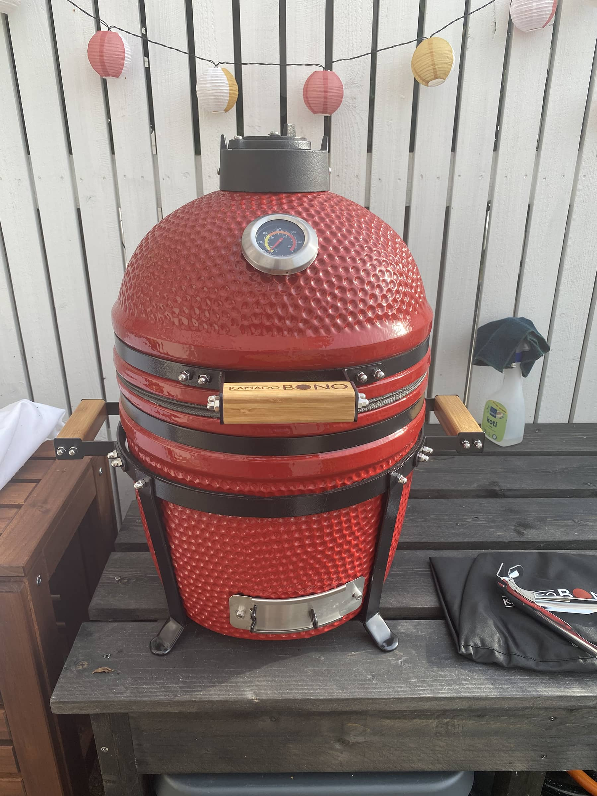

Nälkä tosiaan kasvaa syödessä ja [Weberin pallon](/weber-master-touch-gbs-e-5750-hiiligrilli-57-cm-yhden-kesan-jalkeen/) kaveriksi saapuikin eilen ensimmäinen kamado! Päädyin tilaamaan Bono Minimo kamadogrillin ja pakko antaa kiitosta ja ilmaista mainosta [bigshop.fi](https://www.bigshop.fi/) verkkokaupalle! Tarkoitus oli tilata punainen ja olinkin söhlännyt ostoskoriin mustan. Aspaan viestiä ja väri vaihtuikin punaiseksi. Tilauksen tein maanantai aamuna ja grilli oli tiistaina pihassa. Loistavaa toimintaa ja kiitos! Toki kerrankin Postin rahti toimi mallikkaasti.

Koska en heti päässyt tätä sisälle siirtämään niin piti hieman pressulla "naamioida" tätä ettei nyt ihan kenen tahansa matkaan lähde. Olisi tuossa vajaassa 50 kilossa ollut puuhaaminen, mutta silti.

Vaimon kanssa illemmalla siirrettiin kaveri sisälle ja alettiin kasaamaan. Koko laitos on tosiaan yhdessä hyvin pakatussa laatikossa. Sisällä on pahvia ja pehmikettä ympärillä ja itse kamadon sisällä on myös pehmikettä, jotta keraamiset osat pysyy ehjänä. Kaiken kaikkiaan ihan hyvin pakattu ja itsellä oli kaikki ehjää.

Tässähän tulee tosiaan mukana ihan kaikki. Matkassa itse kamadon lisäksi on keraaminen lämmönjakolevy, suojapeite/pussi, hiilenkaavin, ritilännostin sekä reseptikirjanen. Tämä oli myös yksi syy valintaan. Ainut mitä pohdin on hiilikori, että pitäisikö semmoinen jostain saada / tuunata jostain. Näkyi olevan ylimääräisiä ruuvejakin matkassa josta myös plussaa!

Kasaus kävi suht nopeaan. Kaikki osat kiinni ja kamadon nosto pidikkeeseen ja siitä sitten ulos. Ulkona sitten loput keraamiset osat sisään ja homma on ensikäryjä vaille valmista.

Hiiliä sisään ja sytytyshommiin. Pitihän se kokeilla vielä että lämpeneekö se... Lämpenihän se ja tässä huomaa jo tuon keramiikan erikoisuuden itselle. Ulkokuori esim. lämpenee hitaasti eli alussa tuohon kärsi koskea. Sitten kun oli tohotellut noissa lämmöissä jonkun aikaa niin sitten olikin jo oikeasti lämmin ettei pahemmin kärsinyt koskeakaan. Mielenkiintoista ja opettelua vaatii tämä kaveri.

Uusi grillihän pitää makkaralla korkata ja tällä kertaa sattui löytymään paikallista [Savo-Karjalan Lihan](https://savokarjalanliha.fi/) Aito Lenkkiä. Kyytipojaksi oli sitten tölkillinen originaalia. Yllätyin muuten lenkin lihapitoisuudesta. Tarkistin tämän vasta ensipuraisun jälkeen ja sehän oli 90 pinnaa. HK:n sinisessä lihapitoisuus on 43 pinnaa.

Lopuksi heitin vielä sisään tuon lämmönjakolevyn, jotta näkee hieman sitäkin komboa.

Ensikokemus kamadoista ja varsinkin tästä kamadosta on positiivinen. Tässä tulee opettelua vaatimaan lämmönsäätö ja yleensäkin käyttäminen. Tällä olisi ajatus päästä vakaasti niihin mataliin lämpöihin ja pitkiin vetoihin. Tuohon saa aika hyvän köntin esim. kassleria tekeytymään pulled porkiksi.

Huomasin myös sen, että jälkilämmöt tuossa on aika kiitettävät. Reilu pari tuntia "sammuttamisen" jälkeen lämpöä oli vielä 50 astetta. Tunnin jälkeenkin lämpöä oli vielä se sata astetta. Tohotin tosin menemään siinä 250 asteessa...

Erittäin mielenkiintoinen laite ja tulee kyllä käyttöön. Tämä sekä Weberin pallo tulenee olemaan jonkin verran yhtäaikaa käytössäkin sillä huushollissa on yksi sekäsyöjä ja yksi täysin kasvis. Sekä nyt saadaan myös tehtyä esim. ribsejä kamadolla ja sitten lähempänä valmistumista pallo tulille ja lisukkeet sekä kasvis vaihtoehto. Mahdollisuuksia siis taas on.

Nyt jos on heittää hyviä vinkkejä kamado touhuihin tai lisävarustetta niin kommenttiboxiin saa paukuttaa!