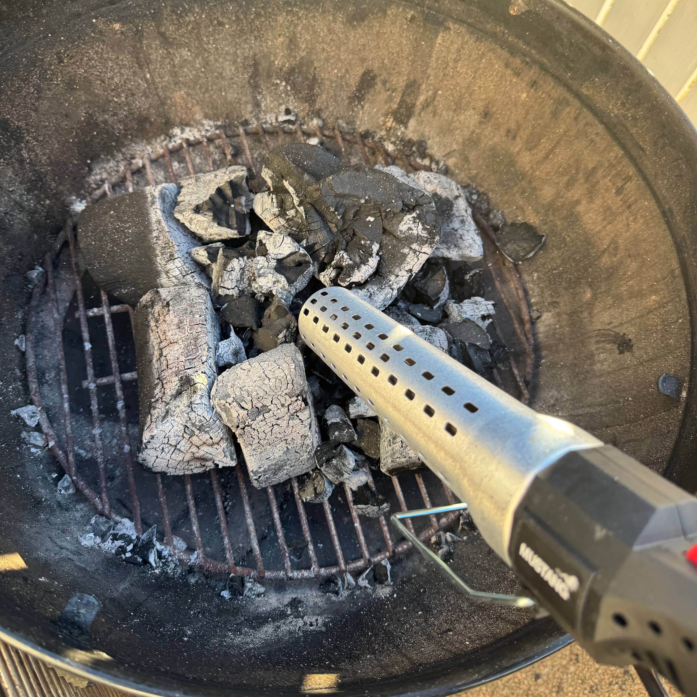

Tuli tehtyä Sulo Vilenit ja hankin grillisytyttimen, kun halvalla sain. Pääajatuksena oli käyttää tätä pääasiassa [Bono Minimon](https://bbqblogi.fi/testissa-bono-minimo-kamado/) sytyttämiseen, mutta se onkin nyt käyttökiellossa, kun pohja alkoi lohkeilemaan ja tämä on takuukäsittelyssä - tästä lisää [foorumilla](https://bbq.palstat.fi/t/kamadon-pohja-halkeilee/48).

Aloitinkin jo foorumille [ketjun](https://bbq.palstat.fi/t/mustang-grillisytytin/44) tästä sytyttimestä ja siellä onkin hieman lisätty kuvia ja giffejä. Kyselin siellä myös jos jotain testaan, mutta koska foorumi on niin uusi ja ei ole porukkaa kauheammin niin tästä tulee nyt postaus ja kysymykset voi esittää jatkossakin tuonne foorumin puolelle, tämän artikkelin ketjuun.

## Käyttäminen

Käyttöönottohan oli ihan super helppoa. Paketista sytytin pois ja pistoke seinään. Ohjeista vilkaisin, kumpaan suuntaan tuota nappia painellaan ja eikun sytyttämään grilliä.

Tässähän käytännössä pistät tuon suuttimen hiiliin kiinni ja painat kytkimen pohjaan. Tämän jälkeen odottelet hetken, että alkaa hiilet syttymään. Tuon kun tekee parista kohtaa ja alkaa toisella kytkimellä kauempaa puhaltamaan ilmaa. 

Eka kasasin vaan palloon grillejä pohjalle ja sytytin parista kohtaa. Helppo homma, siinä ne alkoi sitten palamaan. Tässä allaolevassa kuvassa on aika ns. levällään ja sanoisin, että toinen yritis korilla oli parempi.

Kamadoon olisi tosiaan ihan omiaan tämä. Pieni kohta syttymään ja siitä sitten lämmittämään. Low & Slow hommiin olisi siis tosi hyvä. Sillä nimittäin saisi kivasti parista kohtaa syttymään ja sitten odottamaan, että päästään tavoitelämpöön. 

Toki samaa ajatusta jatkaen tämä toimisi myös pallogrillissä aivan samalla ajatuksella. Esim. ns. snake metodiin tämä voisi toimia tosi hyvin jos brikettejä olisi yhdessä reunaa ja sytyttelee sitten siitä snaken alusta osan.

Weberin pallon mukana tuli nuo hiilikorit ja lähdinkin sitten niiden kanssa kokeilemaan. Jokusesta kohtaa sytytin tällä ja eikä aikaakaan kun oli tulta. Sanoisin, että saa suht kivasti syttymään myös pallon ja olenkin sitä käytellyt nyt ns. makkaranpaistohommiin sillä varsinkin jos itselle paistan pari käyrää niin ei tarvitse kuin pieni osa pistää palamaan.





## Loppu löpinät

Sanoisin, että olen saanut rahalle vastinetta, kun taisi 20 euron luokkaa tuo olla. Odotankin innolla miten tämä tulee toimimaan alkuperäiseen tarkoitukseen hankittuna eli tuon Bono Minimon kanssa. 

Ainakin näin lyhyen ensikokeilun jälkeen vaikuttaa oikein toimivalta kamppeelta ja päivittelen joko uuden artikkelin tai sitten ainakin foorumin puolelle kokemuksia lisää, kunhan tuo kamado keissi saadaan maaliin ja päästään silläkin grillaamaan.

Ohjeissa mainittiin, että voisi käyttää puidenkin sytyttämiseen ja miksi ei jos tällä sytyttää sytyt. En koittanut tätä sillä ei ole puu-uunia tai muutakaan puuta käyttävää. 

Tästä vekottimesta jos joku asia kiinnostaa niin saa kysellä. Vastailen jos osaan ja pystyn.

Ja tässä vielä linkki Mustangin sivuille: [mustang-grill.com/tuotteet/mustang-grillisytytin](https://mustang-grill.com/tuotteet/mustang-grillisytytin/)