Tuli tehtyä Tori.fi:stä oikein megalöytö ja piti sitten mennä hankkimaan tämä Weberin Go-Anywhere pienikokoinen hiiligrilli itselle. Tätä olen pidemmän aikaa halunnut, mutta en ole saanut aikaiseksi hankkia. Nyt tuli vastaan käytännössä uusi yksilö ja hintakin oli kohdallaan.

[Foorumilla](https://bbq.palstat.fi/t/weber-go-anywhere-hiiligrilli/55) hieman jo ketjua aloittelin ja nyt on sitten jokunen grillaus tällä grillillä takana ja voin pieniä ensikäden arvioita jo antaa. Tästä tulenee sitten myöhemmin lisää rustailua modauksen ja ehkäpä isomman arvostelun kanssa.

Weber Go-Anywhere on siis Weberin valmistama pieni hiiligrilli, joka on kompakti, kevyt ja helppo kuljettaa mukana. Kuvassa onkin alla jo paketti kasattuna ja vielä uudenkarheana. Hankin myös kaveriksi Weberin pienen piippusytyttimen.


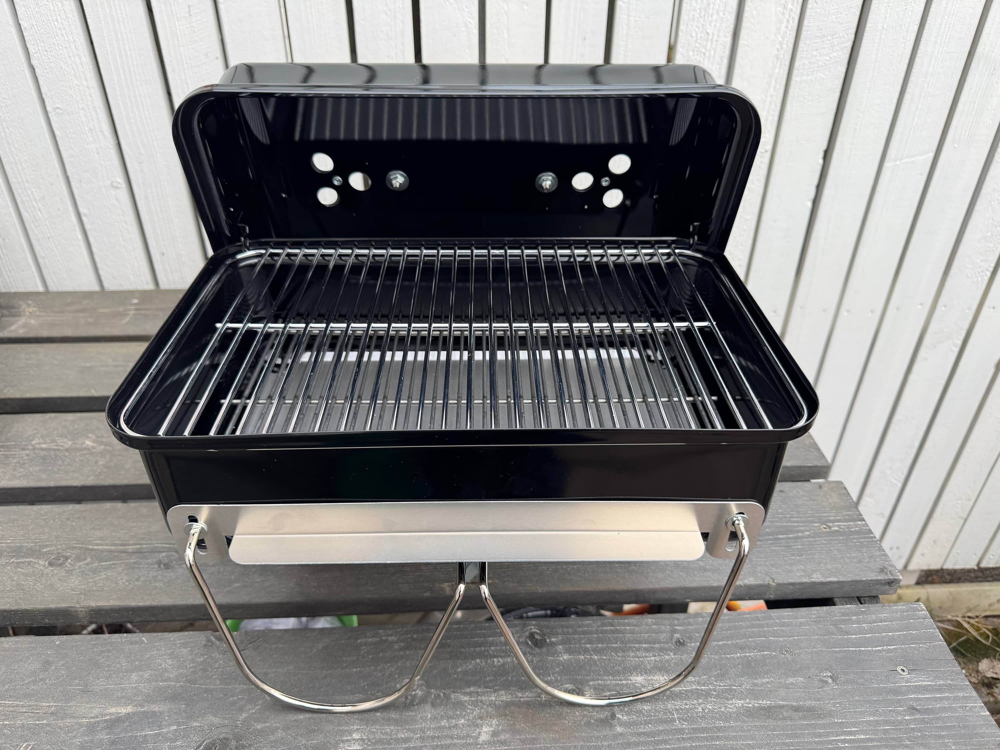
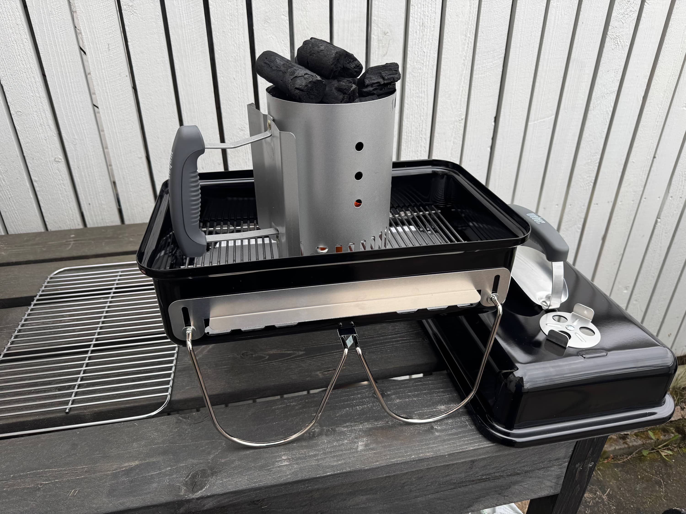


Grillijumalat pitää pitää tyytyväisenä ja ensimmäisen grillauksen on tällöin oltava perinteinen grillimakkara. Jotkut sanoo, että halvinta mahdollista, mutta en pysty noihin jauhomakkaroihin. Eli tämä on halvinta mitä itse syöne ja tällä kertaa taisi olla ihan perus Wilhelm tai Kabanossi.

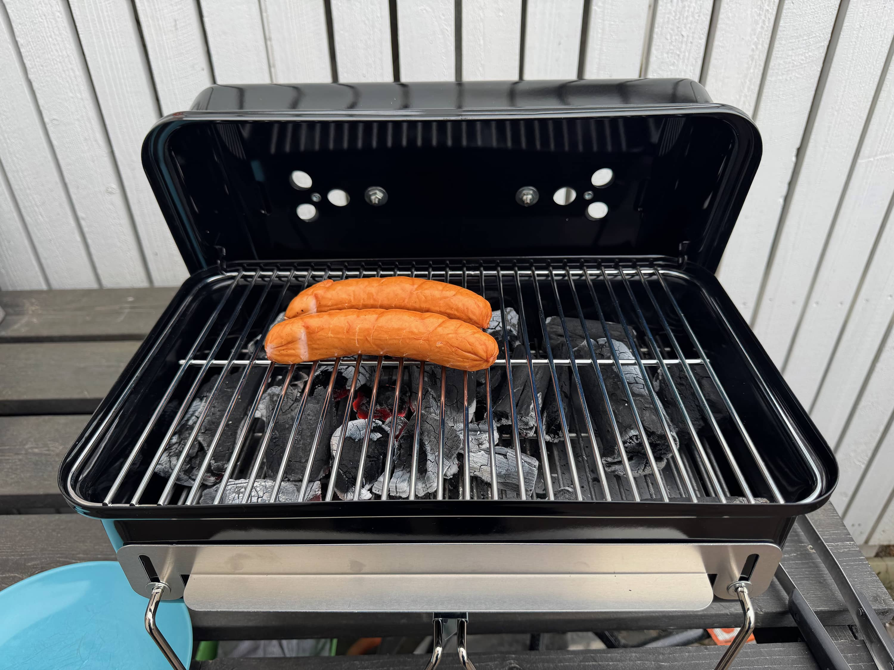

Tälle tuli hankittua myös pienikokoinen grillausvälinesetti (Napoleon TravelQ) ja ensipuraisulta vaikuttaa toimivalta setiltä. Ei ainakaan jää pullot aukaisematta. Ajatuksena on tosiaan tehdä suosittuja modauksia ja tehdä tästä oikeasti kannettava setti, jossa grillin sisään menee kaikki mitä käyttöön tarvitset.

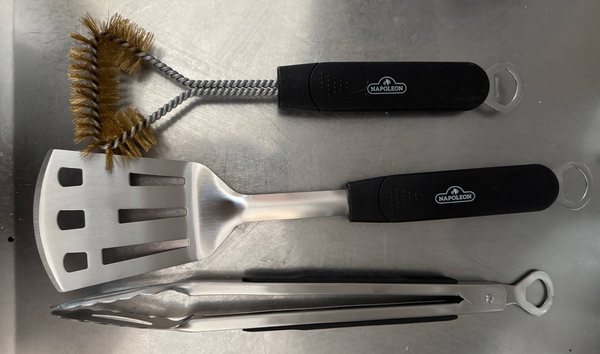

Ensimmäinen ns. isompi grillaus oli sitten ihan perinteiset burgerit. Burgeria kahdelle hengelle ja toinen oli vegejauhiksesta ja toinen ihan perinteinen naudanlihaburgeri. Alla onkin myös toisesta burgerin teosta kun tein vain itselleni burgerin.

Kahdelle hengelle saa kivasti burgerit tehtyä ja varsinkin jos eka paistelee veke version ja sitten lihallisen niin, että jakaa hiilet toiselle puolen ja toinen on sitten ilman suoraa lämpöä. Näin saat pidettyä lämpimänä kannen ollessa kiinni toista puolta myöskin. Käytän samaa periaatetta ihan pallogrillissäkin sillä harvoin pidän koko pinta-alaa ns. kuumana.


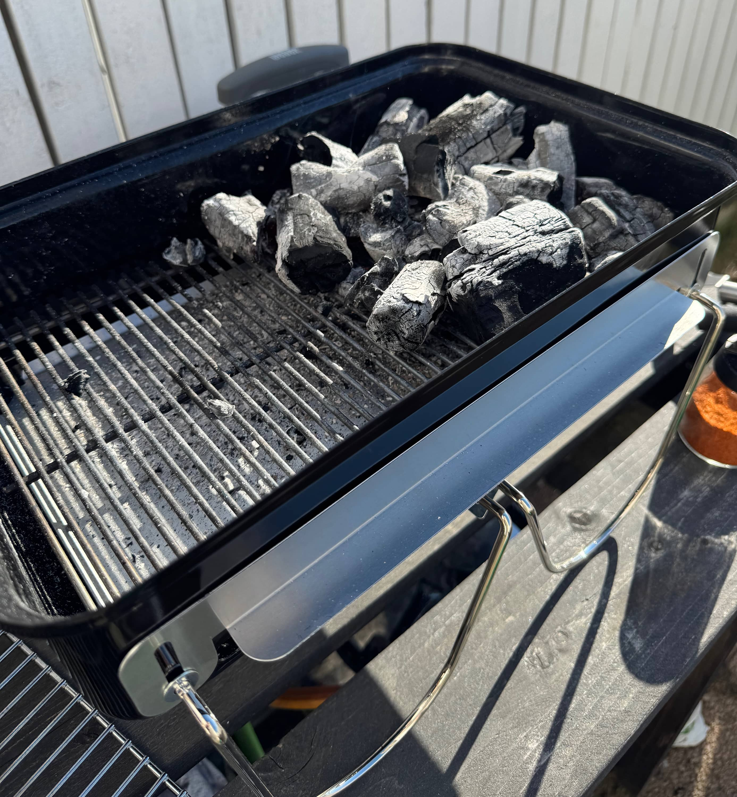
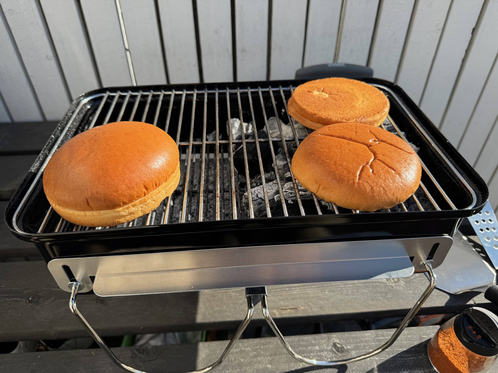
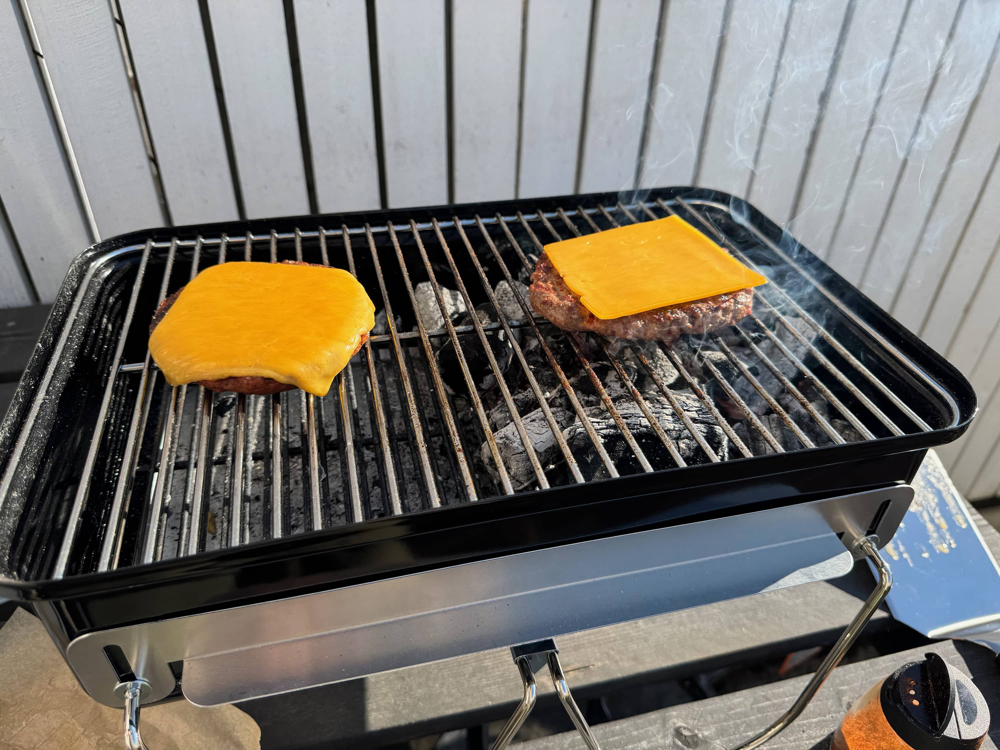
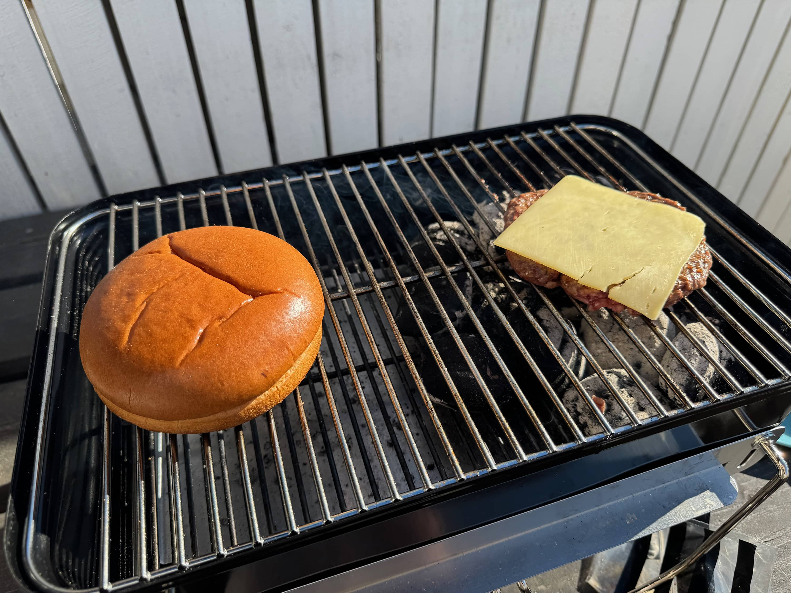


Onpa melkein sanomattakin selvää, että tuli aika hyvä setti... Kaveriksi oli molemmille kerroille vielä airfryerissä tehtyjä ranskalaisia. Eli ihan kunnollinen hampurilaisateria.


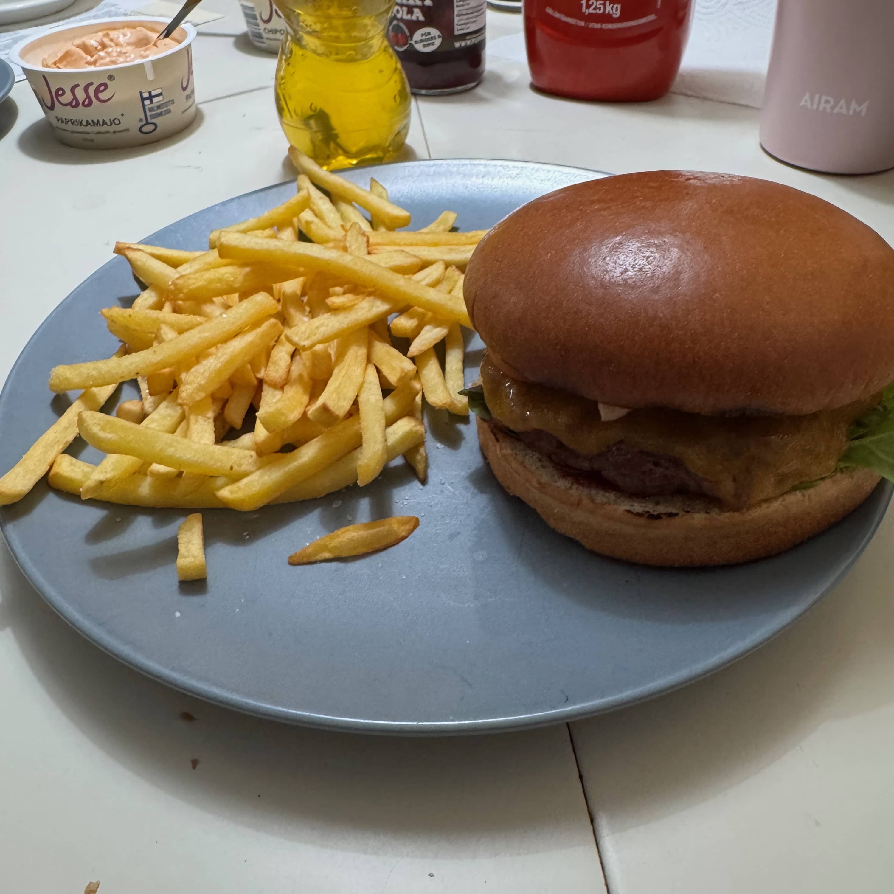
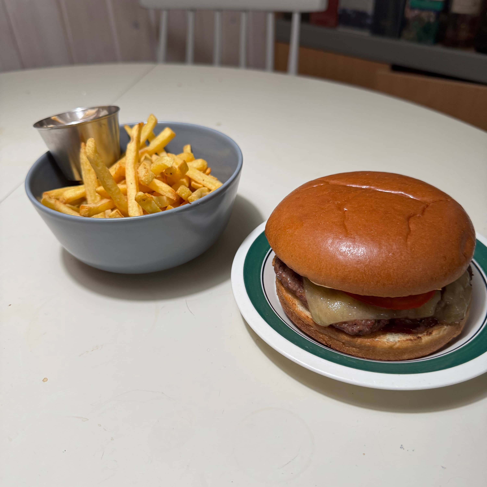


Tarkkasilmäiset huomasi, ehkä sen, että toisessa burgerikuvassa oli jo brikettejä alla. Minulla kun pääosin on aiemmin ollut käytössä kovapuuhiiliä ja ne on suht isokokoista. Tähän kuitenkin arvelin, että Weberin briketit sopisivat paremmin. Kooltaan nämä kun on sen verta tasaista ja sopivampaa tähän grilliin. Toki tähän kävisi myös pienempi hiili ylipäätään, mutta olen nyt käytellyt pitkästä aikaa brikettejä tämän kanssa. Toimii oikein hyvin.

Sitten otettiinkin hieman isompi kahden hengen grillaussetti alle. Eli grilliin lähti halloumia, kesäkurpitsaa, vekemakkaraa sekä lihallista makkaraa. Taas sama ajatus, eli toinen puoli kuumaksi ja toinen "kylmäksi", jossa sitten pidetään lämpimänä. Näin saa grillattua isommankin satsin kerralla.

Ensin grillasin halloumit ja kesäkurpitsat ja sitten makkarat. Tää ajatus toimi tähänkin oikein hyvin.

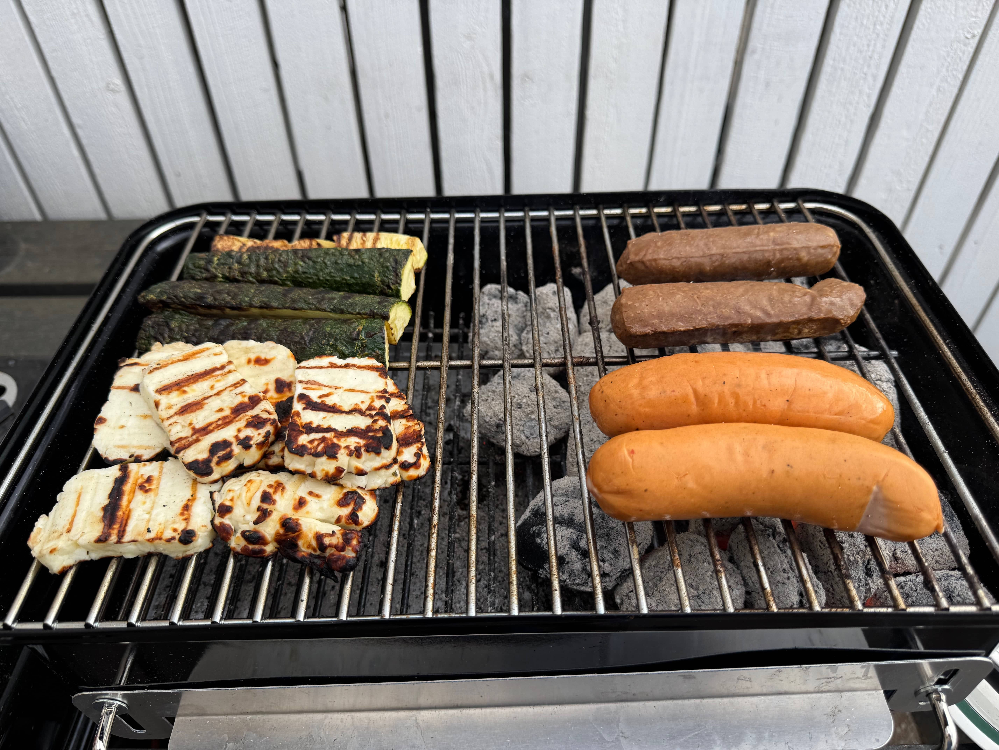

## Modaukset

Modauksia on myös ajatus tehdä ja tuohon on suosittuja modeja mm. se, että tuo ritilä katkaistaan kahteen osaan ja näin se menee tuon itse grillin sisään. Tällöin ritilää voi käyttää myös puolittain ja saada lisättyä hiiliä jos esim. tekee pidempää vetoa. Tuo modi on melkein pakollinen jos haluaa saada piippusytyttimen mahtumaan tuonne sisällä pakattuna.

Toinen modaus olisi ehkä tuo lämpömittarin asennus tuohon. Se helpottaisi lämmönsäätelyä ja varsinkin, jos meinaa mitään pidempää tehdä niin olisi kiva tietää paljon siellä on lämmintä.

Sitten oli myös mietteissä, että tekisi jonkinlaiset "kahvat" noille ilmansäädöille sillä nyt pitää olla hanskat tai pihdeillä tehdä säädöt. Ei ole nimittäin pallogrillistä tuttua muovisuojaa noissa.

## Loppu lätinät

Jos pitäisi sanoa monelle hengelle tämä on niin kahden hengen ruoat saat kivasti tehtyä. Voisi isommallekin lössille paistella burgeria jos tekisi ns. liukuhihnalla ja mahtuisihan tuohon useampi pihvikin kerralla paistumaan.

Toinen mitä olen miettinyt, mutta en vielä tehnyt on vartaat. Tuon koko on nimittäin sopiva sillä varrastikut mahtuisi sopivasti tuohon ja niitä voisi käännellä kivasti. Ajatus olisi ottaa ritilä pois ja suoraan ns. hiilien päällä grillailla kun olisi ruoka vartaissa.

Pidempiä vetoja en tuolla ole koittanut tehdä, mutta voisi ehkä koittaa jonkun kasslerin vetää pullediksi tai sitten possunoppia. Vaatisi melkein sen lämpömittarin, jos haluaa hieman tarkemmin saada lämpöjä selville.

Tämähän on tosiaan kannettava grilli ja sitä on helppo kuljettaa mukana. Itse ajattelin, että tämä on hyvä kaveri mökille tai retkille, joissa ei ole mahdollisuutta isompaan grilliin. Toki tämä on myös hyvä lisä pallogrillille, jos haluaa tehdä jotain nopeaa ja helppoa. Makkaranpaistoon saat nopeammin tämän lämpimäksi kuin pallogrillin tai kamadon.

**Onko sinulla WGA tai oletko miettinyt hankintaa?**