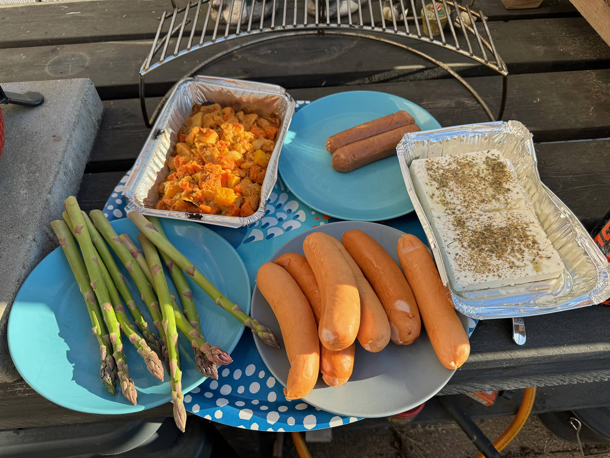
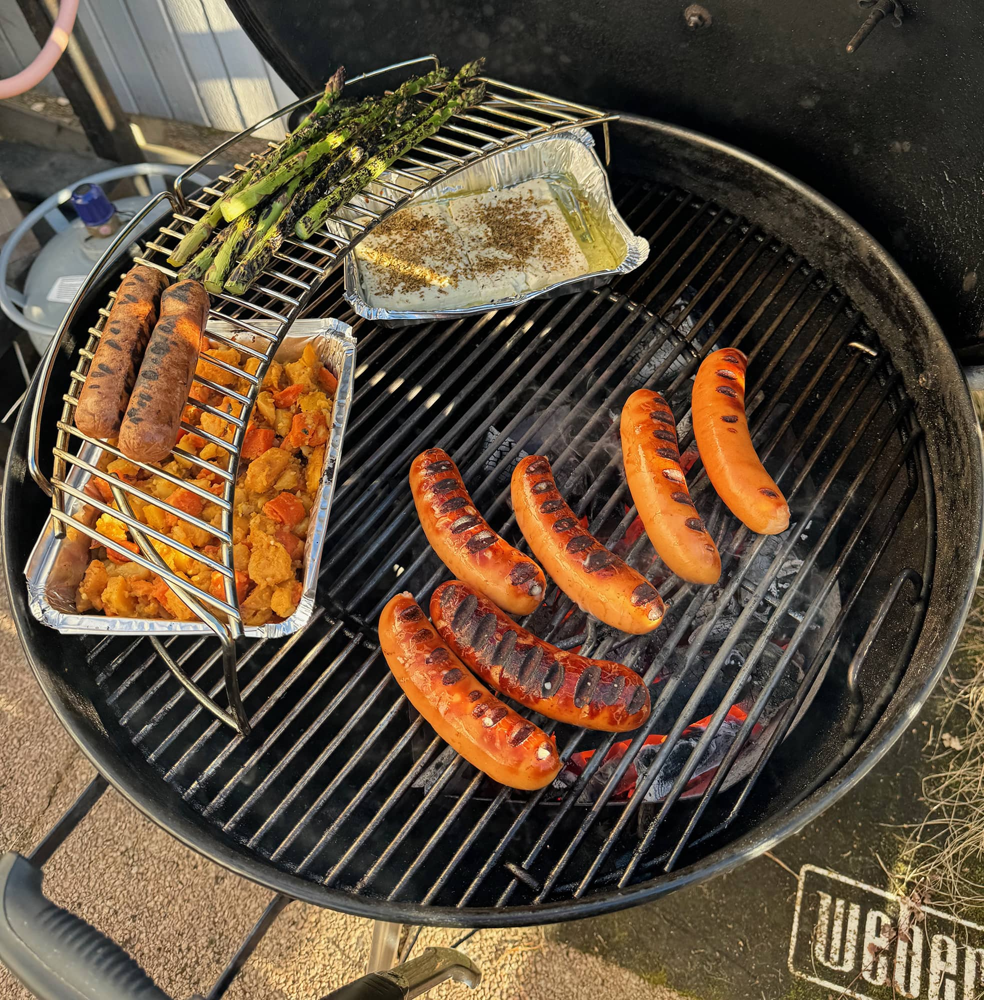
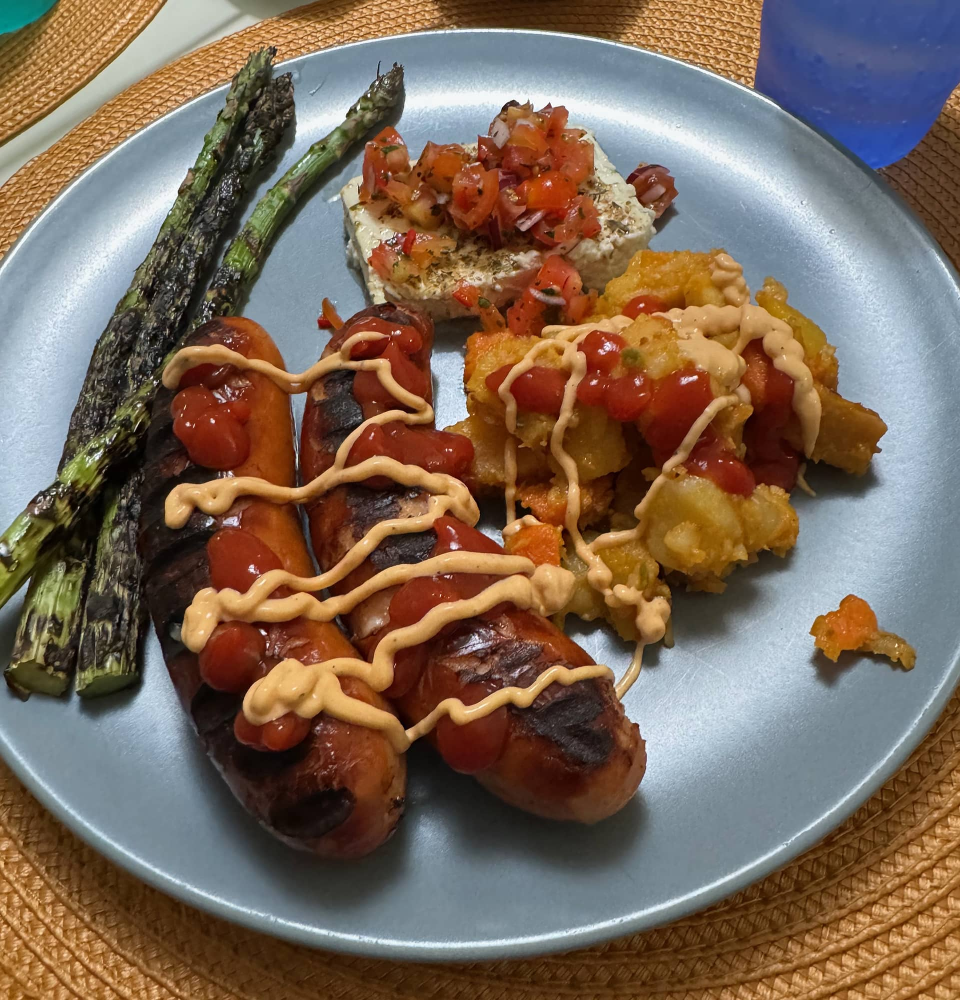
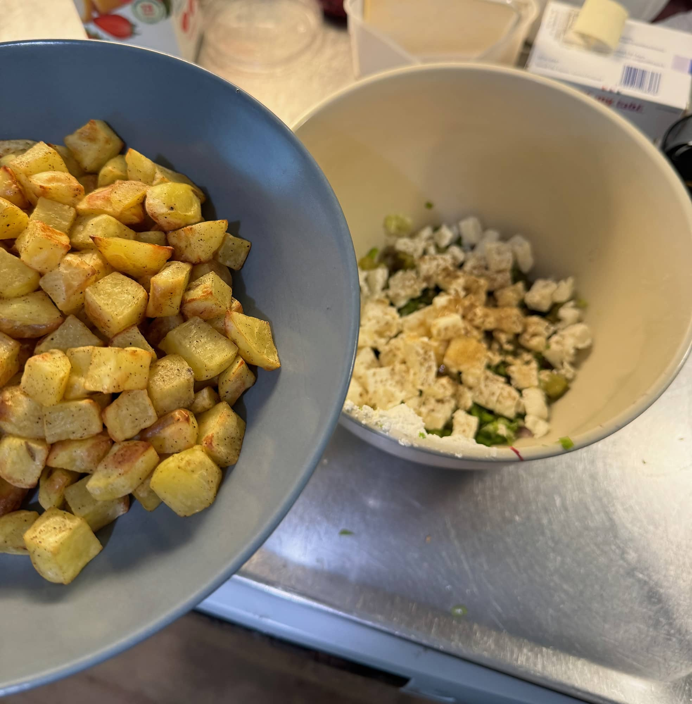
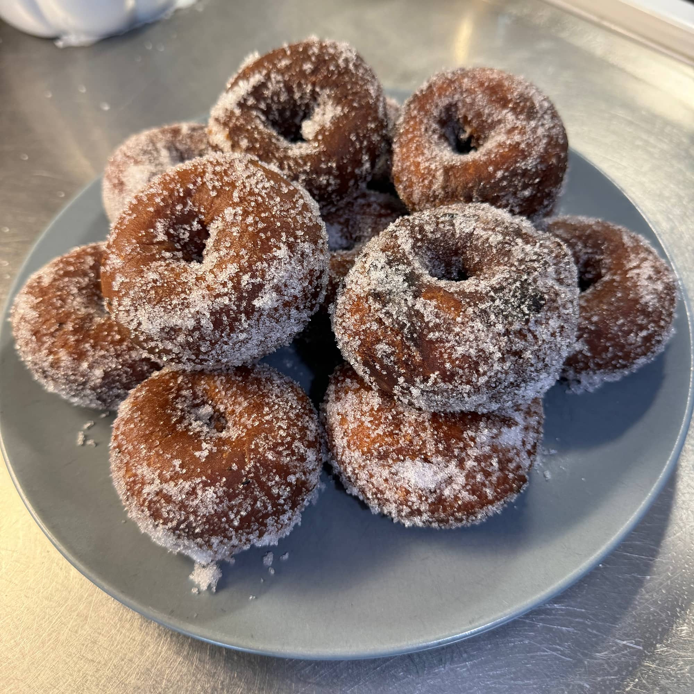
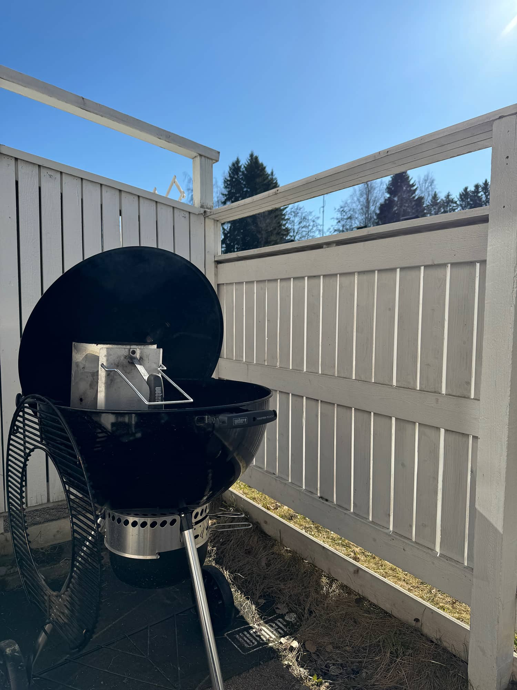
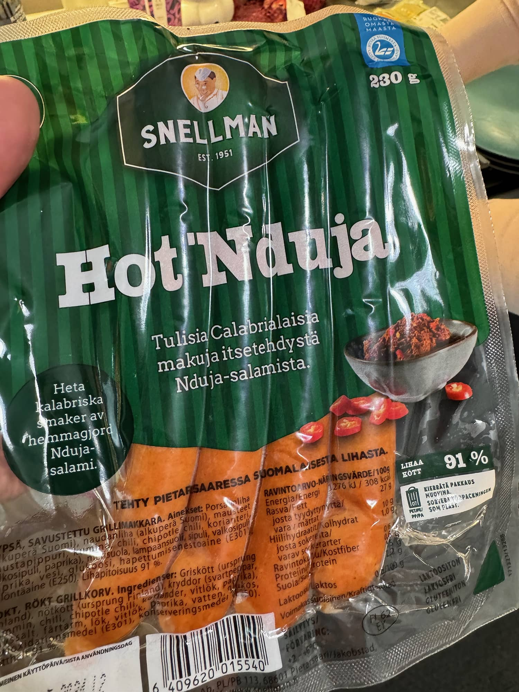
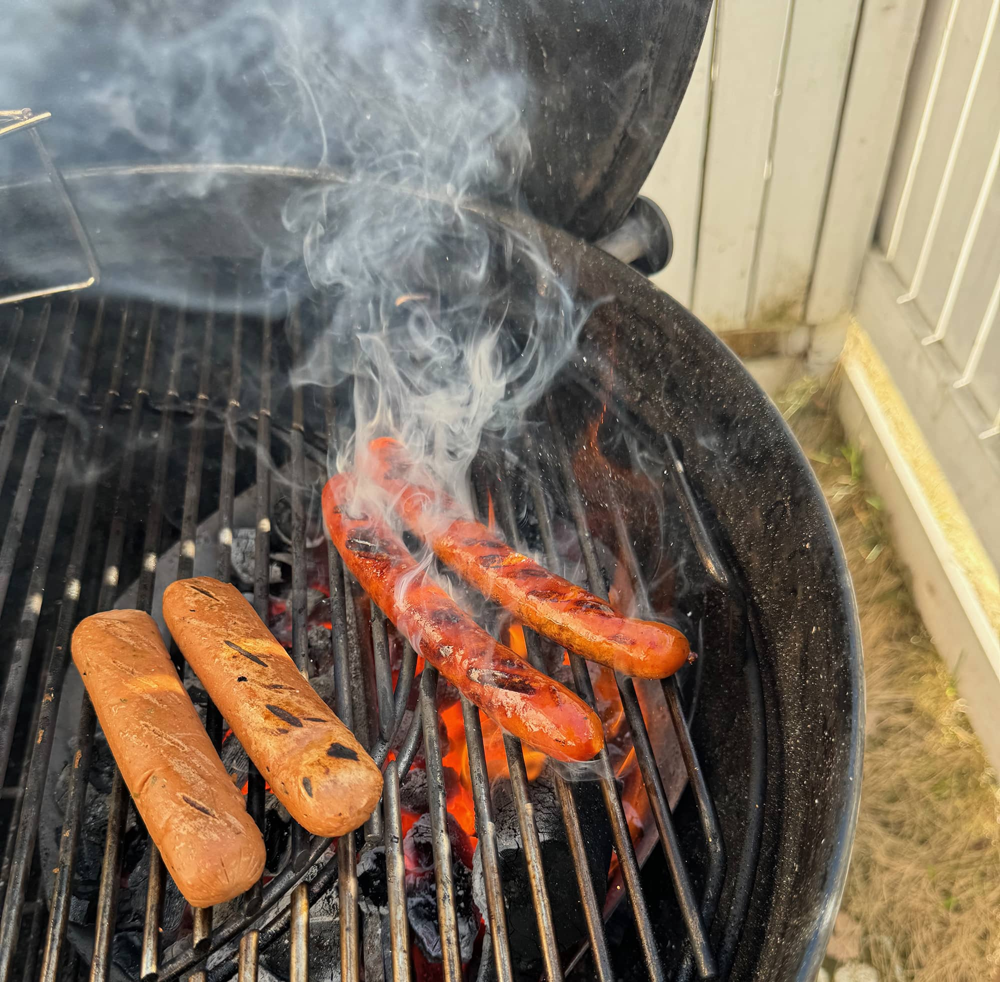
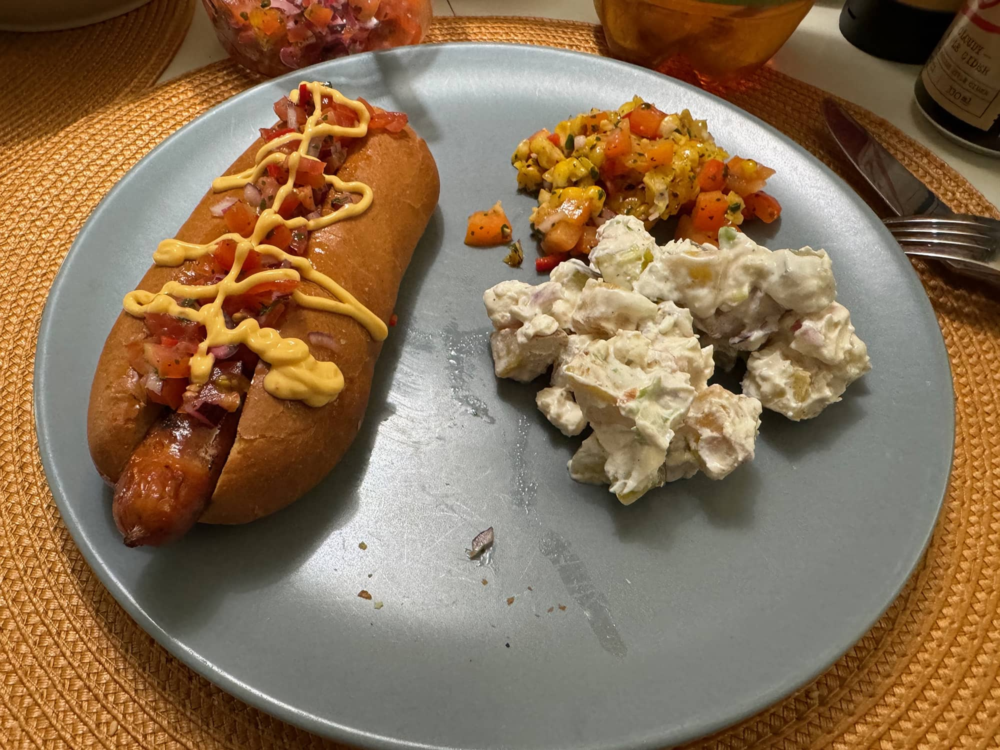

Vappu on superhyvää aikaa grillata. Tässä onkin katsaus mitä vappuna oli omassa grillissä.

Kuvien lisäksi on tarjolla reseptit ja niiden lähteet mikäli muistan / löydän ne.

## Makkaraa, parsaa, kasviksia ja fetaa

Ekana päivänä heitettiin aika perinteistä settiä Weberin viisseiskaan. Makkaraa (veke ja juusto), parsaa, fetaa ja kasviksia. Kasvikset oli valmissetti nimellä kesäjuurekset.





Sitten matkassa oli parsaa, joka me grillataan ilman mausteita tai öljyä. Sit grillauksen jälkeen laitetaan oliiviöljy, suoja ja pippuri pintaan. Simppeliä, mutta toimivaa.

Feta onkin grillissä hyvää ja super hyvä lisuke sekä menee kivasti patongin palan päälläkin. Astiaan kevyesti oliiviöljyä, fetaa paloina sekä mausteita. Meillä taisi olla oreganoa tai jotain kreikkalaista maustetta mitä rouva pisti siihen. Grillauksen jälkeen rouva tekikin sitten simppelin salsatyyppisen tomaatista, punasipulista, chilistä ja öljystä sekä mausteista.

Tätä simppelimmäksi ei oikein perus grillieväs meillä mene.

## Hodareita, perunasalaattia, maissisalsaa ja munkkeja

Itse vappuna sit aamusta tuli tehtyä pottusalaatti. Tämä resepti onkin [@chefwallinin](https://www.instagram.com/p/C5KzKQINlkg/?hl=fi) Instagrammista napattu eli "Perunasaalattien ferrari". Lopusta löytyy vielä resepti tähän.

Samoin tuli myös munkkitaikina tehtyä sillä pitäähän vappuna nyt olla niitä munkkeja!

Myöhemmin Weber pääsi taas töihin kun piti pistää nakit paistumaan. Hodareihin halusin ehdottomasti kokeilla burgerimiesten Ossin [Pups hodarisämpylöitä](https://www.k-ruoka.fi/artikkelit/k-kaupassa/pups-tuotesarja). Meni heittämällä jatkoon. Lisukkeena oli myös grillattua maissisalsaa, jonka resepti on löydetty [K-ruoka.fi sivuilta](https://www.k-ruoka.fi/reseptit/grillattu-maissisalsa). Kokeilussa oli myös nduja nakit, ne toimi ihan kivasti ja oli potkuakin.





Eipä taas tartte arvata maistuiko nämä eväät... Kyllä se on vaan niin, että grillistä tulleena kaikki maistuu paremmalta.

## Reseptit

Alla on reseptit vielä kootusti.

### "Perunasalaattien ferrari" by Chef Wallin

- 4 Perunaa
- ½ Punasipuli Pilkottuna
- 1 Suolakurkku kuutioituna
- 2 Valkosipulin kynttä pilkottuna
- 2 tl Hunajaa
- 1-2 Vartta kevätsipulia pilkottuna
- 1 pkt fetaa
- 200 g Turkkilaista jugurttia (käytin itse Kreikkalaista)
- ½ dl Majoneesia
- ½ tl Suolaa
- ½ tl Mustapippuria
- 2 tl Sitruunan mehua

1. Aloita kuorimalla ja kuutioimmalla perunat. Mausta suolalla ja pippurilla. Paahda 225 asteisessa uunissa kunnes pinnassa on mukava väri ja perunat ovat kypsiä. Anna jäähtyä.
2. Sekoita kaikki ainekset keskenään ja anna tekeytyä noin 2 tuntia jääkaapissa ennen tarjoilua. Tarkista myös suola ja lisää tarvittaessa.

Itse ehkä pistän ensi kerralla enemmän punasipulia ja kevätsipulia mitä nyt. Tästä tuli kuitenkin ihan tosi hyvää ja menee omalle vakiolistalle.

Itse paistoin myös peruna kuutiot airfryerillä. Itse pidin kuutioita 3x 6min @ 180°C. Perunoista riippuen voi vaatia lisää aikaa tai vähemmän.

Lähde: [https://www.instagram.com/p/C5KzKQINlkg/](https://www.instagram.com/p/C5KzKQINlkg/?hl=fi)

## Grillattu maissisalsa

- 1 pkt (400 g) kypsää maissia
- n. 1 1/2 rkl oliiviöljyä
- 1/2 (100 g) paprikaa (vihreä tai punainen)
- 1 (70 g) pieni punasipuli
- 1 iso valkosipulinkynsi
- 1 mieto punainen chilipalko
- 1 rkl limetinmehua
- 1 dl korianteria hienonnettuna
- n. 1/4 tl suolaa

1. Kuivaa maissit paperilla ja sivele öljyä niille kauttaaltaan. Grillaa maisseja, kunnes ne saavat väriä. Anna maissien jäähtyä ja leikkaa maissinjyvät liuskoina irti tähkästä veitsellä. Maissinjyvät saavat jäädä kiinni toisiinsa, paloittele sopiviksi paloiksi.
2. Kuutioi paprika. Hienonna sipuli ja valkosipuli. Halkaise chili ja poista siemenet, hienonna chili.
3. Sekoita salsan ainekset keskenään ja tarjoa grilliruoan kanssa.

Lähde: [https://www.k-ruoka.fi/reseptit/grillattu-maissisalsa](https://www.k-ruoka.fi/reseptit/grillattu-maissisalsa)
