On taas aika puhua hampurilaisista. Nämä on yksi henkilökohtaisista lemppareista ja näitä tuleekin tehtyä aika usein itse. Tällä kertaa mentiin ns. syvään päähän ja tehtiin sämpylät pitkällä kaavalla.

## Burgeria, burgeria ja lisää burgeria

Hommahan alkoi tietty sämpylöiden teolla ja tehtiin briossi/hokkaido maitosämpylä ohjeella ja siitä resepti ja lähteet löytyykin alta. Nämä on kyllä hyvät burgerisämpylät ja näyttääkin ihan mahtavilta jo.

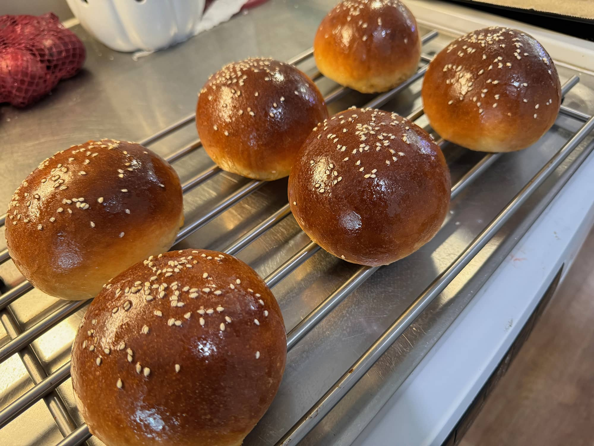

Näitä tulikin tehtyä parinakin eri päivänä. Itsellä oli käytössä [Herra Snellmannin Burgerjauheliha](https://snellman.fi/fi/tuotteet/burgerjauheliha-20-650-g/) ja tällä kertaa tehtiin ihan ns. perinteisiä pihvejä grillissä. Noin 110g oli mulla lihaa näissä ja mausteina aika perus suola ja pippuri. Juustona tulee käytettyä itseasiassa Oltermannin Cheddaria sillä sitä yleensä löytyy jääkaapista muutenkin.

Tuli käytettyä niin pallogrilliä, kuin kamadoakin. Bono Minimossa tuo jaettu ritilä on näppärä, kun saa sämpylät lämpimään ja pihvin alemmas paistumaan. Pallossa oli taas tuo valurautaparila hässäkkä käytössä.

Itse pidän suht simppeleistä burgereistä. Yleensä laittelen majoa, salaattia, tomaattia, suolakurkkua sekä tietty pihvi+juusto+sämpylä setti. Majoa sekoittelen joko itse tai sit käytän valmista, riippuu mitä sattuu olemaan jääkaapissa.

Pottuina pistin [Oolannin lankkuja](https://www.oolannin.fi/tuote/oolannin-poimutetut-lankkuperunat-400-g/) sillä nää on ehkä mun omat suosikit pakasteesta. Nämä on vähän kuin ne pippuriranet mitä mäkkäristä saa silloin tällöin. Itsellä nämä meneekin air fryerissä ja mausteeksi suola ja pippuri.

Kasvisruokavaliolle vinkkinä kaupasta saatavat vegejauhikset. Esim. ihan Pirkan oma [Vegejauhis](https://www.k-ruoka.fi/kauppa/tuote/pirkka-vegejauhis-250g-6410405257291). Tuosta 250g paketista saa kivasti kaksi pihviä. Tee pihvit joko käsin muotoilemassa tai puristimille, mutta huomioi tosiaan se, että tämä ei kutistu grillatessa eli tee sämpylän kokoinen pihvi. Pintamausta suolalla sekä pippurilla tai muilla mausteilla. Grillaa. Jos teet pannulla niin pistä öljyä vähän. Vaimo on näitä kehunut niin pakko se on uskoa.


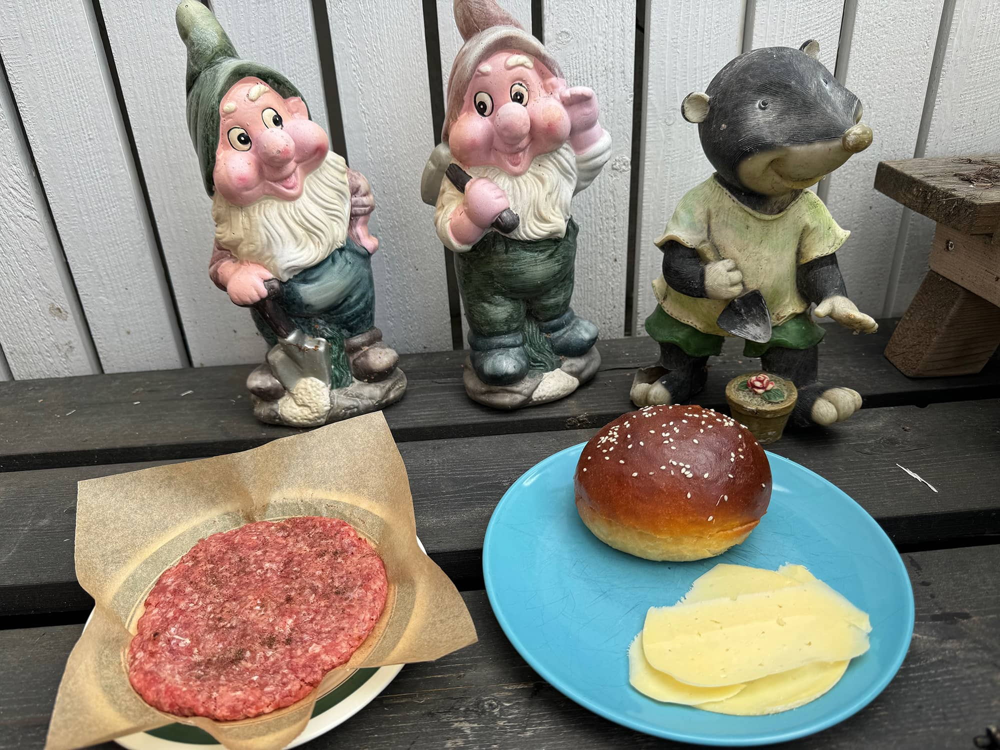
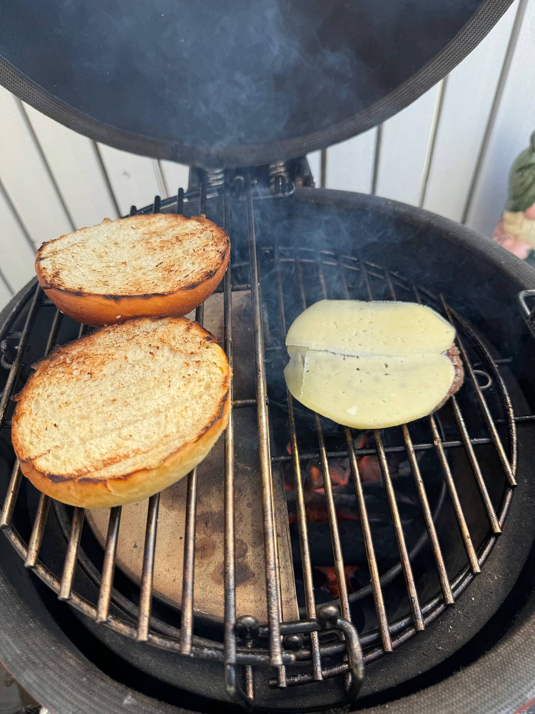
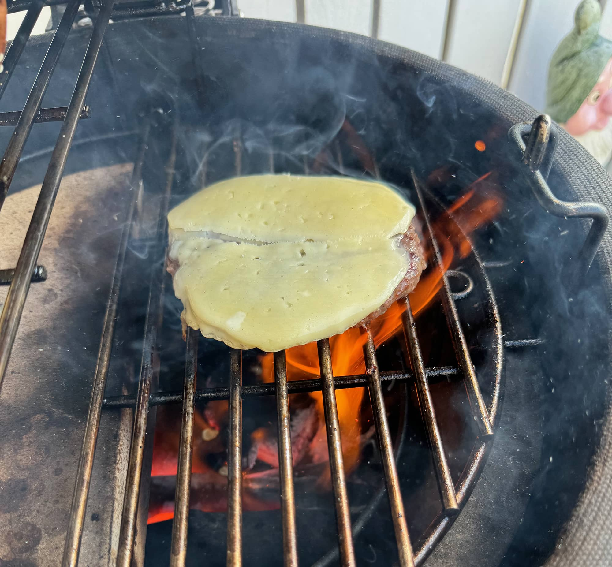
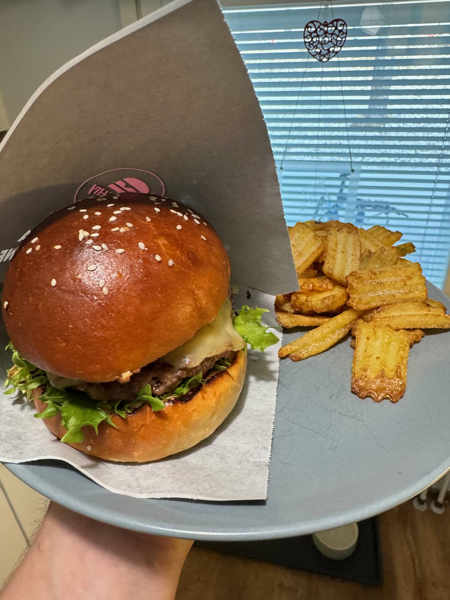
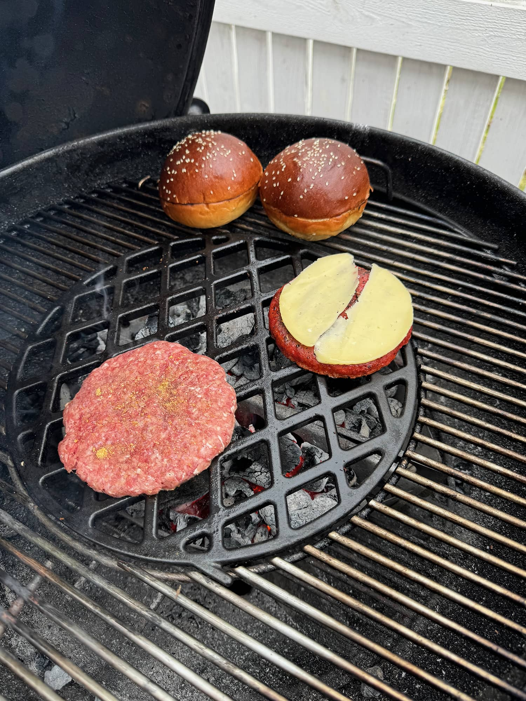
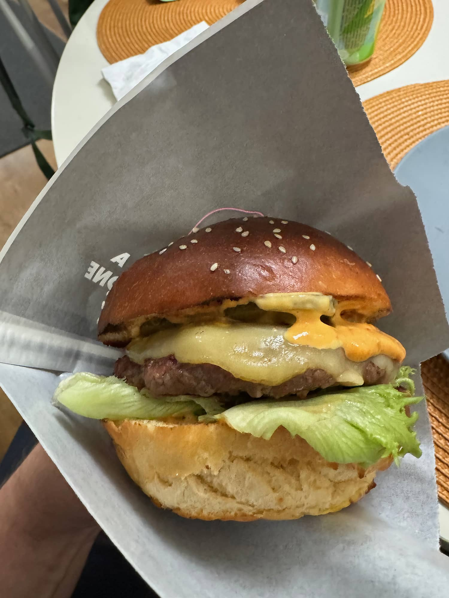


## Reseptit

Alla on vielä kootusti tässä artikkelissa olleet reseptit.

### Briossi/hokkaido maitosämpylä

Tämä on Resepti kanavan Mikon ohje ja hän sen idean saanut John Weissmannilta. Alla on resepti kirjoitettuna ja kuvat ovat omiani.

Tästä tulee 6kpl noin 110g sämpylää. Aikaa kannattaa varata sillä kohotuksiin menee hyvä tovi.

#### Ainesosat

**Tangzhong**

- 60g täysmaito
- 27g vettä
- 20g jauhoja

**Voiteluun**

- 1 kananmuna
- Tilkka maitoa

**Taikina**

- 20g täysmaito (30 °C)
- 9g kuivahiivaa
- 320g jauhoja
- 7g suolaa
- 35g sokeria
- 1 kananmuna
- 1 keltuainen
- 42g voita

#### Ohje

**Tangzhong**

Sekoitetaan maito, vesi ja jauhoja pienessä kattilassa keskilämmöllä, kunnes saadaan aikaan jauhomassa, joka myöhemmin lisätään taikina-aineksiin

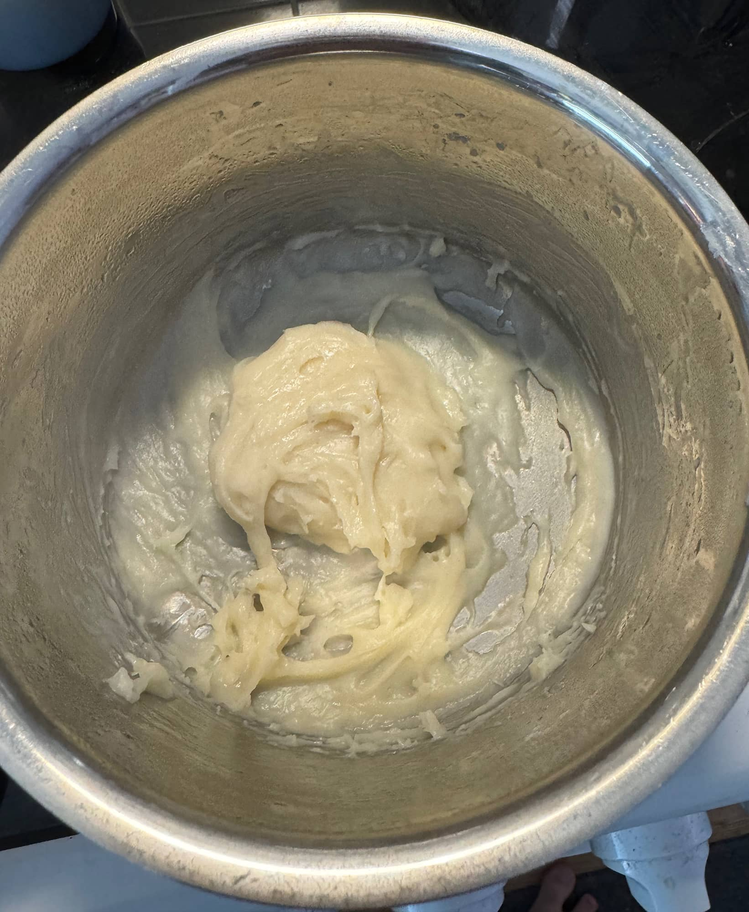

**Sämpylät**

Sekoita 120g noin 30 asteista maitoa kuivahiivan kanssa. Anna seistä noin 8 minuuttia.

Sekoita loput kuiva-aineet (yleiskoneen) kulhossa. Ala pyörittää pienellä teholla ja lisää maito-kuivahiivaseos hiljalleen sisään. Anna pyöriä puoli minuuttia ja lisää Tangzhong -massa, kokonainen kananmuna sekä keltuainen kulhoon. Nosta yleiskoneen nopeus keskitasolle ja sekoita kunnes aineet kunnolla sekoittunut keskenään. Lisää voi kulhoon ja vaivaa vielä noin 7 minuuttia.

Tee taikinasta nätti pallo ja kohota huoneenlämmössä kunnes koko on tuplaantunut. (Noin 1h 15min - 1h 45min)


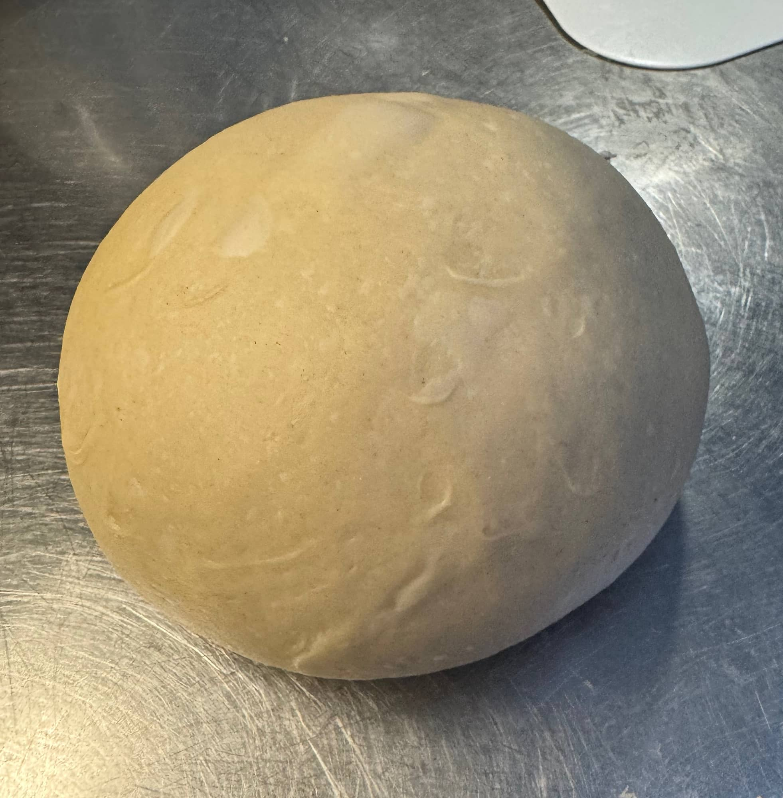
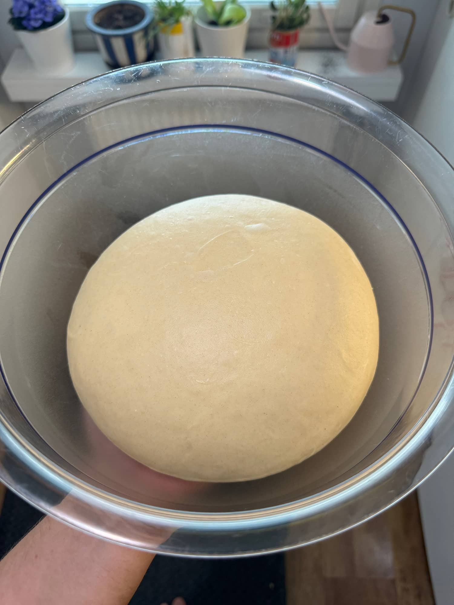


Laita vähän jauhoja työtasolle ja tee 6 x 110g palloa. Asettele uunipellille, laita toinen uunin pelti suojaksi ja Anna kohota 1h 45min huoneenlämmössä.


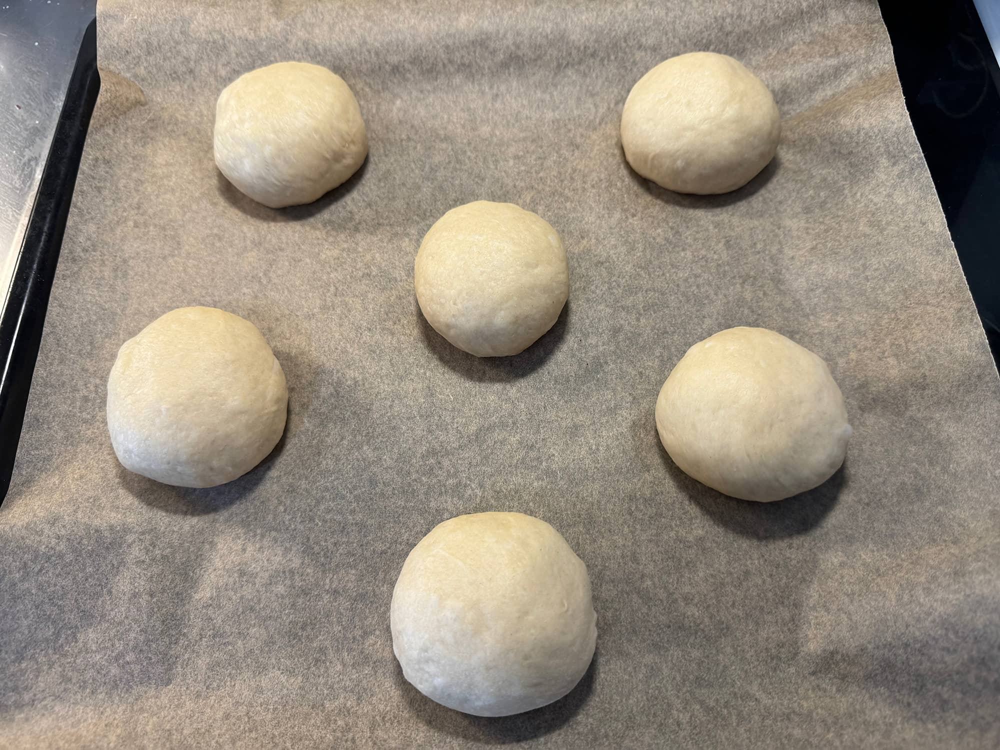
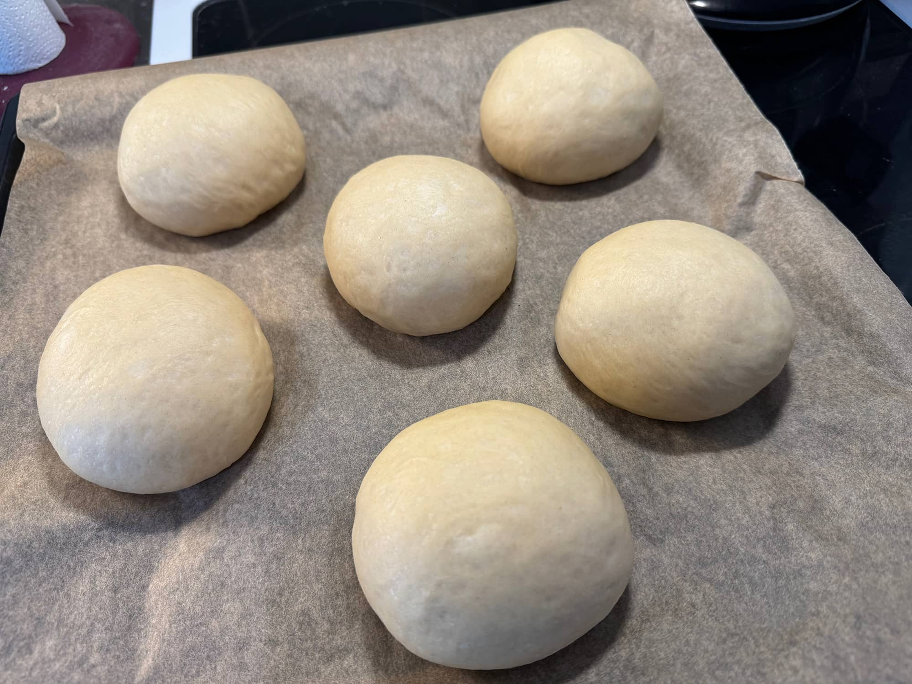


Riko muna kulhoon ja sekoita pienen määrän maitoa kanssa. Voitele taikinapallot munaseoksella ja laita uunin keskitasoon 190 asteeseen noin 15-17 minuutiksi paistumaan.

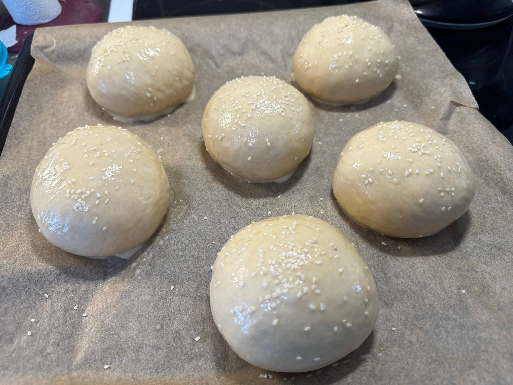

Ota sämpylät pois uunista ja sivele vielä sulaa voita päälle.

Anna hetki jäähtyä ja nauti!

Lähde: [https://www.youtube.com/watch?v=7vsr1Zgfx7U](https://www.youtube.com/watch?v=7vsr1Zgfx7U)
