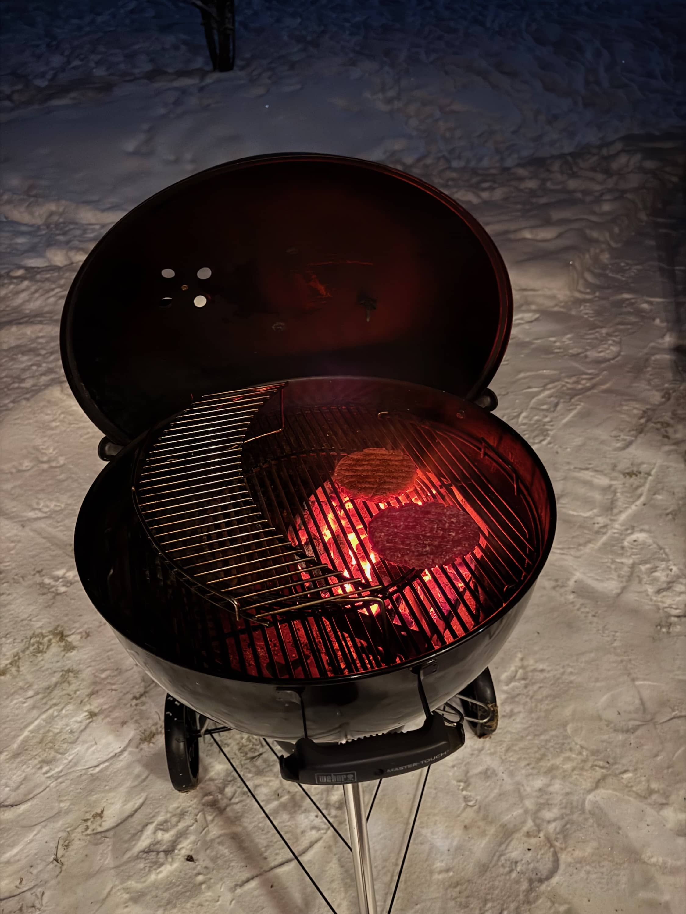
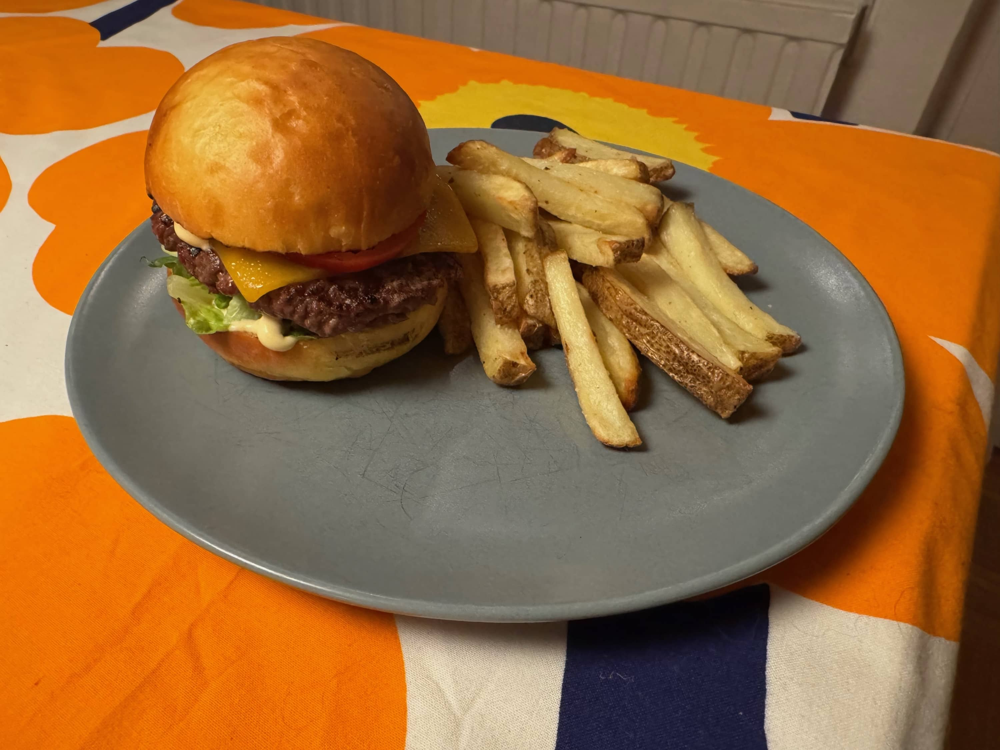
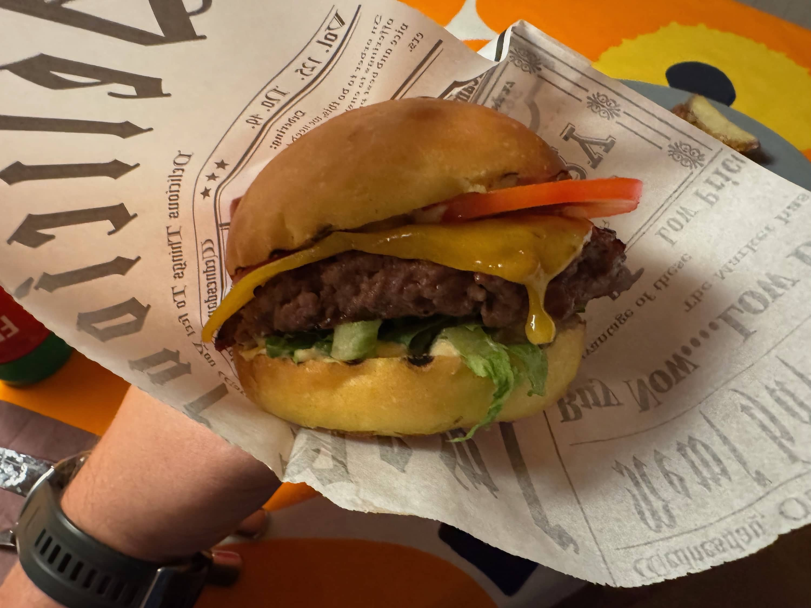
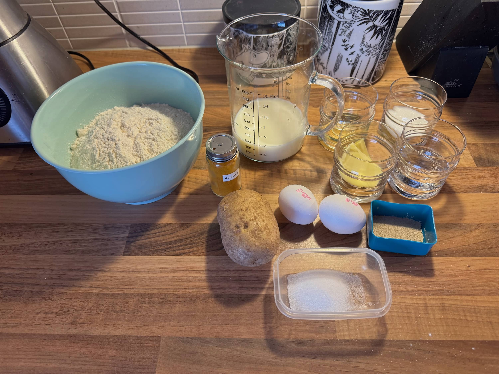
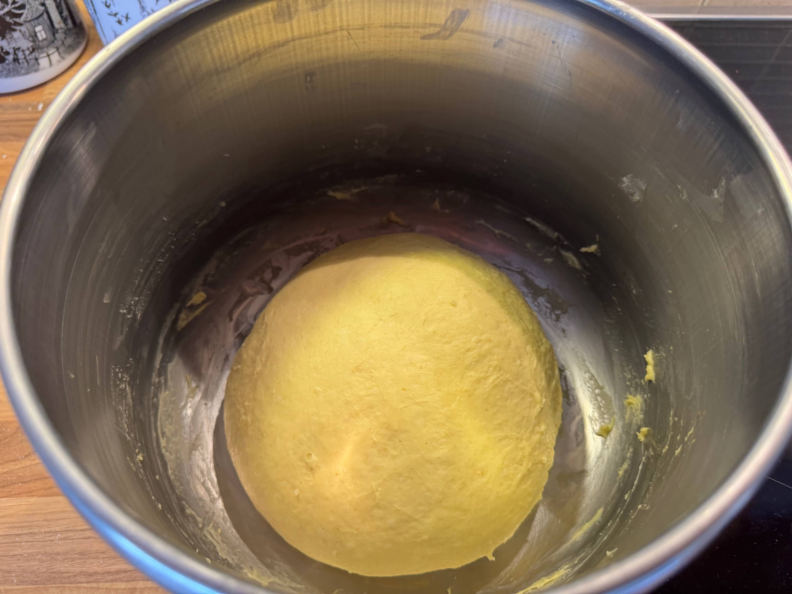
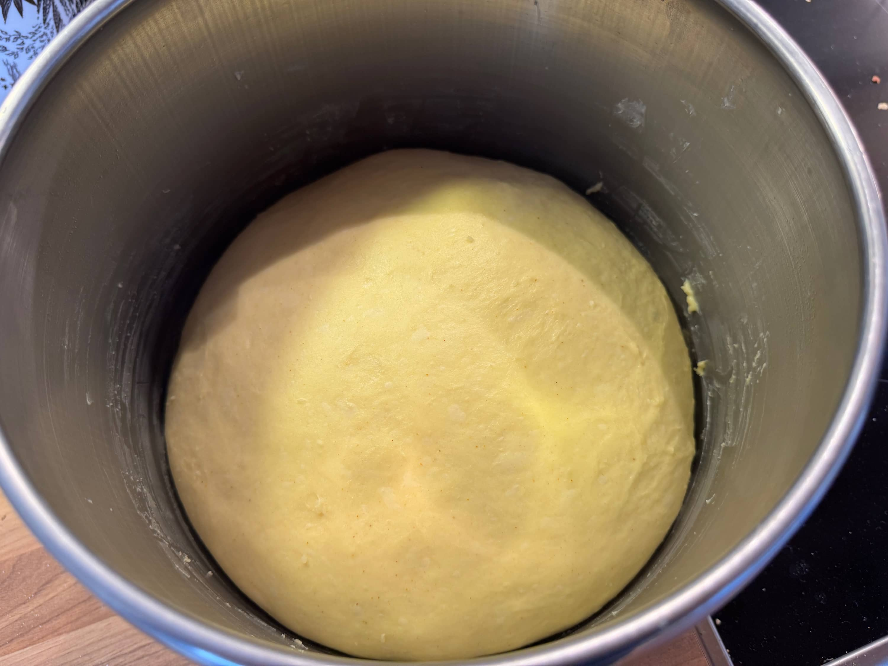
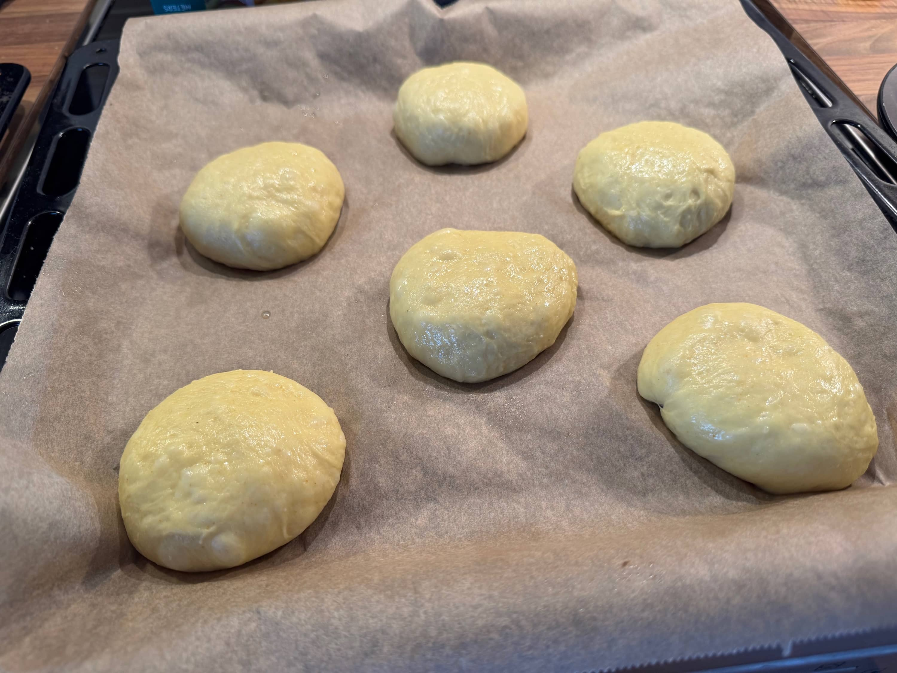
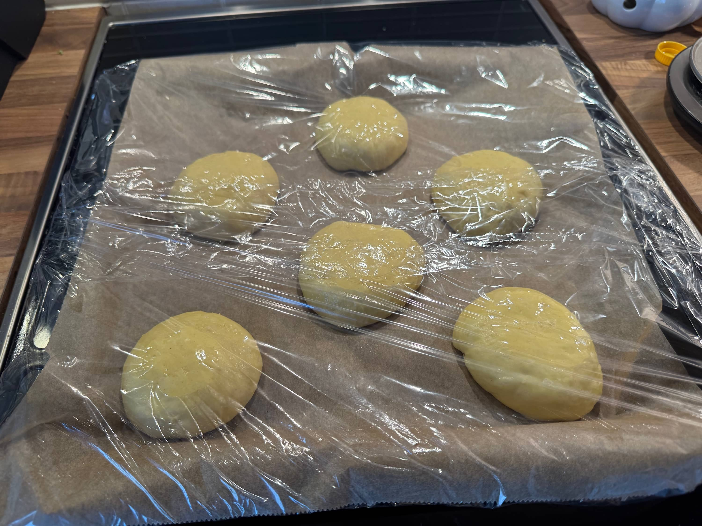
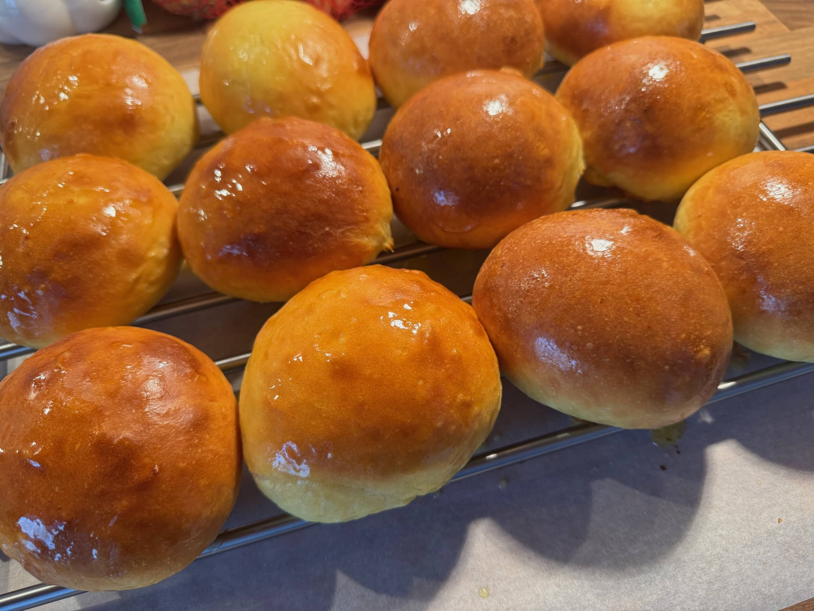
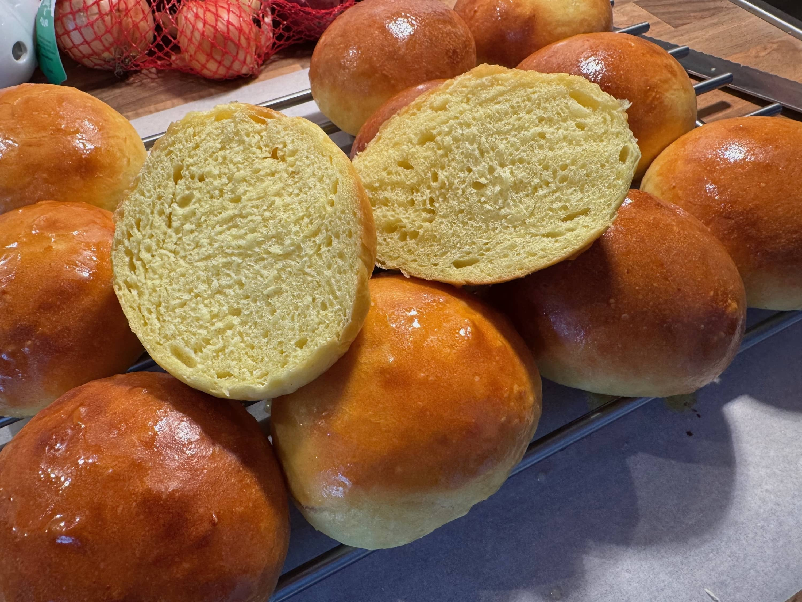

Eräs päivä tuli taas katsottua YouTubea ja vastaan tuli sitten uusi resepti hampurilaissämpylöillä, tällä kertaa perunasämpylöillä. Olenkin halunnut koittaa tehdä perunasämpylöitä jo pidemmän aikaa, joten nyt oli hyvä hetki kokeilla sillä löyty varteenotettava resepti.

Perunasämpylät on itsellä ehkä lempparit mitä kaupasta löytyy ns. valmiina. Eli nämä [Vaasan perunasämpylät](https://www.vaasan.fi/tuotteet/kaikki-tuotteet/vaasan-street-food-soft-bun-perunaburgeri/) on olleet pitkään suosikkeja. Nyt sitten päätin tehdä itse.

## Tehdään burgeri

No koska ollaan BBQ Blogin puolella ja halusin nämä sämpylät tosissaan käyttöön niin pitihän se Weberin viisseiska pistää tulille. Rouvalle vegejauhiksesta pihvi ja itselle perinteistä naudan jauhelihaa. Itsehän tykkään tehdä pihvit aika simppelisti, tälläkin kertaa oli noin 130g pihvi ja mausteena pelkkää suolaa.

Grillauksen ohessa airfryeriin meni sitten ranskalaisia. Nyt olen viimeaikoina tehnyt niitä itse ja on löytynyt tosi hyvä peruna kiitos tästä menee myös tuonne Resepti Mikon suuntaan sillä nämä Russet potut oli mainittu tässä ja Lidlistä löytyi sitten kotimaisia Russet perunoita. Kannattaa ottaa kokeiluun.

Sämpylätkin sai hetken lämpöä grillissä ja itselle sämpylän väliin päätyi tällä kertaa salaattia, kurkkumajoneesia, tomaattia ja itse pihvi juustoineen.





Oli kyllä todella toimivat sämpylät ja menee kyllä jatkoon. Suosittelen kokeilemaan ja resepti onkin alla lähteineen.

## Perunasämpylät resepti

Kuten aiempikin niin tämä resepti on nyysitty Resepti Mikolta, joka on tainnut molemmat napata Joshua Weissmanilta. Olen molempia katsonut ja tämä resepti tuli koitettua ja itse totesin toimivaksi. Alla on itselle vielä kirjoitettuna muistiin ja muillekin jaettavaksi.

Tästä ohjeesta tulee noin 12kpl 100-110g sämpylöitä. Aikaa menee tovi, joten älä kiirehdi.

### Ainesosat

- 1 Russet-peruna (tai muu jauhoinen peruna), kuorittuna
- 245g täysmaitoa, lisäksi hieman voiteluun
- 55g vettä
- 7g kuivahiivaa
- 50g hienoa sokeria
- 575g leipäjauhoja (vahva vehnäjauho, itse käytin pizzajauhoja)
- 14g hienoa merisuolaa
- 1g amylaasia (valinnainen, en käyttänyt)
- ½ tl kurkumajauhetta
- 25g neutraalin makuista öljyä (esim. rypsi-, kasvi- tai avokadoöljy)
- 1 iso kananmuna
- 1 iso kananmunan keltuainen
- 120g russet-perunaa (kypsänä, soseutettuna)
- 30g voita, pehmeänä, lisäksi hieman loppuvoiteluun

### Valmistus

Aloita keittämällä peruna kypsäksi. Tässä menee 20-40min riippuen perunan koosta ja pilkoitko vai et. Kun peruna on kypsä, valuta vesi pois ja muussaa peruna mahdollisimman sileäksi. Anna jäähtyä.

Yhdistä maito ja vesi pienessä astiassa (32–35 °C) lämpö. Vispaa joukkoon hiiva ja sokeri ja anna seistä noin 2 minuuttia, kunnes seos on liuennut ja vaahtoavaa.

Suosittelen yleiskoneen käyttöä sillä tämä on melko "märkä" taikina. Jos sinulla ei ole yleiskonetta, katso huomio lopusta.

Lisää jauhot, suola ja kurkuma yleiskoneen kulhoon ja sekoita ne. Sekoita matalalla nopeudella ja lisää hiivaseos, öljy, kokonainen muna, keltuainen ja kypsä jäähtynyt perunasose. Vaivaa 5min ja kaavi tarvittaessa kulhon reunoja mukaan ja vaivaa kunnes taikina on sileää ja elastista.

Lisää pehmeä voi ja anna sen sekoittua taikinaan. Jatka vaivaamista vielä 2–3 minuuttia, kunnes taikina on erittäin sileää.

Itse vaivasin vielä hieman nopeammalla teholla ja annoin 10min välilevon. Sen jälkeen otin sen pöydälle ja käytin slap n fold tekniikkaa ja annoin vielä pienen välilevon. Sen jälkeen palloksi ja kohoamaan. Tältä se näytti ennen kohoamista.

Siirrä kulhoon ja peitä kelmulla tai kostealla liinalla ja anna kohota 1½–2 tuntia, kunnes koko on noin kaksinkertainen.

Paina taikina kasaan ja ota työtasolle. Jaa taikina noin 100-105g palloihin ja näin tästä pitäisi tulla se 12 kpl. Suosittelen vaa'an käyttöä, jotta saat tasakokoiset sämpylät. Käytä tarvittaessa öljyä käsissä, jotta ei tartu niin käsiin.

Tee näistä sitten pallot ja tässä on hieman pizzanpallon teon opeista apua. Asetellaan pallot uunipellille ja pistä max 6kpl per pelti. Painele samalla hieman lyttyyn niin saadaan hieman leveyttä eikä niinkään korkeutta näille. Peitä kelmulla ja anna kohota vielä 30–60 minuuttia, kunnes koko on lähes 1,5-kertainen ja taikina palautuu lähes kokonaan kevyesti painettaessa.





Laita ennen kohoamisen loppua uuni lämpenemään 190C asteeseen, kiertoilmalla jos mahdollista.

Voitele sämpylät kevyesti täysmaidolla ja paista 15–17 minuuttia, kunnes ne ovat kevyesti ruskistuneita. Ota uunista ja voitele heti sulatetulla voilla. Anna jäähtyä kokonaan ritilällä.





> **Huomio käsin vaivaamiseen:** 
> Jos vaivaat taikinan käsin, korvaa voi vastaavalla määrällä neutraalia öljyä. Voita on vaikea sekoittaa tähän taikinaan käsin. Lisää öljy samalla vaiheessa kuin öljy muutenkin lisätään taikinaan – aivan vaivaamisen alussa. Älä lisää sitä myöhemmin valmiiseen taikinaan.

Lähde: [https://www.youtube.com/watch?v=4wbwgEWoTNc](https://www.youtube.com/watch?v=4wbwgEWoTNc)