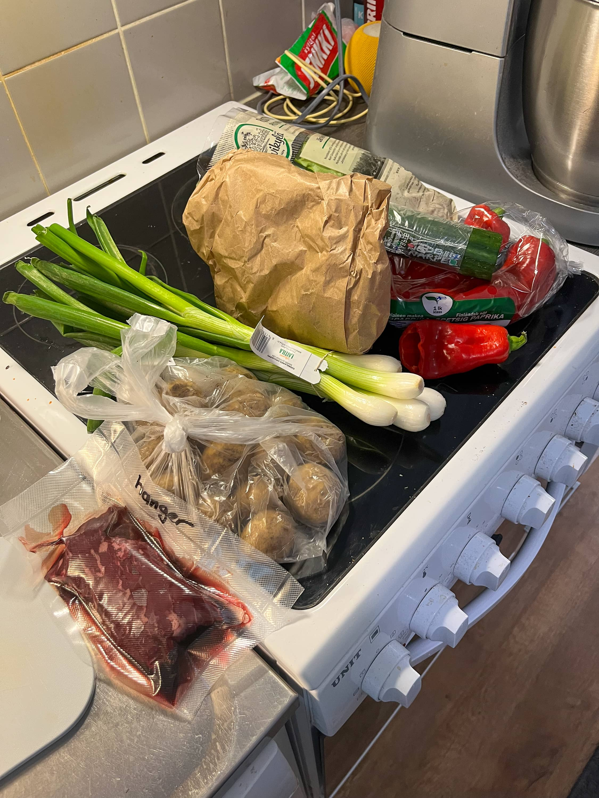
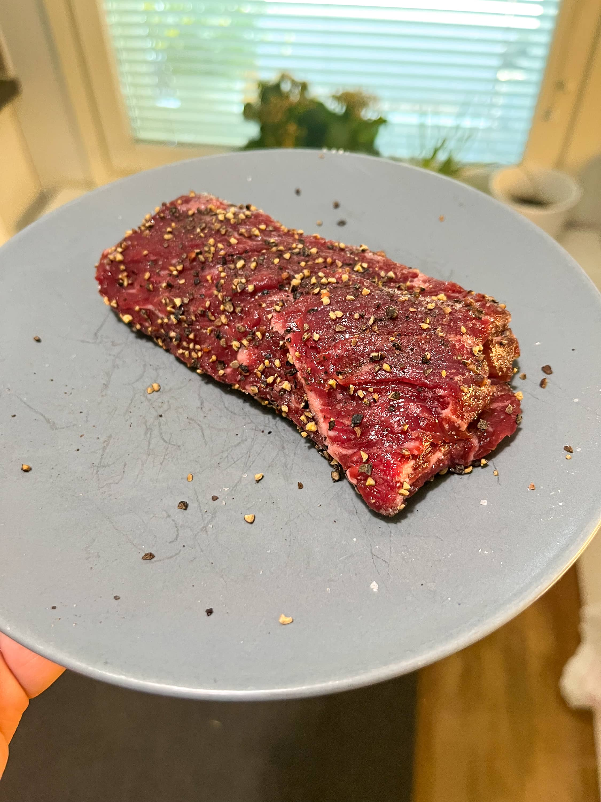
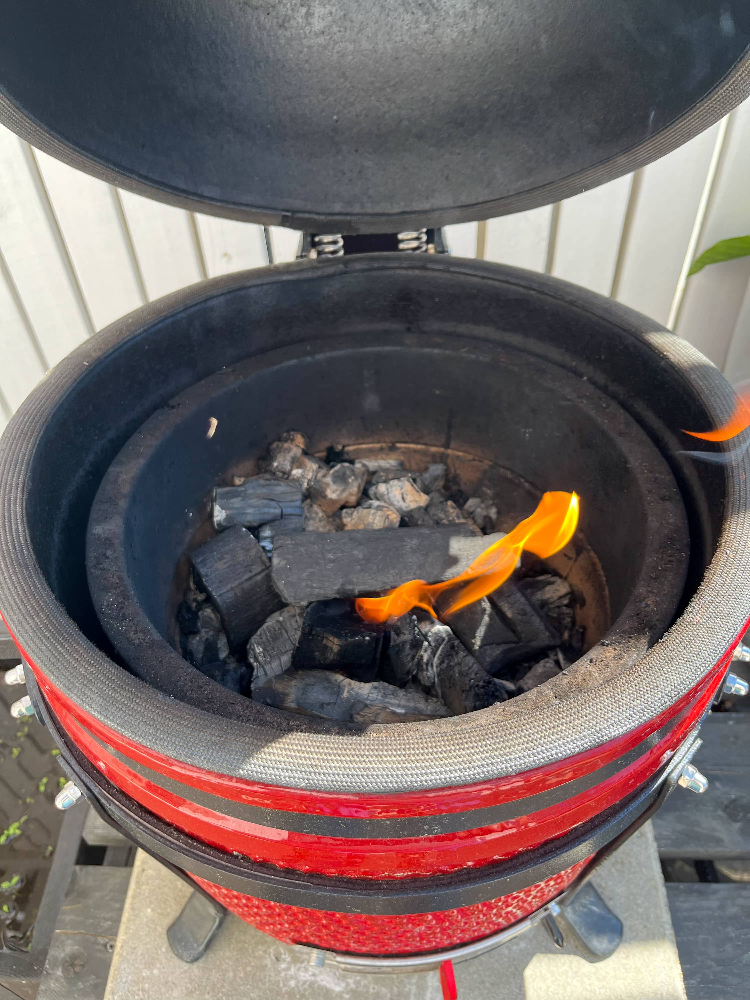
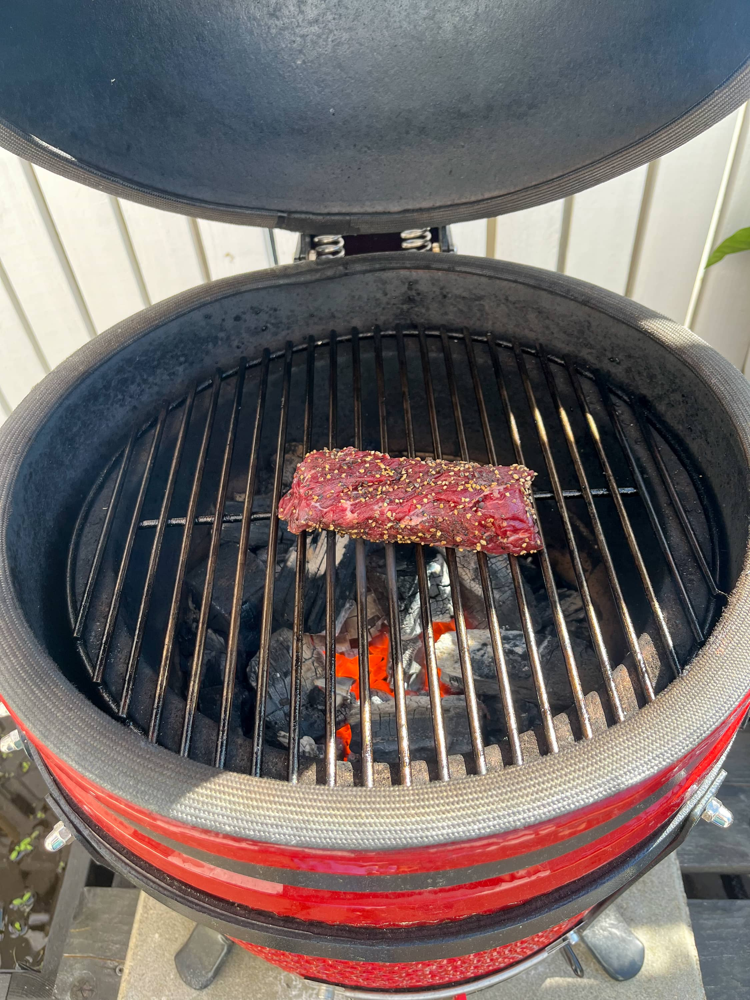
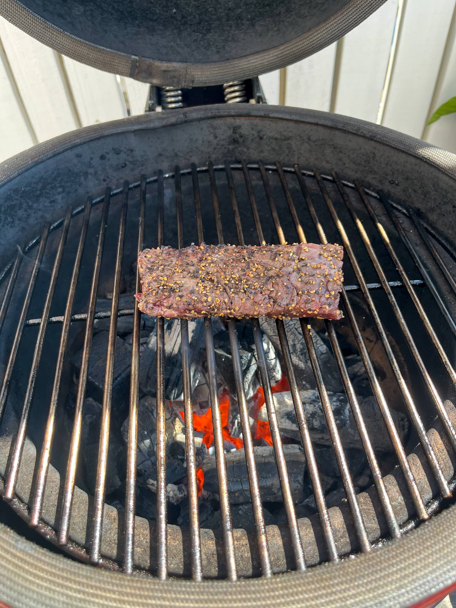
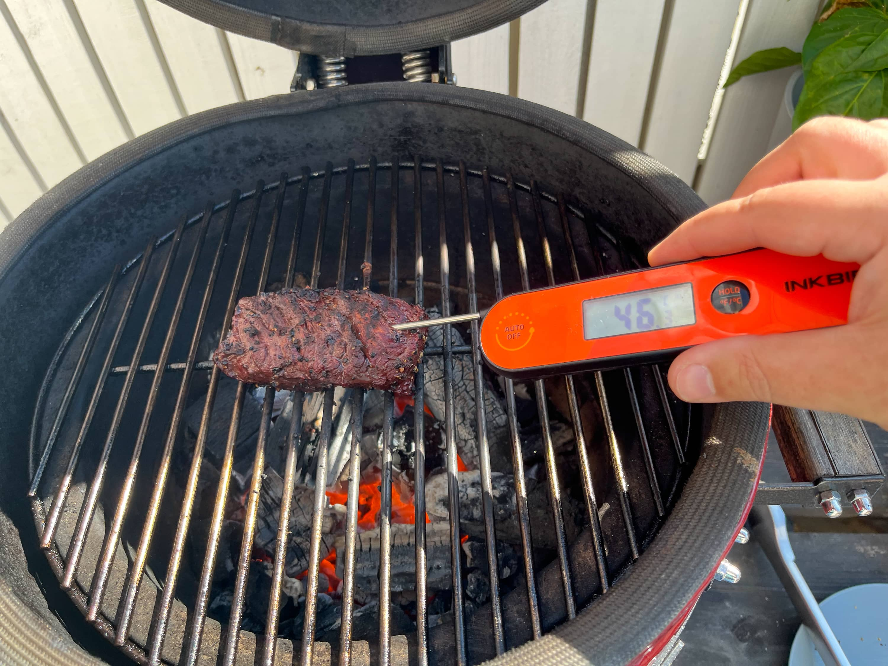
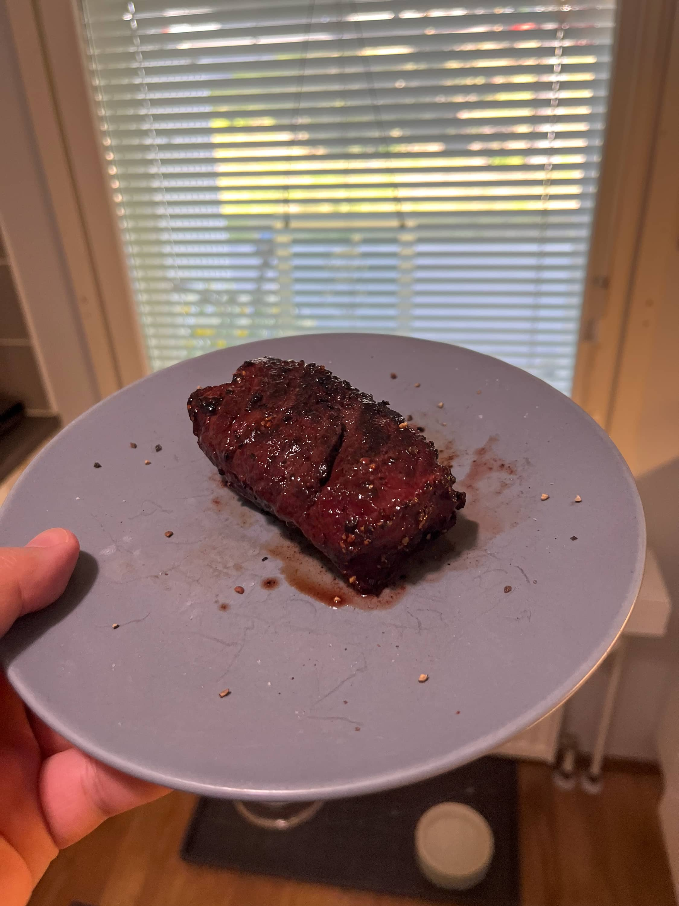
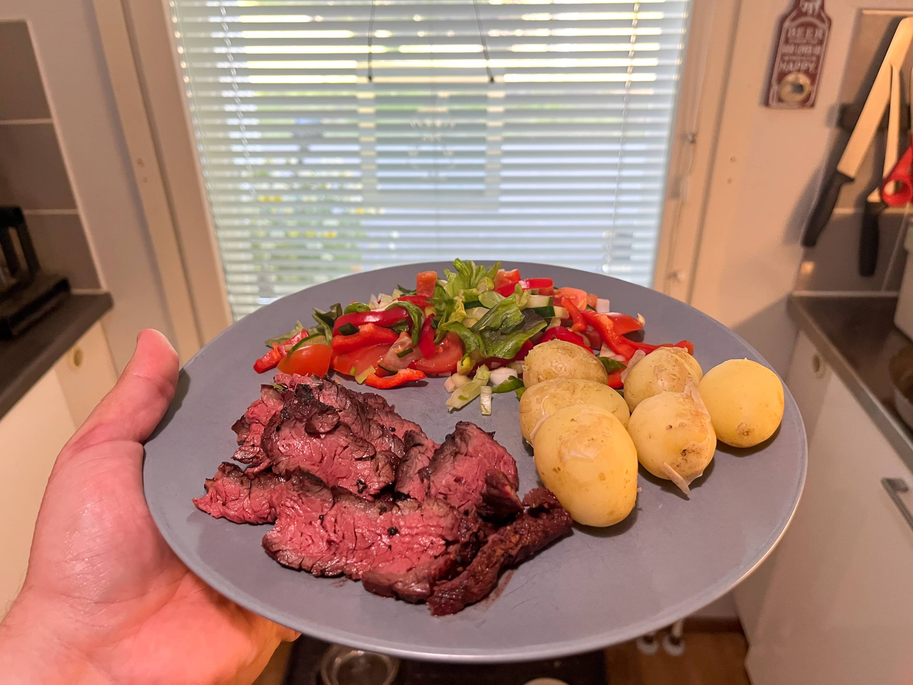

Tuli tosiaan aiemmin tilattua hanger steakkia [Atrian lihakaupasta](/kokeilussa-atrian-lihakauppa/) ja nyt tuli sitten ajatus tehdä itselle hieman evästä siitä.

Ajatus lähti oikeastaan siitä, kun eräänä perjantaina kaupasta tarttui mukaan tarjouksesta uusia pottuja (harmillisesti ruotsalaisia) sekä kevät sipulia. Siinähän on siis lauantaille hyvä eväs, kun ottaa kaveriksi palan hanger steakkia pakkasesta.

Ensin tein salaatin ja sitten pesin potut ja laitoin ne kiehumaan. Sitten olikin aika pistää kamadoon tulia ja ajatus oli tosiaan tehdä kuumalla tämä hangeri ja käännellä sitä aika ajoin. Tavoitteena oli sisälämpöön 52 astetta ja tässä touhussa on tuommoinen tökättävä lämpömittari tosi hyvä.

Sitten, kun oli lihaan saatu sopiva lämpö niin liha hetkeksi lepäämään (vaikein vaihe). Tässä välissä potut olikin käytännössä valmiita ja ei tarvinnut, kun heitellä kaikki lautaselle odottelemaan hangeria.

Lopullinen setti näyttää sitten tältä. Ruotsalaisia uusia perunoita, salaattia sekä hanger steakkia. Oishan tuohon voinut, jonkun soosinkin tehdä, mutta hyvin meni noinkin. Uudet potut sai hieman voita kaveriksi ja salaatti jääkaapista löytynyttä kastiketta. Jos olisi halunnut hifistellä niin lihalle olisi joku punaviini soosi voinut sopia, mutta kyllä toi liha menee tommoisenaan varsin hyvin. Ei ollut kuivaa ja on kyllä hyvä leikkuu.

Hanger steak muuten tunnetaan toiselta nimeltään ns. butcher's steakkina. Tämä on ollut semmoinen pala minkä on teurastaja aikoinaan ottanut itselleen. Enkä ihmettele yhtään. Suosittelen kyllä kokeilemaan!
