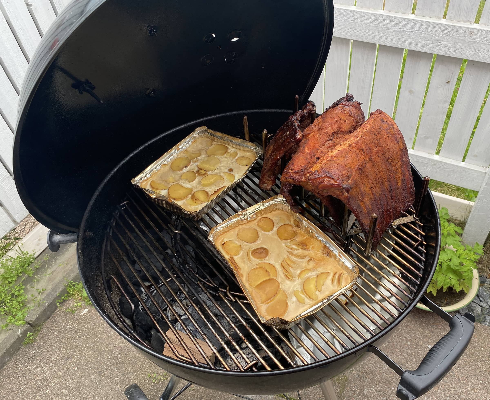

Jatketaan "Ikea hackeilla". Tällä kertaa kohteena on ribsit eli grillikyljet. Ikeasta saatava kattilankansiteline ei millään muotoa ole tarkoitettu tähän tarkoitukseen, mutta toimii kerrassaan mainiosti.

Hae siis Ikeasta [Variera](https://www.ikea.com/fi/fi/p/variera-kattilankansiteline-ruostumaton-teraes-70154800/) niminen kattilankansiteline hintaan 5,99€ ja ala grillaamaan ribsejä! Ei muuten kannata niitä kumisia osia laittaa paikalleen. Ne palanee kivasti grillissä.

Ribsit voi asetella vaikka ylläolevan kuvan mukaisesti telineeseen tai miten itse tykkääkään. Ribsit voi paistaa telineissä aivan kuten muutenkin ja itsellä ne oli tosiaan epäsuoralla tulella savustumassa hyvän tovin ennen kuin käärin ne folioon. Ohjeita ja tapoja on tähänkin melkein yhtä monta, kuin tekijää ja niitä on Facebook ja Internet pullollaan.

Kuvassa on muuten kermaperunat savustumassa samalla kertaa ja näistäkin tuli oikein suun myötäisiä. Kannattaa kokeilla! Ohjetta tulenee tulevaisuudessa, kunhan otan uusinnan.

Verrokkina muuten noi ns. oikeat telineet ribseille maksaa hieman enemmän, kuin tuo Ikean teline joka on toimivaksi havaittu.

Laita kommentteihin oma resepti ribseihin!
