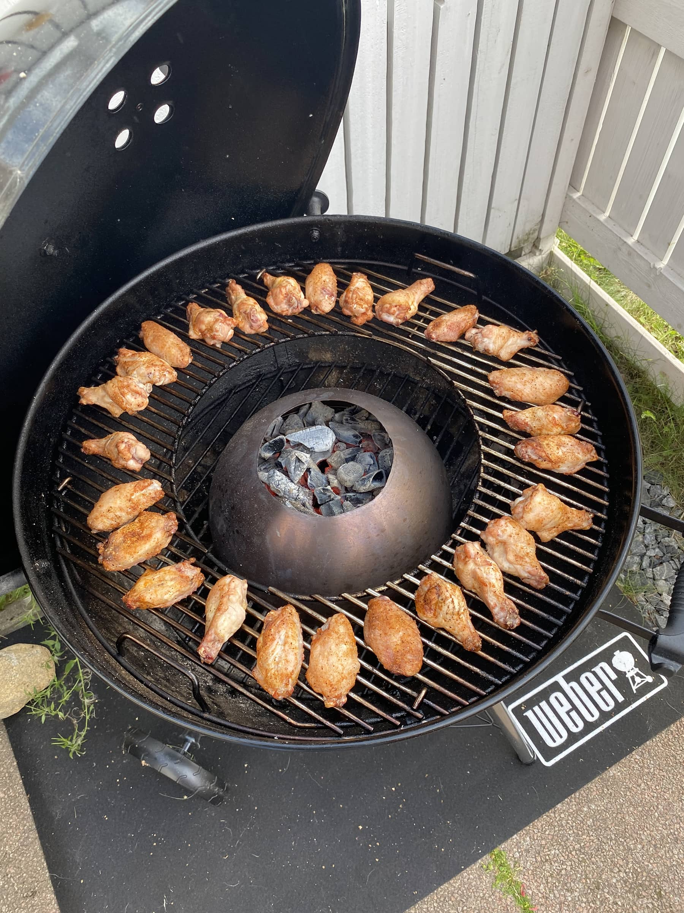
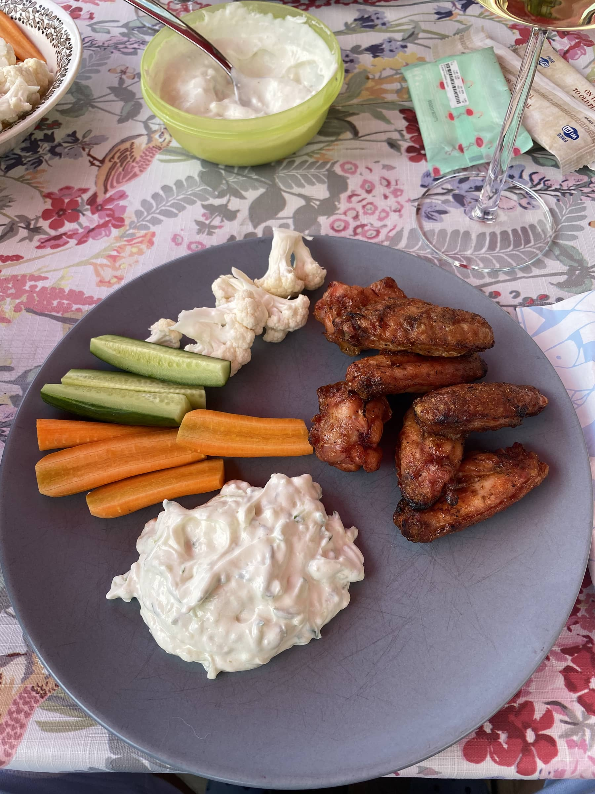

Aloitetaan ensin kertomalla hieman mikä vortex oikein on. Tämähän on suht monikäyttöinen lisävaruste tarkoitettu nimenomaan Weber 57cm grilliin sekä tietysti kaikkiin muihinkin vastaavankokoisiin grilleihin.

Vortexin ajatus on nimenomaan keskittää hiilien tuottama lämpö yhteen paikkaan ja näin ollen se tulee vortexin yläosasta suoraan ylöspäin. Tämä tekee lämmöstä todellä lämpimän (jopa 300+ astetta). Lämmön on ajatus jakautua pallogrillin kuvusta reunoille. Tämän takia ruoka asetellaankin keskelle. Alta näettekin hieman millainen setup tämä on, kun grillataan wingsejä.

Sitten siihen miten tommoinen vitosen vortex oikein tehdään.

1. Mene Ikeaan ostamaan Blanda blank 28cm teräskulho: [https://www.ikea.com/fi/fi/p/blanda-blank-tarjoilukulho-ruostumaton-teraes-50057254/](https://www.ikea.com/fi/fi/p/blanda-blank-tarjoilukulho-ruostumaton-teraes-50057254/)
2. Tee kulhoon keskelle halkaisijaltaan 14cm reikä (kiitos Pasi!) - eikä tartte olla ihan niin justiinsa
3. Homma on oikeastaan selvä kulhon osalta

Otetaan tähän vielä kuvan wingsien resepti:

1. Kuivaa wingsit talouspaperilla
2. Mausta wingist haluamallasi tavalla - itse käytin Poppamiehen All in one rubia
3. Jätä odottelemaan grilliä
4. Piippusytyttimellä tai omalla tavalla hiilet kuumaksi vortexiin, joka on keskellä grilliä kuten em. kuvassa.
5. Odottele hetki, että on lämpöä (kansi kiinni siis)
6. Sitten pistä wingsit grilliin reunoille
7. Anna grillaantua 20 minuuttia  
Itsellä oli lämmöt about 250 asteessa pallon oman mittarin mukaan
8. Wingsejä ei tartte muuten käännellä ja 20 minuutin jälkeen itse glaseerasin vielä wingsit soosilla ja annoin olla viitisen minuuttia
9. Syömään

Eli aika helppo ja nopea grillaus. Itse vedin wingsit napaan tsatsikin ja vihannesten kera.

Tämä on ehkä edullisin lisäosa mitä olen omaan pallogrilliin hankkinut. Voin kyllä suositella kaikille joilla on vastaava pallogrilli.

Vortexiahan voi käyttää myös esim. toisin päin jolloin saat kuuman alueen keskelle tai sitten erottamaan hiilet keskialueelta. Tietty voit grillailla muutakin, kuin wingsejä tällä. Itselle pääasiallinen käyttötarkoitus on nimenomaan wingsit ja tämänkaltainen eväs muutenkin. Kokeiluun on tulossa myös ikään kuin luuttomat "wingsit".

Meinasi jo unohtua. Alkuperäisen idean tähän sain [Lähiöfaijat grillaa](https://www.instagram.com/lahiofaijat/) Facebook sivulta. Eli kiitos vain heidän suuntaan!

Joko aloit suunnittelemaan Ikean reissua?
