Tämä on ollut mun "grillauslistalla" jo pidemmän aikaa. Nyt tuli se aika, kun laitettiin kanagyros valmistumaan. Tämän päädyin itse tekemään kamadossa epäsuoralla ja tälleen spoilerina: siitä tuli hyvä.

Tämä on Poppamiehen [sivuilta](https://www.poppamies.fi/kanagyros-tsatsikilla/) versioitu. Eli omaa keksintöä tämä ei taas ole, mutta kaikkihan on jo oikeastaan keksitty.

Tähän itse nappasin 1,2 kiloa kanan paistileikettä, n. 4dl kreikkalaista jugurttia ja rubia mitä nyt sattui löytymään ja vaikutti sisällöltään sopivalta. Paistileike on tähän sopiva, koska siinä on hitusen rasvaakin matkassa.

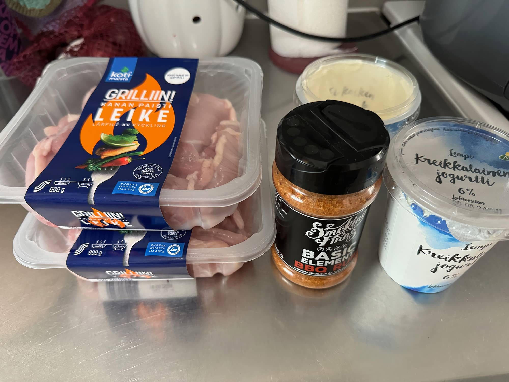

Kuivasin kanan leikkeet ja sekoitin rubia niihin ja sit sekoitin vielä kreikkalaisen jugurtin sekaan. Sen jälkeen heitin jääkaappiin maustumaan pariksi tunniksi.

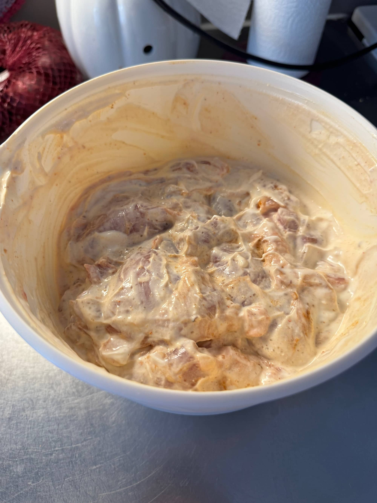

Sit meni kokeiluun Sunset Charcoalin Coffee hiilet ja olihan noi aikamoisia murkuloita. Hyvää hiiltä kamadoon kyllä.


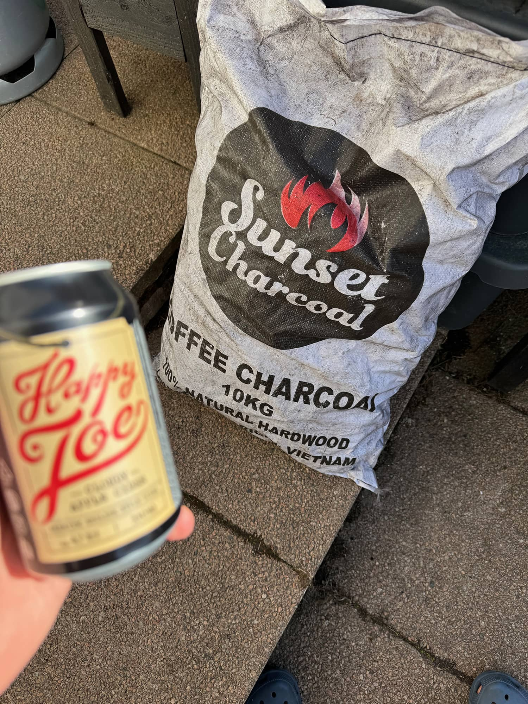
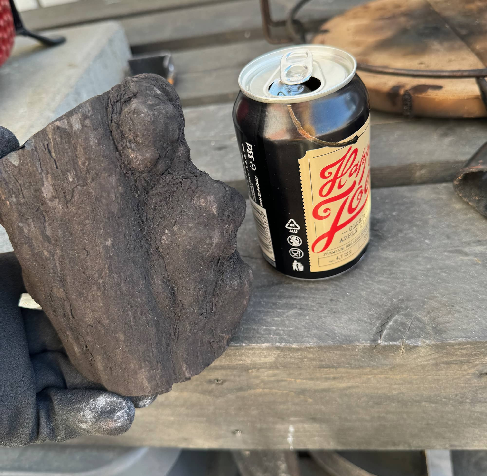
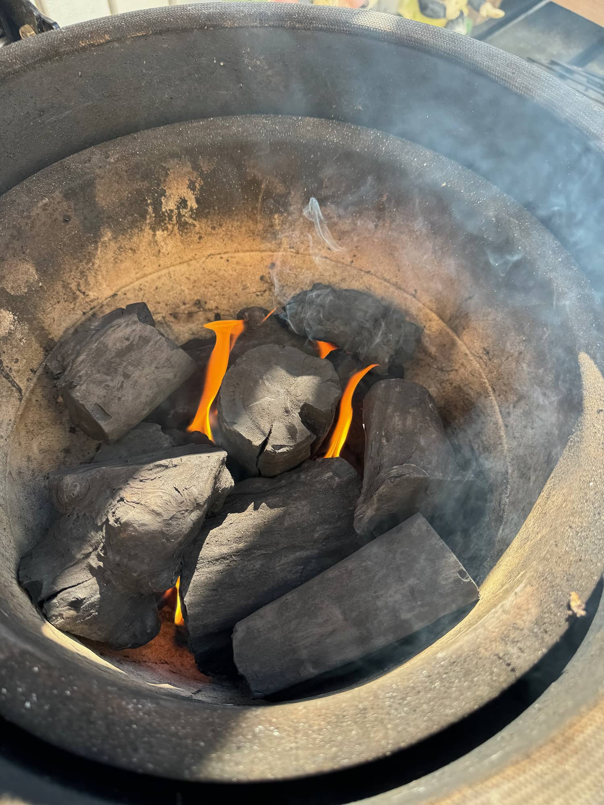


Kamado kun alkoi lämmetä 170 astetta kohti niin länttäsin kanat folioastian päälle vartaisiin. Tässä kantsii olla puuvartaita tai sit sopivia metallisia. Noh, tarina kertoo, että mun puuvartaat joita luulin olevan kaapissa meni askarteluun. Eipä siinä, huonot metallivartaat sai pientä lyhennystä ja taivuttelua, että mahtui tohon [Bono Minimoon](/testissa-bono-minimo-kamado/).

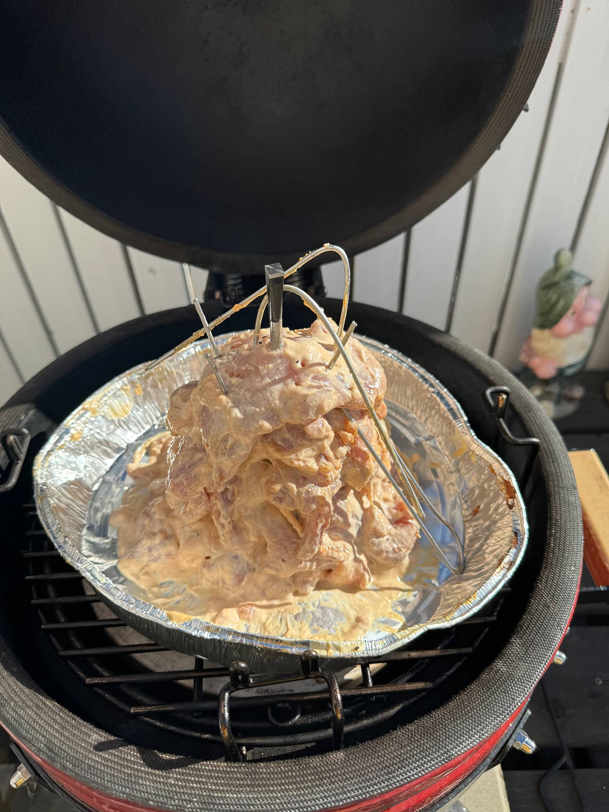

Mulla oli [Meater](/meater-ensimmainen-kokeilu/) kiinni tässä tornissa ja tavoitteena 75 astetta. Piti sitä silti käydä kurkkimassa tuolla kamadon sisällä... Valmiiksi tosiaan totesin tämän sen jälkeen, kun Meater ja mun tökittävä mittari näytti joka kohtaa sen 75 astetta tai enemmän. Siis näyttäähän tää ihan tosi hyvältä... Tämä otti aikaa 160-190 lämmöissä parisen tuntia.


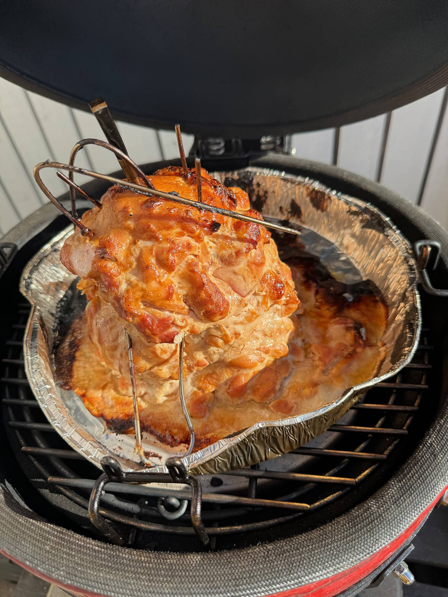
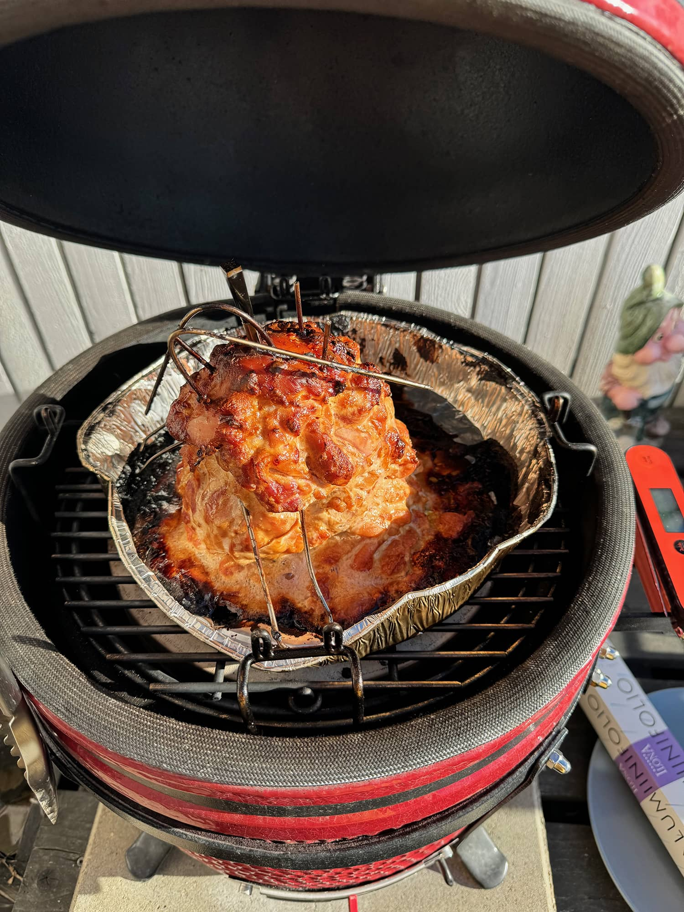


Ettei nyt pelkkää kanaa ole niin tehtiin lisukkeeksi kesäkurpitsaa ja parsaa sekä kasvissyöjälle tofua vielä. Nämä tuli tuossa pallossa kivasti samaan aikaan niin saatiin kaikki mukavasti yhtäaikaa.

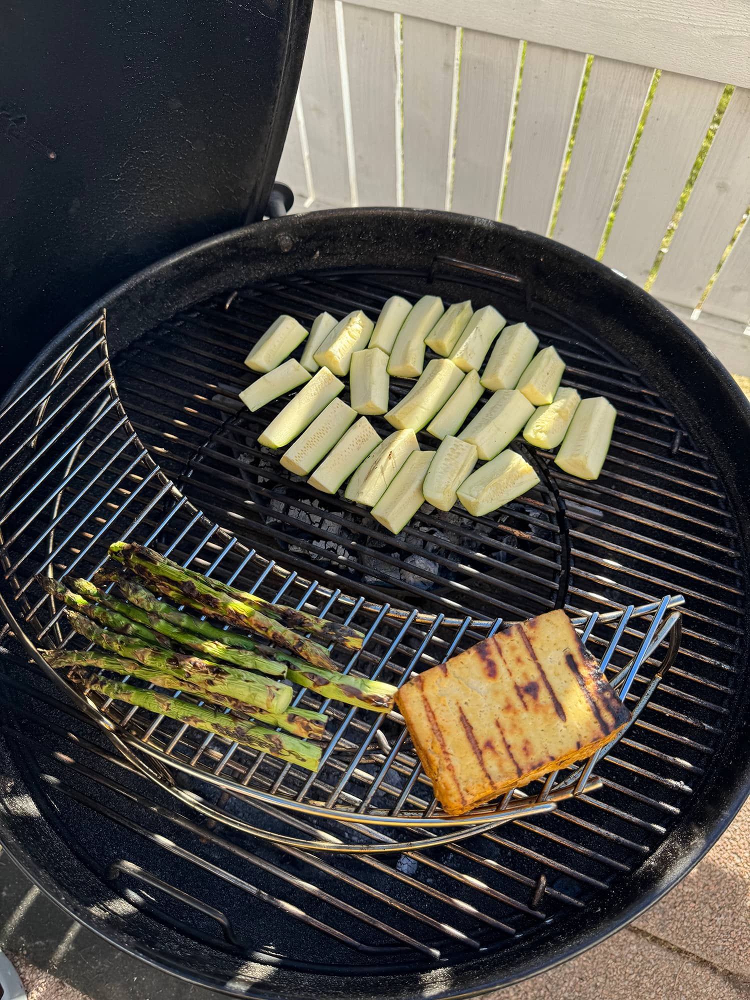

Sit pistetään kanagyros leikaten ja onhan toi nyt hyvännäköistä evästä... Tämä käy ihan tämmöisenään tai sit pitaan, tortillaan tai ihan mihin vaan... Itse seuraavana päivänä vedin kanasalaattia.

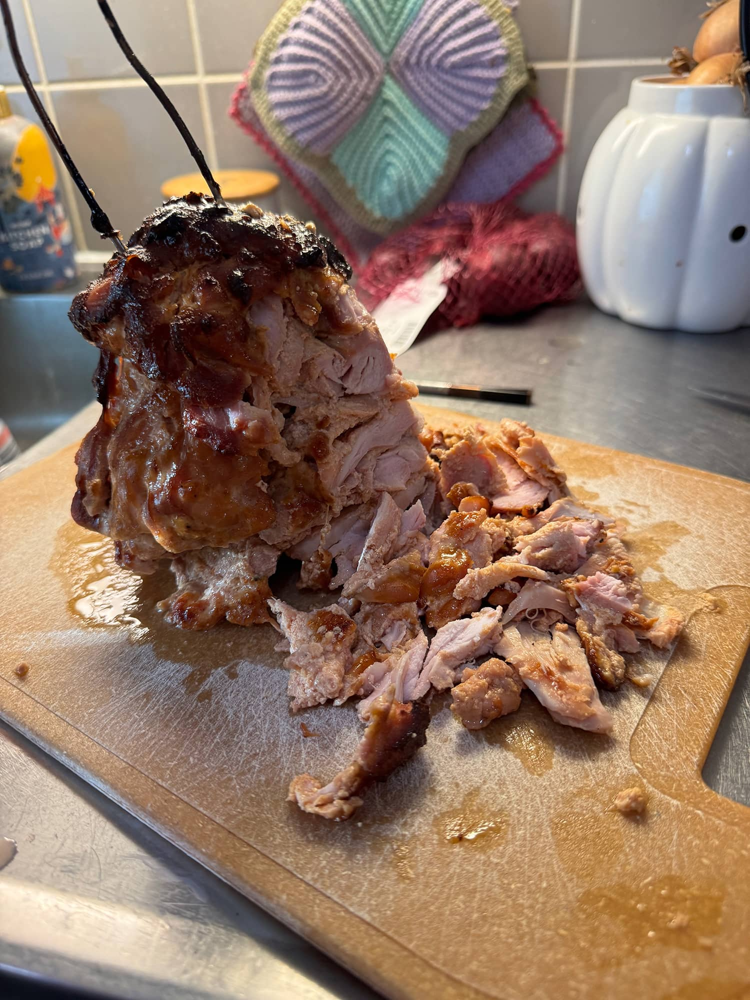

Meillä oli sit kanan kaverina em. kasviksia, vihreää salaattia leipäjuustolla sekä vesimelonilla, perunasalaattia sekä sooseja ja viiniä.

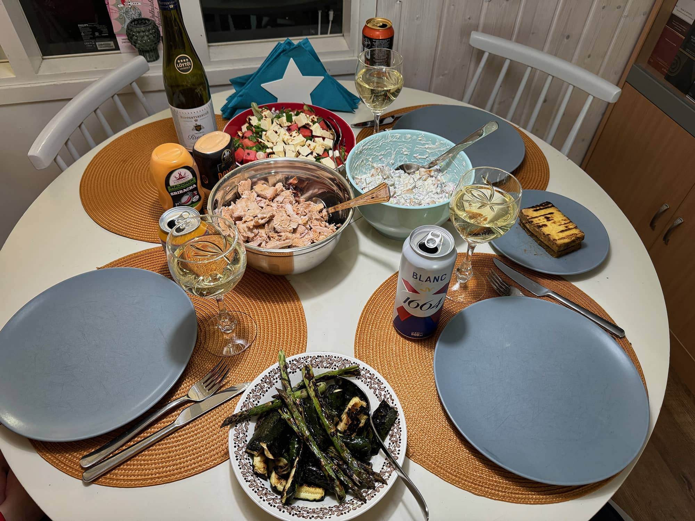

Tämä meni heittämällä jatkoon ja tulen tekemään uudemman kerran. Kanaahan tein tosiaan kerralla tuon 1.2 kiloa sillä ajatus on syödä sitä tässä viikolla

Tässä haaveilen isommasta kamadosta ja siihen varraslisäosasta ni vois saada aika kovan setin myös kun siitä vuolisi pinnasta... Tämä setti kyllä menisi vartaissakin oikein hyvin. Jos ei ole ennen paistileikettä tehnyt niin iso suositus.
