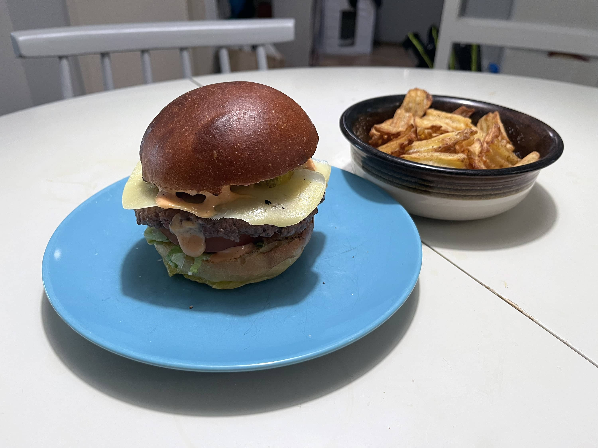

Jotta blogiin saadaan elämää ja ei ole niin pirun vähän postauksia niin otetaan tämmöinen enemmän blogimainen postaus. Eli tässä on koosteena vähän mitä on tullut tehtyä parin viikon aikana grillissä.

## Kermaperunat ja Petite tender

Oon [tehnyt aiemminkin petite tenderiä](/tehdaan-ensimmaista-kertaa-petite-tender/) ja on yksi mun lempilihoista, jossa hinta kohtaa laadun ja oi sitä onnen päivää, kun se löytyy -30% lapulla.

Ensin kuitenkin pistetään kermaperunat kamadoon. Tästä tuli muuten ihan törkeän hyvät potut kun hiilistä tulee kuitenkin hieman sitä makua tuohonkin.

Kamado Bono minimoon meni mukavasti 3 pientä vuokaa kermaperunoita.

- Ensin kamado lämpenemään ja tavoite lämpötila olisi siinä 180 asteessa ja epäsuoralla mennään
- Potut viipaleiksi ja astiaan kermaa sekä mausteita ja jos haluat niin juustoa tai valkosipulia kaveriksi sinne.
- Astia(t) sitten kamadoon ja anna olla siellä niin kauan kuin on kypsää. Meni 1.5-2 tuntia.

Petite tender onkin tuttua. Tehdään siis reverse sear metodilla ja tämä tulee äkkiä.





- Mausteeksi suola ja pippuri pintaan
- Petite tender grilliin 120-150 asteeseen
- Odottele että on sisälämpö siinä 48 asteen tienoilla ja ota pois
- Sit grilli kuumaksi ja hitusen pintaa (ei tosiaan tartte paljon)
- Anna levätä hetken ja sit paloiksi ja pikku kärkisuola halutessaan

Sitten kun yhdistää kermaperunat ja petite tenderin niin on siinä valmis annos ja voi kuule kun oli hyvää. Salaattia hieman kylkeen niin avot.

## Putsaillaan grillejä ja paistetaan makkaraa

Hieman kerkesi lumet sulaa lisää edellisestä grillailusta niin päästiin kivasti putsaamaan grillit paremmin. Kamadosta putsailin sisukset ihan kunnolla ja otin sisälmykset pois ja tuhkat veks. Loppu putsautuu, kunhan sitä lämmittelee kunnolla.

Pallosta sama homma ja enimmät möhnät mitä oli pohjalla pois samaten. Pallon laitoinkin sit ihan kunnolla lämpiämään ja eihän sitä hiiltä voinut tuhlata niin laitetaan vielä sitten makkaraa tulille.





On muuten grillin putsailu mukavan vähätöistä, kun on ollut käytössä käytännössä koko talven ja tullut harjattua ritilät ennen ja grillauksen jälkeen. Toki voisi aina pallokin kiiltää, mutta nämähän on käyttövekottimia. Ei ole mennyt pallo tai kamado miksikään vaikka on kesät/talvet ollut tuossa terassilla säiden armoilla.

## Hampurilaisia

Pääsiäisen aikaan sunnuntai aamuna tuli pyyntö ette burgereita. No mulla oli vähän samoja mietteitä ollut myös ja pitihän se alkaa sit itse tekemään sämpylät. Ohjeena oli [Resepti-kanavan Mikon sämpylät](https://youtu.be/7vsr1Zgfx7U), jotka on ilmeisesti hokkaidon maitosämpylät nimellä (tai vastaava).

Tulen jatkossakin tekemään tällä ohjeella burgeri sämpylöitä. Hieman olisi voinut aiemmin ottaa pois uunista ja en tiedä, jos olisi hieman painanut ennen vikaa kohoa tai uuniin menoa alaspäin niin olisiko tullut hieman matalammat sämpylät. Pitää kokeilla ensi kerralla.





Weberin viisseiska pääsi töihin ja pistetään burgeria tulille. Sämpylöille eka hieman väriä ja sit kasvispihviä ja ihan perus suola/pippuri kombon naudan burgerjauhelihasta tehtyä pihviä grilliin. Toi viime vuonna hankittu "hylly" on muuten tosi näppärä niin saa pois suoralta lämmöltä ja tuonne hyllylle lämpiämään.

Sitten alla on parilta eri päivältä burgerit, joissa on about samat täytteet: salaatti, tomaatti, suolakurkku, juusto, burgerkastike. Burgerkastikkeen tein vähän heittämällä: majoneesin jämät, ketsuppia, sinappia, wings kastiketta, suolaa ja pippuria (sekä hieman sipulijauhetta).

Bataattiranet tuli airfryeristä ja samoin toisen kuvan pakasteranet. On muuten näppärä vekotin noihin hommiin...





## Lopuksi

Tämmöistä tällä kertaa. Tuossa nyt oli kuvatut grillailut tuolta välin ja lisää on tulossa vielä. Mitäs pidit tämmiösestä blogijutusta vaihteeksi?

Isommista grillailuista ja muista vekottimista tulen kyllä kirjoittamaan omia juttuja jatkossakin, mutta tässä oli jokunen ns. perusgrillaus niin oli kiva koota. Näitähän tulee instaan sillon, kun muistan päivittää sinne: [https://www.instagram.com/bbqblogi/](https://www.instagram.com/bbqblogi/)

**_Mitäs sinä olet grillannut?_**
