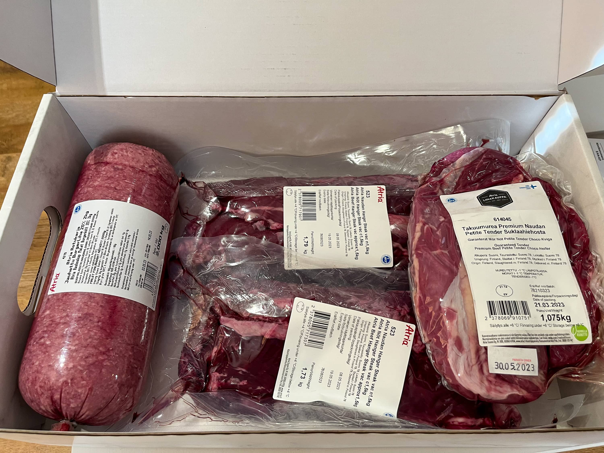
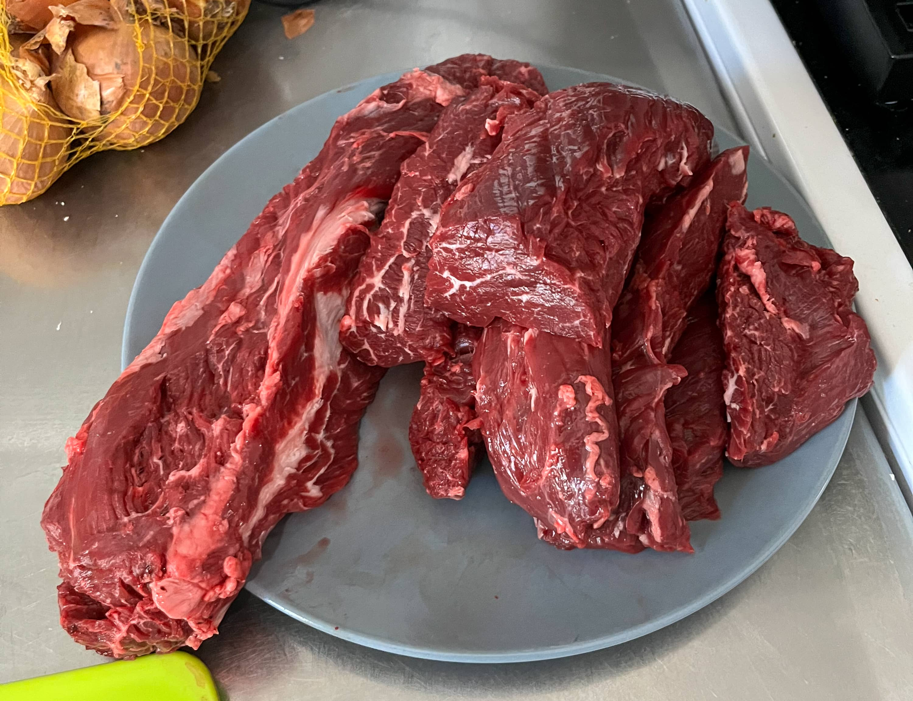
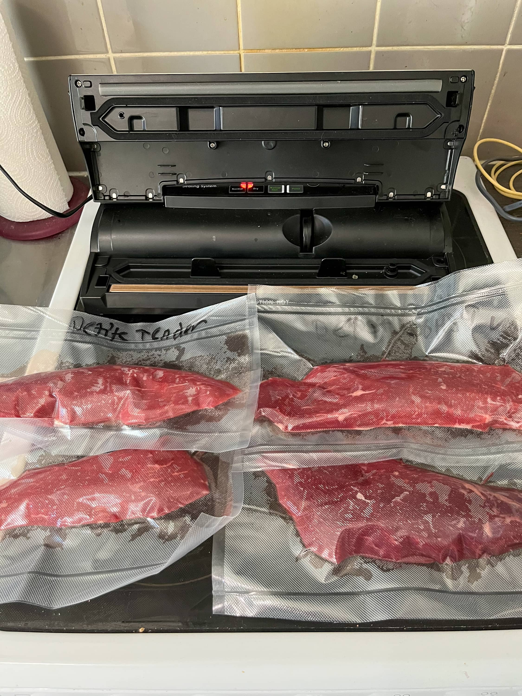
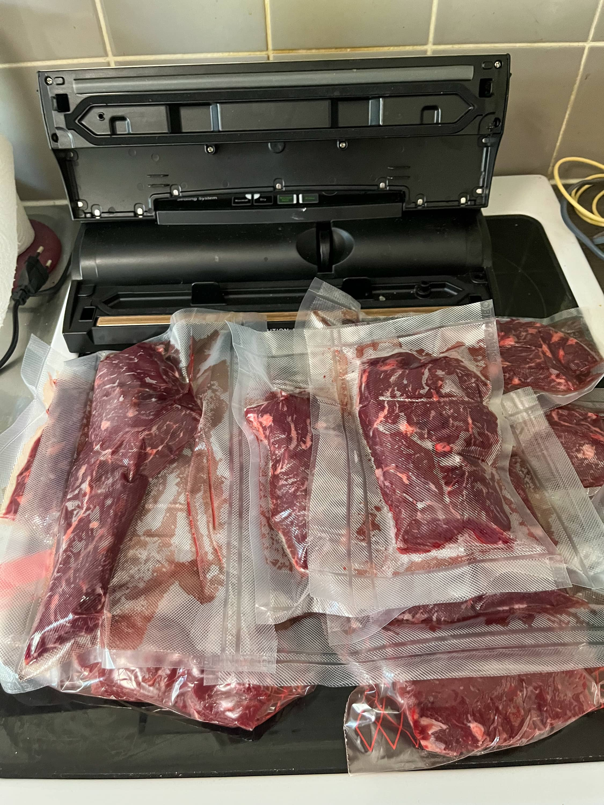

Mietin tätä jo viime vuonna, mutta tuli tuossa aiemmin keväällä testattua Atrian lihakauppaa. Täältä nimittäin saa Atrian lihaa suoraan kotiin toimitettuna ja jos tilaa tarpeeksi isolla summalla niin saa vielä ilmaiset postikulut.

Täällähän on hyvä kattaus tuotteita niin grilliin, kuin pannullekin. Sieltä löytyy mm. briskettia, naudan poskia, erilaisia leikkuita nautaa muutenkin sekä tietty myös eri possun leikkuita.

Itsellä meni tilaukseen Burger jauhelihaa (2kg), Petite Tender suklaahiehosta (n. 1kg) ja 2 x Naudan Hanger Steak (n. 1.5kg). Tämä oli minusta sopiva tilaus näin ekaksi kerraksi ja tuossa oli itselle hyvä setti sillä burgereita tulee tehtyä ja tuota on kiva olla pakkasessa. Petite tender on yksi lempi lihoistani ja hanger steakkia olenkin halunnut koittaa.

Tämähän tuli kotiin asti suoraan ja kylmäkuljetuksena. Homma pelasi näiltä osin tosi hyvin ja tuli sovittuna aikana kotiin asti. Onhan se kiva kun tulee useampi kilo lihaa koti ovelle asti.

Atriallahan muuten homma toimii niin, että nuo määrät mitä tilaat on se määrä mitä minimissään saat. Kuvasta näkeekin, että minulla tuli pari reilu 1.7kg pakettia hangeria ja hieman yli kilo petiteä. Sain siis hangeria puolisen kiloa enemmän mistä ns. maksoin.

**Vinkki:** Huomasin sen, että toimitusaikaan vaikuttaa se mitä tilaat. Ensin meinasin tilata flank steakkia ja hanger steakkia, mutta jos korissa oli flank steak niin toimitus meni pidemmälle.

Kyllähän tuo hanger näytti tosi hyvältä, kun lihoja aloin työstämään. Hangerissahan menee tuossa välissä kova rusto (tjs. osa) joka on hyvä ottaa pois. Itse samalla siivoilin myös isoimmat kalvot yms. pois hangereista ja petiteistä. Burgerjauheliha meni myös pakkaseen sopivissa osissa.

Vakuumikone on muuten tosi hyvä tämmöisten lihojen kanssa, kun voit siivota lihat ja sitten sopivissa paloissa pistää vakuumiin ja pakkaseen. Pakkasesta on sitten helppo edellisenä päivänä ottaa jääkaappiin sulamaan ja pistää sit seuraavana päivänä grilliin tai pannulle.

Olen tosi tyytyväinen Atrian lihakaupan toimintaan ja en nyt tästä mitään moitteitakaan voi antaa - ainakaan tämän kokemuksen perusteella. Lihoista on maistettu burger jauhelihaa ja hanger steakkia. Molemmat on kyllä olleet joka pennin arvoiset. Petite tender on vielä kokeilematta, mutta kyllä se vielä grilliin pääsee.

Onhan tuo nyt kivaa kun voi pakkasesta ottaa laadukasta lihaa ja grillata se. Jos oikein "hätä" tulee niin voi pistää kuumaan vesihauteeseen ja odotella että hieman sulaa ja sitten pistää se grilliin. Kohta puoliin tuleekin kirjoitusta tuosta hanger steakista.

Oletko sinä tilaillut Atrian lihakaupasta lihoja? Jos olet niin mitä ja mitä olet tykännyt?

_Tämä kirjoitus **ei** ole sponsoroitu, mutta tässä on kuitenkin linkki lihakauppaan: [www.atria.fi/lihakauppa](https://www.atria.fi/lihakauppa/)_
