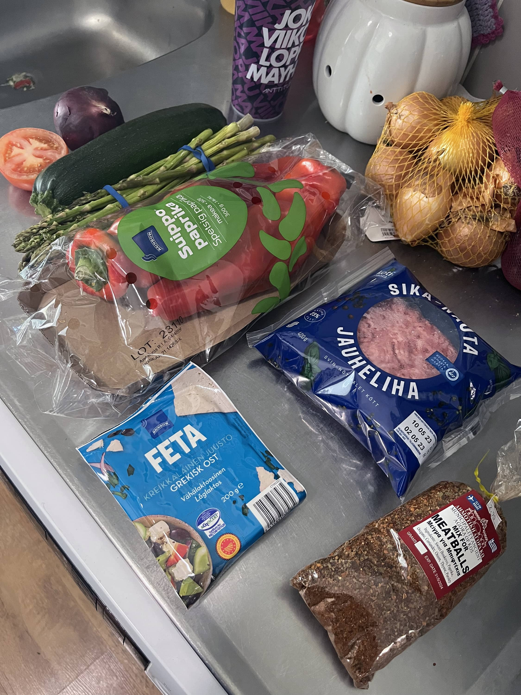
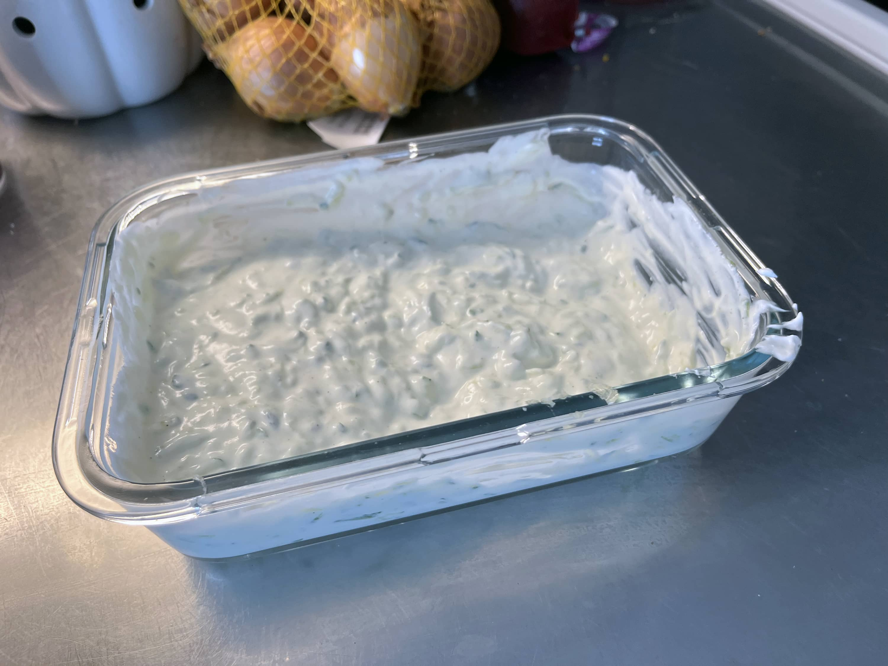
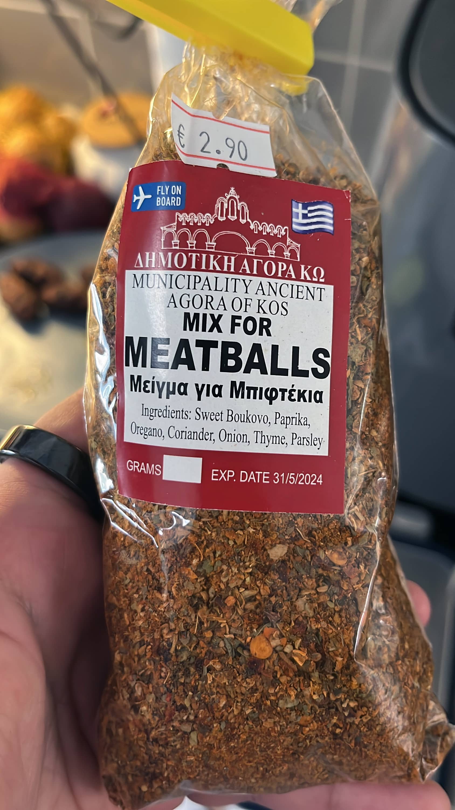
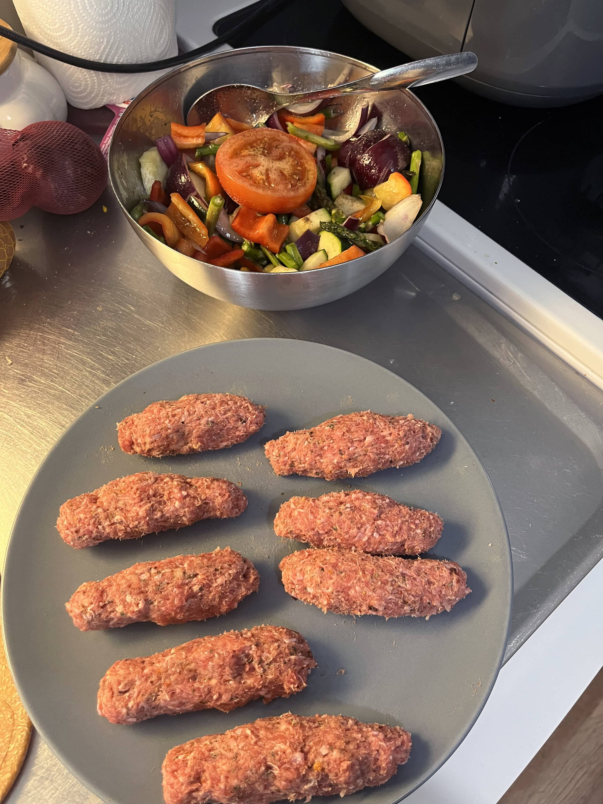
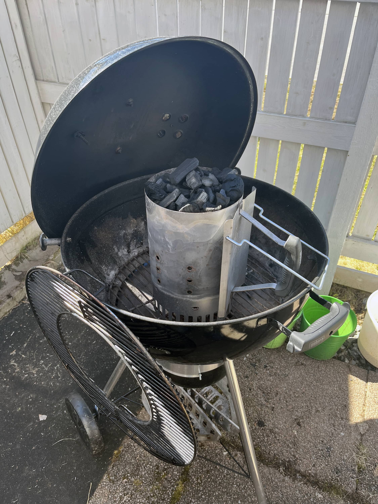
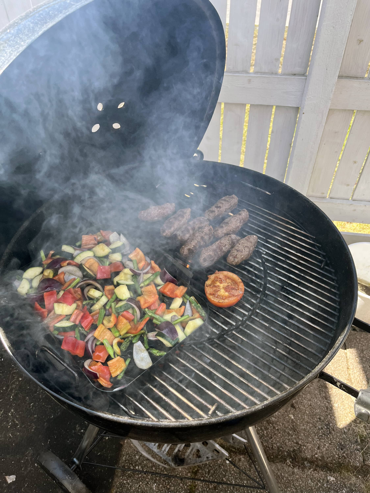
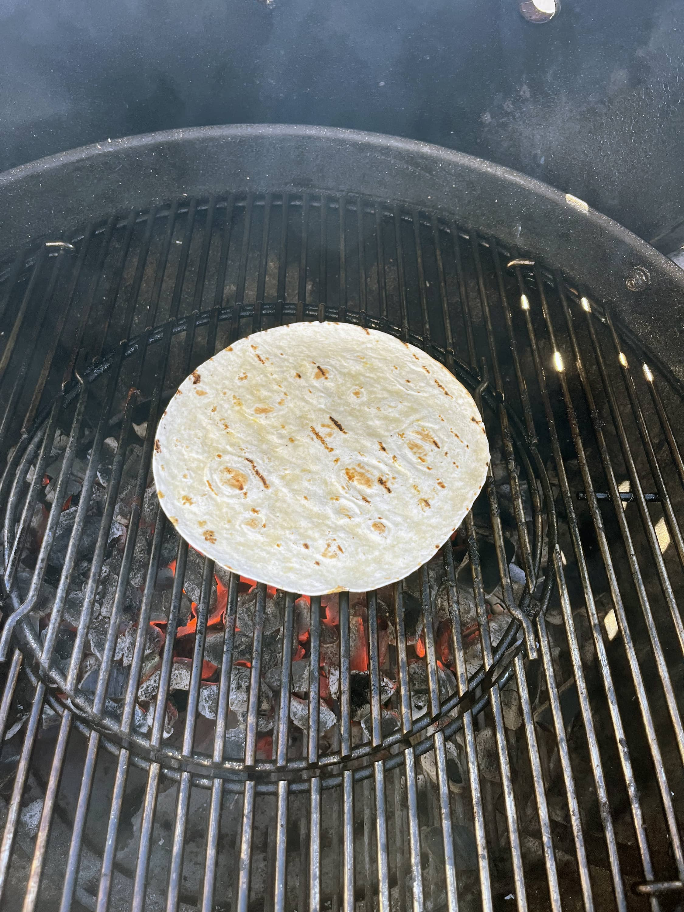
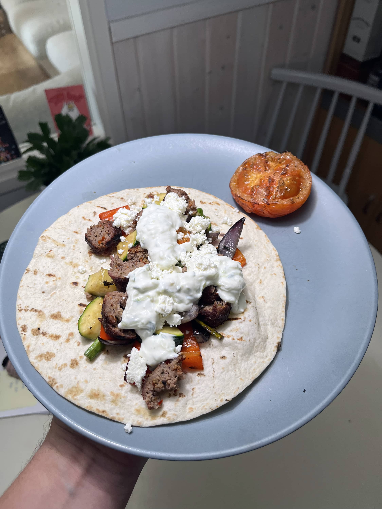

Tällä kertaa tehdään hieman kreikkalaistyylistä ruokaa. Ajatuksena oli tehdä jauhelihapötköjä kreikkalaisilla mausteilla. Siihen grillattuja kasviksia ja tsatsikia kaveriksi. Loppumetreillä tuli käärittyä ne tortillaan, mutta pita olisi ollut parempi.

## Tsatsiki

Tämähän on perinteinen kreikkalainen soosi ja yksi omista lemppareista. Nyt kun on löytynyt vielä takuuvarma reseptikin.

### Ainesosat

- 850g kreikkalaista jogurttia
- 320g raastettua kurkkua
- 2 tl (noin 15g) valkosipulinkynsiä
- 3 rl oliiviöljyä
- 1 tl punaviinietikkaa
- ⅔ tl suolaa
- mustapippuria (esim. myllystä)

### Ohje:

1. Kaada kreikkalainen jogurtti kulhoon ja sekoita se sileäksi niin ettei ole möykkyjä
2. Raasta kurkku ja purista siitä nesteet pois. Lisää ne kulhoon ja sekoita jogurtin kanssa.
3. Lisää loput ainesosat kulhoon ja sekoita.

Tsatsiki kannattaa tehdä esim. aamulla tekeytymään tai vielä parempi on edellisenä iltana. Itse tein hieman pienemmän määrän, kuin tuossa ja säädin sit sen mukaan.

Resepti löydetty: [Real Greek Recipes](https://realgreekrecipes.com/tzatziki-recipe/)

## Jauhelihapötköt ja kasvikset

Tähän ajatus lähti oikeastaan siitä, että muistin Kreikan matkoilta tuodun lihapulla maustemixin. Tässä on sitä Kreikan makua ja tämähän toimi hyvin. Siihen kaveriksi grillikasviksia.

Resepti on tähän simppeli eli suolaa ja mausteita pussista sekaan ja sekoitellaan jonkun aikaa. Sitten tehdään pötköjä.

Kasviksissa on myös simppeli resepti. Katsotaan mitä jääkaapista löytyy ja pistetään sopiviksi paloiksi kulhoon ja sitten öljyä, suolaa ja pippuria.

## Grillaus

Pistetään ensin pallo lämpimäksi ja nyt mennään hot&fast tyylillä. Työvälineenä on pallogrilli ja tietty piipulla kuumaksi.

Kun on saatu ns. pöhinää pönttöön niin pistetään kaikki grilliin. Itsellä oli kasviksille tommoinen grillikorin tyylinen systeemi jossa niitä oli helppo käännellä. Lämmitin vielä tortilloja grillissä kun oli muut valmiina.





## Syömään!

Huomasitte aiemmissa kuvissa fetan? Sen murustin, jotta sitä voi laittaa hieman lisäksi tuonne lätyn päälle. Tosiaan pita ois ollut tähän sopivampi, kuin tortilla, mutta tämmöistä oli nyt tällä kertaa.

Tässä oli kyllä sitä kreikka fiilistä mitä hainkin ja tuo maustesekoitus oli oikein hyvä tämmöiseen käyttöön. Tulen ihan varmasti uudestaan käyttämään.
