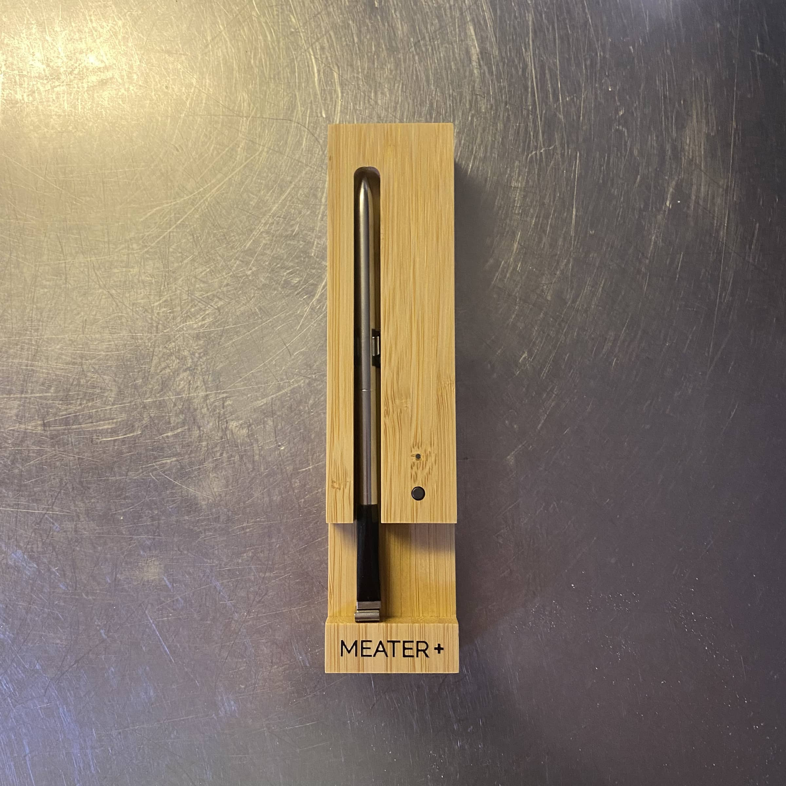
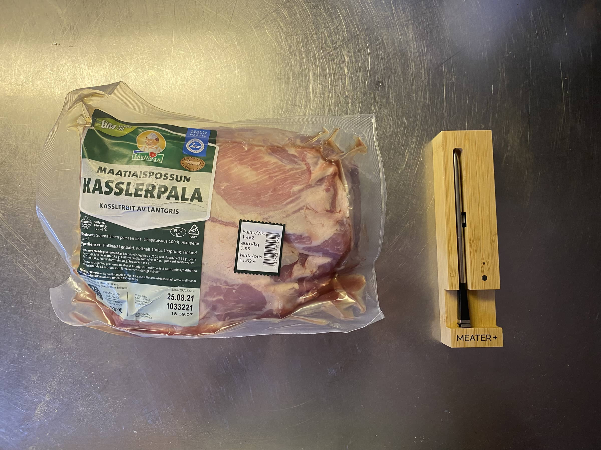
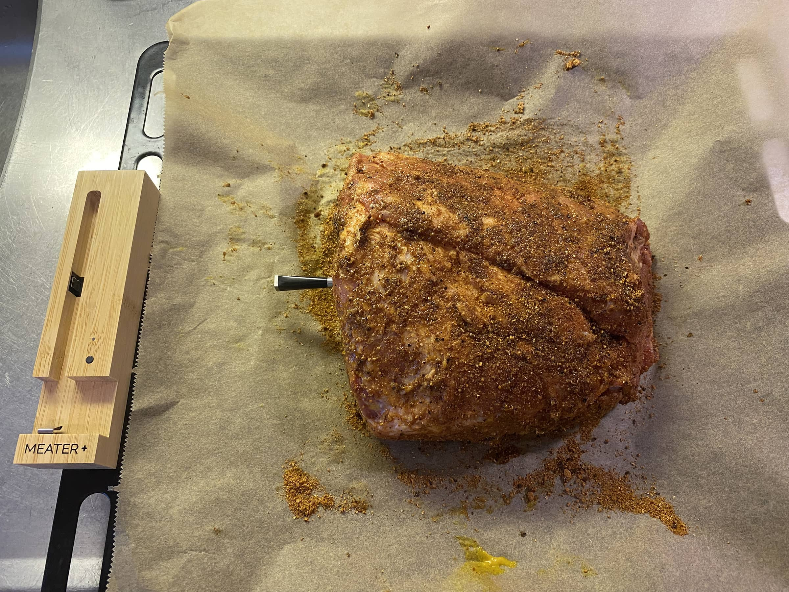
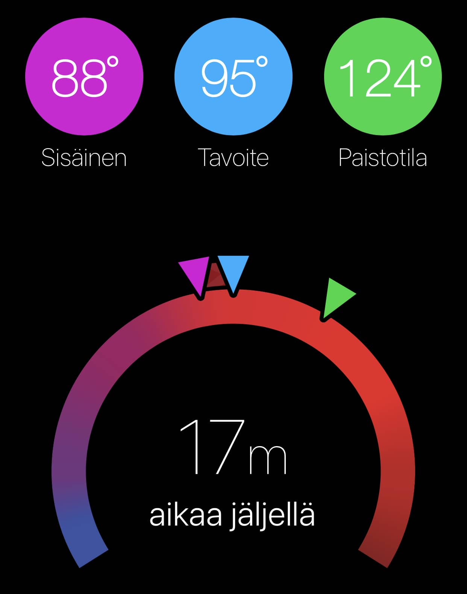
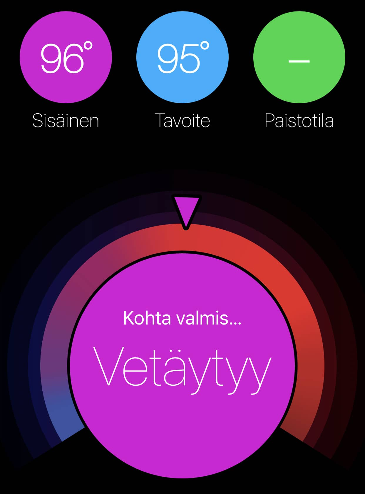
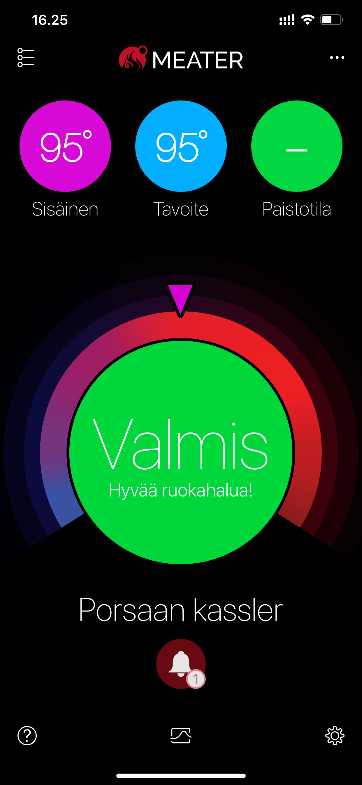
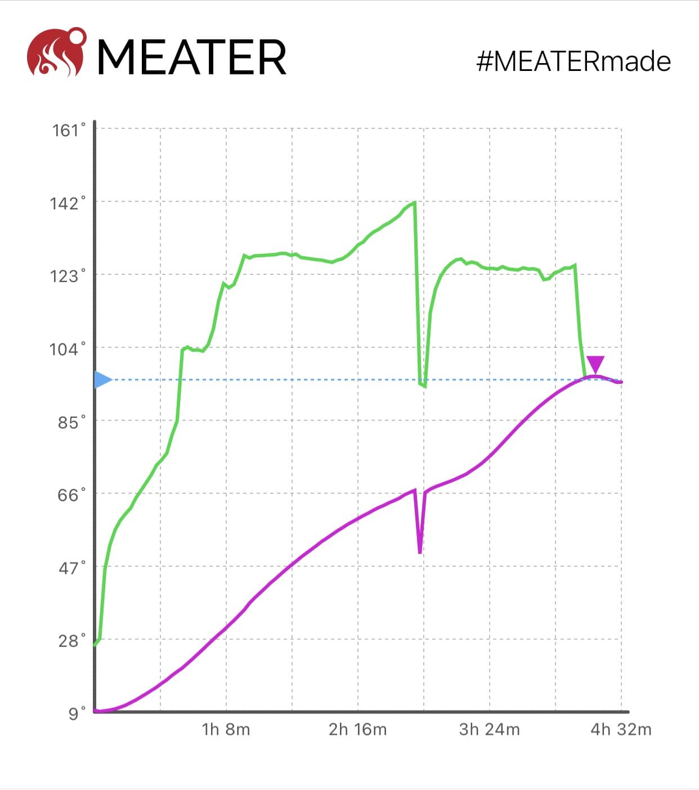

Tuli sitten hankittua Meater+ langaton lämpömittari nimenomaan tuohon grillitouhuun. Tämä pääsikin heti tulikokeeseen, kun [kamadoon lyötiin sisään 1.5 kiloa kassleria](/tehdaan-pulled-pork-kamadolla/) ja tavoitteena oli pulled pork. Meaterhan on oikeasti langaton mittari. Siinä "tikku" lyödään lihaan ja tuo puinen lataustelakka toimii bluetooth toistimena, jolloin Meater+ lupaillaan 50m kantomatkaa. Tämän tuotteen taustalla on muuten myös suomalaista väriä sillä tämän on [Teemu Nivala puuhastellut](https://www.meatersuomi.fi/tarina/).

## Käyttöönotto

Unboxaus on jo peruskamaa. Näppärä laatikko ja ennen kaikkea tuo koko tuote on hieno. Itse mittari on hitusen paksuhko vs. muut langalliset mittarit, mutta tämä onkin langaton ja tuon sisään pitää mahtua sitä elektroniikkaa ja akkukin. Se siis selittää tuota kokoa. Puinen säilytyskotelo/telakka on hieno ja se tuokin tähän jo premium luokan tuotteen tuntua.

Eka kantsii asentaa tuo applikaatio sillä se alkaa neuvomaan sinua. Sitten otetaan suojamuovit ja muovilirpake pariston luota pois, jotta itse mittari alkaa ladata itseään. Nyt sitten oma huomio sillä sun pitää oikeasti antaa tuon latautua se nelisen tuntia, jotta homma lähtee rokkaamaan. Osta siis tämä edellisenä päivänä äläkä samana päivänä milloin pitäisi käyttää. Tuo "tikku" ei nimittäin yhdisty tuohon telakkaan ennen kuin siinä on tarpeeksi virtaa. Applikaatiossa pitääkin suorittaa kaikki stepit ennen kuin voit alkaa synkkaamaan sitä oikein. Yksi steppi on antaa tuon ladata se neljä tuntia. Tiedän tämän, koska itse laitoin siihen, että "joo joo kyllä latasi" ja eihän se sitten saanut lämpötiloja tuosta... Noh tästä oppineena voinkin tämän jakaa, lue ohjeet Marko.

Käyttönotto oli oikeasti simppeli homma. Kun vain malttoi odottaa, että mittari lataa itsensä.

## Käyttäminen

Tämä on helppoa. Otetaan vain mittari pois telakasta (kun on ensin ladannut sen mittarin siinä!) ja tökätään lihaan. Mittarissa on viiva mikä pitää mennä lihaan sisään, jotta se ei vaurioidu. Ainut ns. miinus tässä on se, että tuo on paksuhko, joten ihan mihin tahansa et välttämättä tökkää tätä. Mutta oikeasti jos mietitään niin tämähän on optimi juurikin paksummille paloille lihaa tai vaikka kanaa. Ei oikein mitään mittaria saa fiksusti esim. wingseihin. Tämmöisiin tapauksiin on sitten "instant read" mittari.





Tämän jälkeen sovelluksesta voitkin valita mitä olet tekemässä ja se antaakin mukavasti ehdotukset lämpötiloista.

Tuo puinen telakka kantsii jättää grillin lähelle sillä se on se mikä vahvistaa sen signaalin, jotta homma toimii. Älä siis vie sitä sisälle ja ihmettele miksi ei homma pelitä. Itsellä tämä oli noin 1-2 metrin päässä kamadosta ja sisällä kyllä sitten toimi ja näytti lämpötiloja. Telakassa on muuten magneetit takana, joten sen saa metallipintoihin pysymään jo sillä kiinni. Tuon telakan vedenkestävyydestä en osaa sanoa, mutta pitänee itse jonkinlainen suoja viritellä ihan varuiksi.

Sehän tässä on myös huomioitavaa, että tässä on kaksi lämpömittaria. Tuohan näyttää lihan sisälämpötilan ja myös paistotilan lämpötilan. Tämä onkin tosi näppärä homma sillä aina ei grillin lämpömittari näytä oikein ja se on yleensä ylempänä, kuin itse paistettava ruoka.

Voit laittaa hälytyksiä miten haluat eli itsellä oli hälytys 67 asteessa, jotta varmasti muistan kääriä lihan folioon. Automaattisesti tuli hälytys 5 minuuttia ennen, kuin liha on valmis ja sitten tietty kun liha on halutussa lämpötilassa. Samoin tämä pirulainen tunnisti vielä, kun liha oli vetäytymässä ja antoi vielä hälytyksen kun sekin oli valmis. Itsellä tosin se vetäyty noin tunteroisen.

## Sovellus

Tämä on langattomuuden lisäksi parhaita puolia tässä. Sovellus on pirun hyvä. Saat valittua valmiista ehdotuksista haluamasi lämmöt ja voit muokata niitä tai sitten pistää kokonaan omat. Saat laitettua hälytyksiä miten haluat.

Esimerkiksi voit pistää hälyt, jos grillin lämpötila menee yli tai ali halutun lämpötilan, jolloin voit käydä säätämässä lämpöjä.

Sovellus myös laskee aikaa kauan menee, että homma on valmista sekä piirtää kivaa käppyrää ja saatpa sitä jaettua someenkin.





Sovelluksesta näet myös aiemmat kokkaukset ja onpa siellä hieman videoitakin linkattu erilaisiin kokkauksiin. Meaterin tukisivut on englanniksi jos jotain apua tarvitsee sieltä päin.

Sovelluksesta tulen kertomaan kattavemmin kunhan kokkailen ja käytän sitä lisää. Nyt se vaikuttaa vielä tosi hyvälle ja toimivalle kokonaisuudelle. Itsellä sovellus on käytössä iOS laitteella, joten Android puolesta en osaa sanoa.

## Lopuksi

Hieman harmittaa, kun ei ollut tätä viime jouluna, kun kinkkua paistoin uunissa. Itsessään ajan arvioiminen valmistumiseen on jo hienoa. Samaten tuo täysi langattomuus on hienoa. Ei tarvitse puljata niiden pirun johtojen kanssa. Mietitään vaikka tilanne jossa sulla olisi vartaassa **pyörimässä** kana niin ethän sä siihen saa johdollista mittaria mitenkään fiksusti.

Hinta... Tämähän on arvokas tuote, oikeasti. Hintaa on se 109 euroa, joten onkohan tämä grillipuolen Appletuote? Hinta kyllä sinällään kohtaa laadun ainakin näin ekan kerran jälkeen. Katsotaan mitä mieltä ollaan vielä tulevaisuudessa. Mittari ja telakka on laadukkaanoloiset ja ilmainen sovellus toimii tosi hyvin.

Ilmeisesti Meater Block olisi yhdistettävissä langattomaan verkkoon. Tällä kuitenkin on hintaa se 300 euroa, mutta tässä tuleekin noita mittareita 4 kappaletta. Itse en noin montaa tarvitse, joten se nyt jäi kauppaan suoraan.

Meater+ saa synkkaamaan pilveen ja pystyt katsomaan vaikka kauppareissulta edistymistä, **mutta** se vaatii hieman säätöä. Sulla pitää olla ns. ylimääräinen tabletti tai puhelin, joka on yhdistettynä langattomaan verkkoon ja Meater+ mittariin. Tällöin jätät tuon ylimääräisen laitteen kotiin, joka synkkaa sitten pilveen tuota edistymistä. Itseä tämä ei oikeastaan haittaa sillä suunnitelmissa on vanha iPad pistää näyttämään kodin [lämpötiloja](https://markokaartinen.net/paivitysta-ruuvitag-sensoreista/), joten se ehkä voi toimia myös Meaterin ja langattoman verkon välissä.

Olisi muuten näppärä, jos heillä olisi erillinen mittari saatavilla, jolla näkisi pelkästään grillin lämpötilan. Tämä voisi olla joissain kokkauksissa hyödyllinen ja varsinkin jos grilliä tosi kuumaksi niin voisi olla kiva työkalu.

Kaiken kaikkiaan positiivinen fiilis tästä tuotteesta. Heitä kommenttia, jos on jotain kysyttävää tästä niin vastailen, jos pystyn!
