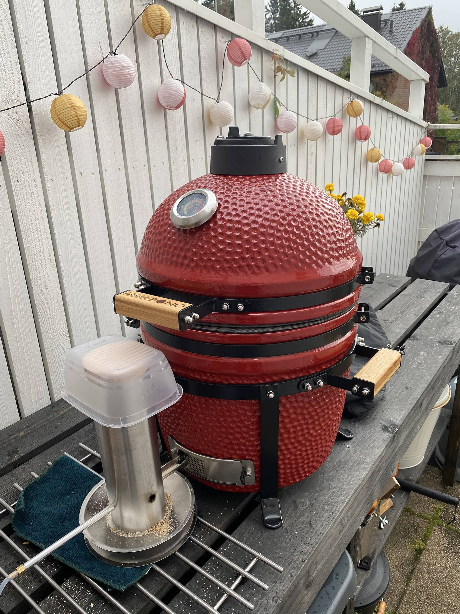
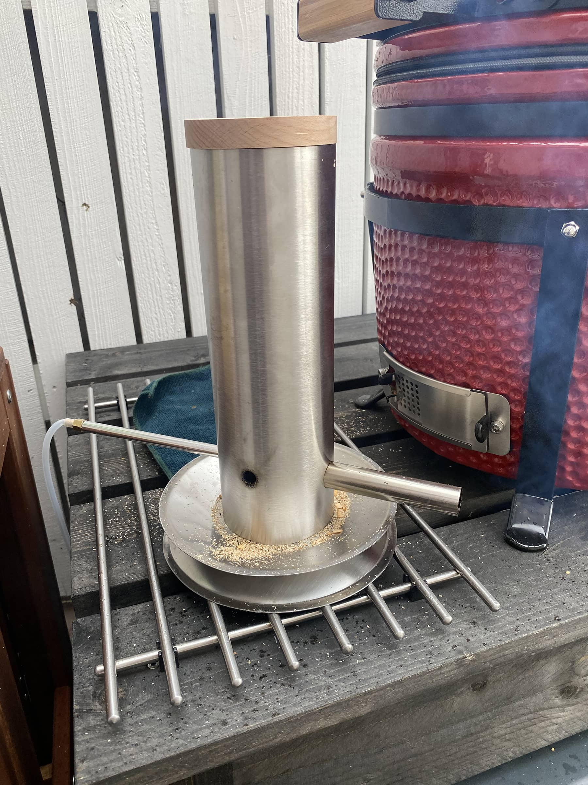
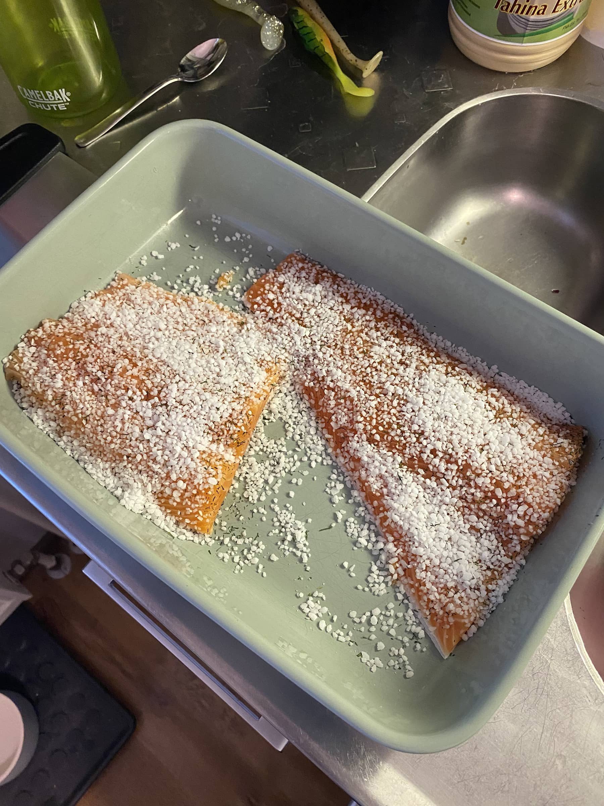
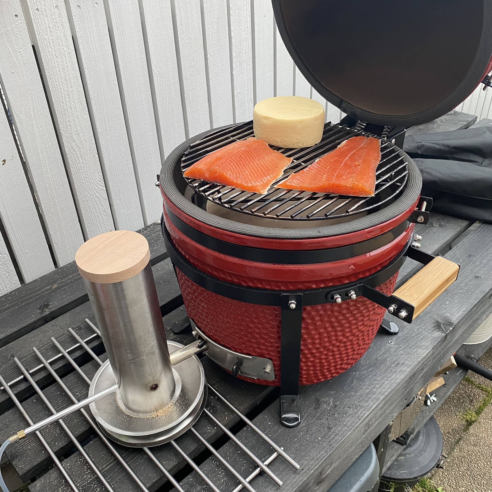
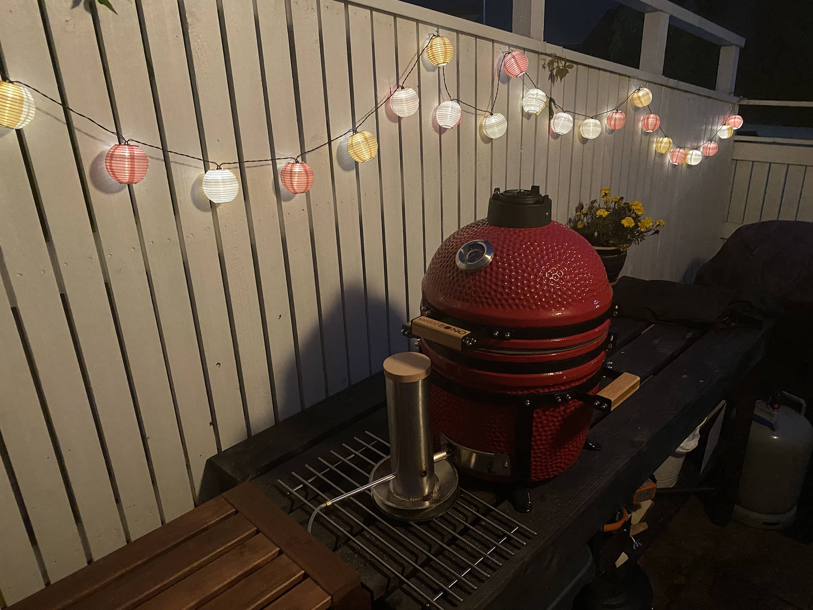
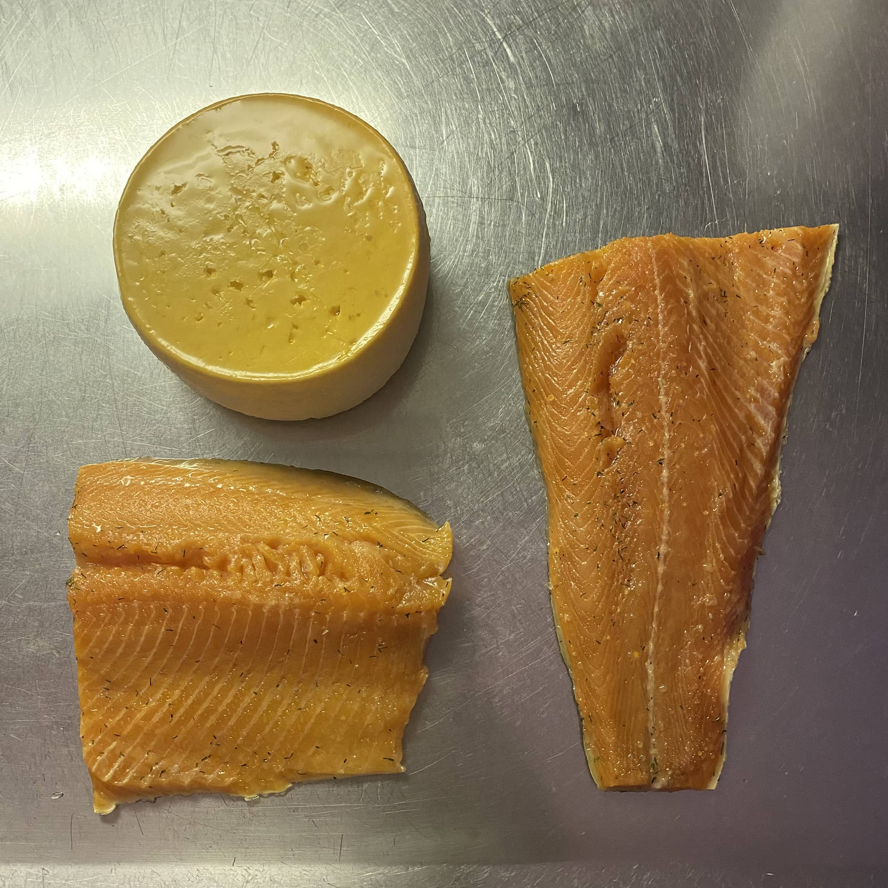
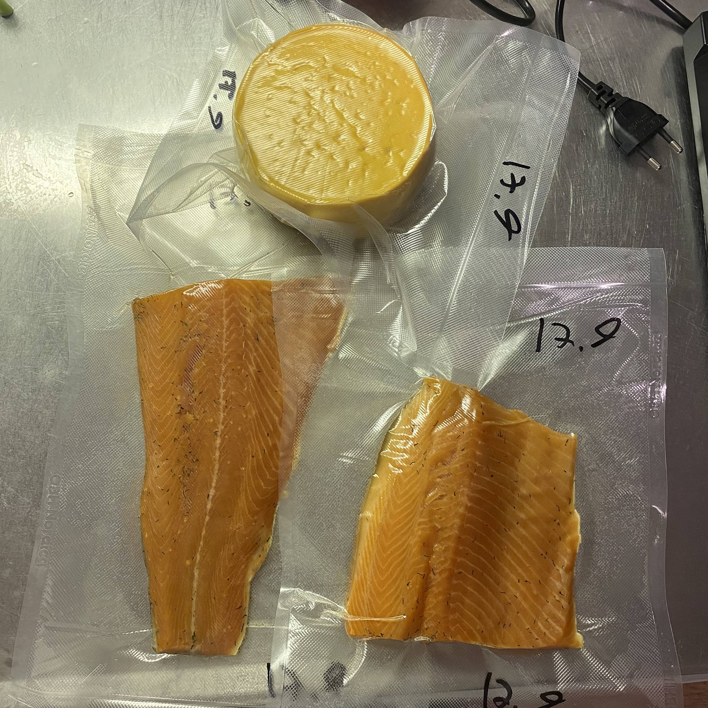
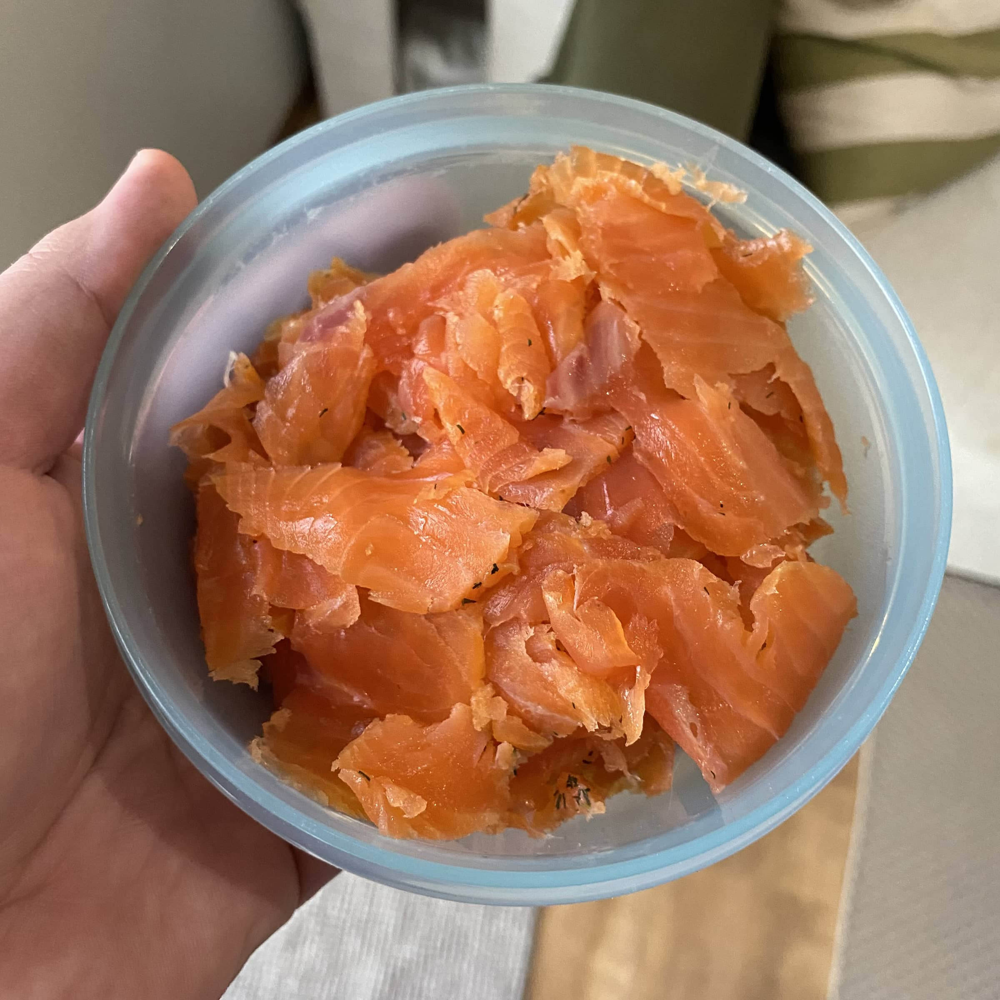

Halusin lähteä kokeilemaan kylmäsavustusta sillä en ollut sitä itse ennen tehnyt ja nyt alkaa olla oikein sopivat kelit siihen hommaan. Tutkiskelun jälkeen päädyin hankkimaan [Mustang savunkehittimen](https://mustang-grill.com/tuotteet/savunkehitin-kylmasavustukseen/), jota sitten lähdin kokeilemaan viime perjantaina.

")

Tutkiskelin jonkin verran tätä asiaa ja päädyin tähän malliin parista syystä. Ensinnäkin olin kuullut hieman vaihtelevia kokemuksia niistä savugeneraattoreista mitkä kiertää kehää ja sytytetään esim. kynttilällä. Osa ei pala kunnolla, osa palaa hyvin, osassa hyppii sitten "aidan yli" ja muuta vastaavaa. Toinen vaihtoehto oli semmoinen mikä käyttää puukiekkoja, joka oli mulla toisena vaihtoehtona. Tähän kuitenkin päädyin koska, tämän saa ulkopuolelle ja näin purujen lisäys on helppoa sekä tässä voi säätää hieman savun määrää tuota pumpun tehoja säätämällä.

Alkuperäinen ajatus oli tätä säätää tuohon pallogrilliin, mutta tuo ulostulo putki hieman kuumeni niin jäin miettimään parempi vaihtoehtoja, kuin muoviletku/-putki. Kamado Bonoon sen sijaan tämän sai viriteltyä aika helpostikin.

## Kasaus ja ensikäryt

Tämähän on suhteellisen simppeli setti. Paketista tulee kaikki mitä tarvitaan ja kasaus onnistui suht helposti. Kasauksessa kannattaa huomioida se, että sisälle menevässä putkessa oleva aukko osoittaa alaspäin, jotta homma toimii kunnolla. Jos käsi sattuu mahtumaan putken toisesta päästä sisään niin sitä kautta on helpoin pidellä sinne tulevaa koukkua jonka avulla nuo aluslautaset kiinnitetään. Tämä olikin kasauksen ainut hieman säätämistä vaativa vaihe - olisi tuon kai hieman paremminkin voinut tehdä tuolta osin.

Muuten ensivaikutelmat on positiiviset ja odotukset on suhteellisen korkealla tämän laitteen suhteen. Ensikäryt meinasi tuottaa hieman päänvaivaa sillä en saanut tuota kunnolla syttymään plasmasytyttimellä ja sitten huomasin, että ohjeissa suositellaan ns. myrskyliekkisytytintä. Päädyin ostamaan tälläisen [Puuilosta](https://www.puuilo.fi/mustang-takkasytytin-30-cm-myrskyliekki) ja sillä saatiin sitten ensikäryt palamaan. Pienellä tohollakin tuon saisi syttymään myöskin.

Tuohan sytytetään aukoista mitä on kaksi kappaletta ja siitä se sitten lähtee palamaan ja pumpun tehoja säätämällä saat säädettyä tuota savun määrää. Itse virittelin kehittimen Bono Minimoon sillä pienellä korotuksella sen sai näppärästi aukosta sisään. Kuvissa on vielä paikallaan hieno patentoitu (not) sadesuojakin!





## Tehdään kylmäsavulohta ja savujuustoa(?)

Jos pitäisi veikata niin yleisin syy kylmäsavustukseen on kylmäsavustettu kala ja varmaan lohi kaikkein yleisin. Itse olen etätöissä ja ajatus oli perjantai aamuna aloittaa savustaminen ja ohjeissa oli että 4-5h kestää tuon putken poltto. En tätä vielä tässä vaiheessa kyseenalaistanut, joten helpompi työpäivän aikana lisäillä puruja, kuin yöllä heräillä.

Homma kuitenkin alkaa jo torstaina, kun pistetään kalat suolaan. Vaimo olikin hakenut valmiiksi fileoitua suomalaista lohta ja sillä päästiinkin sitten alkuun. Ajatus oli yksi puolikas pistää kylmäsavuihin ja toinen sitten lämminsavuihin. Kuivailin kalan talouspaperilla ja nypin ruodot pois ja siitä sitten suolaan. Puolitin myös fileen sillä ajatus on pistää toinen pakkaseen.

Isä oli vinkannut graavisuolasta, jota hän itse on käyttänyt ja siinä onkin kaikki valmiina. Tätä saa myös [Puuilosta](https://www.puuilo.fi/mausteporssi-graavisuola-1kg) ja laitoin sitten kalan suolaan astiaan ja peitin foliolla.

Kylmäsavustushan ei kypsennä kalaa vaan kalan "kypsentyy" oikeastaan tuossa suolausvaiheessa. Kylmäsavustuksella haetaan siis savun makua tuohon kalaan. Samaten kylmäsavustuksessa lämpötila ei saisi nousta liian korkeaksi ja verkossa olikin useaa lämpötilarajaa tähän. Nyt on kuitenkin hyviä kelejä kun lämpötila on siinä 10 asteen kantturassa ja ei ainakaan nouse yli 20.

Kalat on siis ollut yön yli jääkaapissa suolaantumassa ja on aika aloittaa kylmäsavustus. Kalat pois jääkaapista, huuhtelu kylmällä vedellä ja kuivaus. Siitä sitten kamadoon sisään ja savua perään. Pistinpä kokeen vuoksi myös yhden palan Oltermannia samoihin sauhuihin.

Itse savunkehittimen latasin hienolla kylmäsavupurulla ja sitten karheammalla savustushakkeella mitä olen käyttänyt lämminsavustukseen. Suhde oli suunnilleen 1 osa karheaa ja 3 osaa hienoa. Laitoin koko putken täyteen ja arvelin saavani sillä ohjeen mukaiset 4-5 tuntia savua.

Tämähän on siitä helppoa hommaa, että se tapahtuu itsekseen. Kävin välistä säätämässä tuon pumpun tehoa, jotta savua ei olisi kamadossa liikaa. Sopiva pumpun teho oli tuohon noin puolivälissä.

Ihmettely oli kova, kun 4 tunnin jälkeen polttoainetta oli vielä reilusti ja lisäystarvetta ei ollutkaan. Sama homma oli vielä 5, 6.... tunnin jälkeenkin. Loppujen lopuksi annoin tuon pöhistä savua noin 14 tuntia ilman, että lisäsin purua tuonne. Olisi vielä jaksanut varmaan 2-3 tuntia vielä, mutta alkoi savustajasta loppua veto. Tämä johtunee siitä, että ohjeissa oleva 4-5h aika-arvio on karkeammille puruille ja ehkä täydellä savun tuotolla. Tuohonhan saisi patentoitua myös suppiloa ja jatkoa jos haluaisi.

Itseltä, kun löytyy vielä vakuumikone niin pistin tuotokset vakuumiin ja toinen pala kalaa meni pakkaseen ja toinen jääkaappiin - samoin juusto. Ajatus oli lauantaina hieman maistella näitä tuotoksia.





## Miten onnistui ja mitäs sitten savustetaan?

Kalahan onnistui oikein mainiosti. Ei mitään valittamista ja pitää alkaa vaan lisää tekemään. Pakastimessa on vielä yksi odottelemassa maistamista ja ajattelin sen antaa siellä olla ainakin viikon ja ehkä jopa kaksi jos malttaa.

Vaimohan tuosta tekee lapin lumous tyylistä sörsseliä leivän päälle syötäväksi. Kylläpä nuo kelpasi lauantain illan istujaisissakin, kun maistatin.

Niin se juusto. Oltermanni ei ihan nappiin mennyt. Hyvähän se on ja syödään pois, mutta pitää ehkä tehdä lisää kokeiluita. Saattoi tulla hieman liikaa jopa savua tuolle palalle juustoa. **Tähän jos on vinkkejä niin otan kyllä vastaan!**

Ajatus on myös saada tuo jotenkin tuohon [Weberin palloon](/weber-master-touch-gbs-e-5750-hiiligrilli-57-cm-yhden-kesan-jalkeen/) käytettäväksi. Ajatus on saada tuosta L muotoinen putki ylöspäin, jotta saisi savua johdettua palloon. Weberissä, kun olisi hieman enemmän tilaa kylmäsavustukseen, kun tuossa Bono Minimossa.

Annan kyllä peukkua tuolle savunkehittimelle ja suosittelen sitä kyllä tämän kokemuksen perusteella. Itsellä ei ole kokemusta muista savunkehittimistä, joten en osaa sanoa miten ne vertautuu tähän.

Tästä muuten löytyy tuolta meidän [foorumilta lyhyt "liveseurantakin"](https://foorumi.bbqblogi.fi/d/4-ensimmainen-kylmasavustus)!

**Jos sattuu löytymään hyviä vinkkejä kylmäsavustukseen tai mitä kannattaisi kokeilla niin kommenttiboxi on tuossa alhaalla!**
