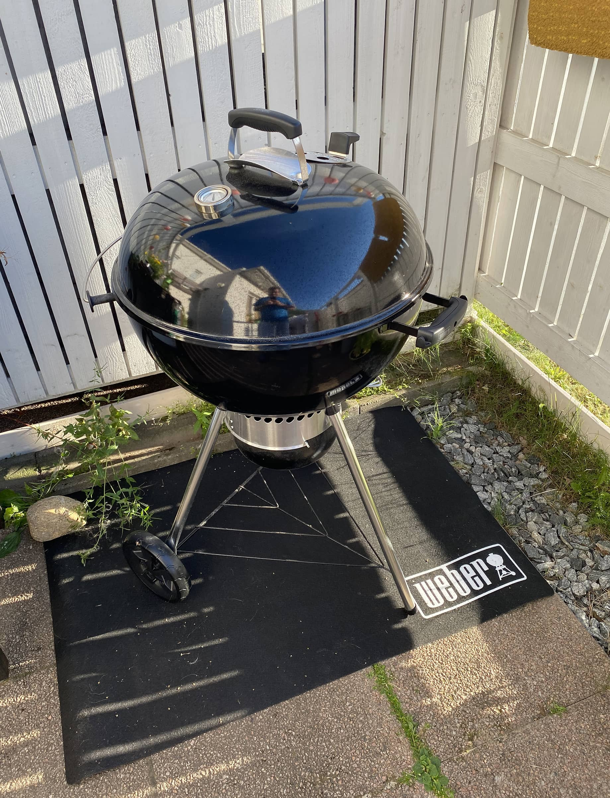

Ajattelin hieman esitellä minkälainen arsenaali noita työvälineitä tällä hetkellä oikein on käytössä. Keskityn näihin ulkona käytettäviin ruoanlaittovälineisiin. Käyn nämä satunnaisessa järjestyksessä läpi ja hieman avaan näiden tarinaa ja käyttötarkoitusta. Näistä pitää ottaa joku "perhepotretti" joskus.

Näiden esittelyistä huomaakin sen, että muutettiin viime vuoden loppu puolella isompaan asuntoon, jossa on kunnon terassiakin. Ulkoruokintatilan varusteiden hankinnat lähti lentoon... Useampi vuotisia hankintojahan nämä on kuitenkin.

## Sähkösavustin

Sähkösavustin on myös tämän kesän uusia välineitä. Tämä on ns. perussähköpönttö jolla tehoja 1100W verran ja hankittu täysin kalan savustukseen. Voisinhan toki savustella nykyään pallogrillillä tai kamadollakin, mutta tällä saadaan nopeasti hyvä savukala aikaan ja hintakin oli kohtuullinen.

Suosittelen kyllä hankkimaan sähköpöntön, jos semmoista ei ole ja savukalaa alkaa tekemään miele. Helppoa savustusta ja nopeasti. Kantsii muuten kokeilla kalaan Poppamiehen One for all rubia. Toimi savulohen kanssa aika kivasti.

## Weber Master-Touch pallogrilli

Tästä kirjoittelinkin jo [aiemmin](/weber-master-touch-gbs-e-5750-hiiligrilli-57-cm-yhden-kesan-jalkeen/). Weberin pallogrilli tosiaan korvasi vuosia palvelleen Landmannin kaasugrillin ja takaisin kaasuun ei ole ihan hetkeen ainakaan paluuta.

Pallogrillillä onkin tullut opeteltua tässä koko kesä ja hyvin on mennyt, mutta menkööt. Tämän kanssa voi iskeä myös pieni varusteluhulluus sillä diy hackeja ja lisäosia on saatavilla aivan älyttömästi johtuen tämän todella kovasta suosiosta.

Tällä tulee tehtyä vähän kaikkea. Kesällä on tullut tehtyä niin ribsejä, burgereita, kuin perus makkaroitakin. Kamadon tultua huusholliin pääpaino pysynee "nopeammassa" grillailussa. Tosin isompia settejä tehdessä varmaan kamado ja pallo pöhisee tulta ja tappuraa yhtä aikaa kaveruksina.

Ehdoton suositus myös tälle pallogrillille.

## Bono Minimo Kamado

Bono Minimo Kamado onkin uusin tulokas tähän huusholliin. Vasta pari päivää vanha ja kerran grillattu kaveri onkin odottamassa uusia haasteita ja pitkiä vetoja.

Kamadohan tuli hankittua juurikin pitkiin vetoihin ja tämä pienempi Minimo versio nimenomaan koon takia. Eihän tuo 40 kilon painoisena kovinkaan pieni muna ole, mutta pienemmästä päästä. Huushollissa, kun on lihansyöjä sekä kasvissyöjä ja lihansyöjää miellyttää nämä pidemmän ajan ottamat ruoat ja kasvisruokailija saattaa haluta samaan syssyyn sitten jotain hieman nopeammin tulevaa niin tämähän ratkeaa kamadolla.

Tämä tulee ehdottomasti pääsemään töihin ja saa luvan ystävystyä pallon kanssa.

Näin lyhyen ajan jälkeen varovainen suositus, mutta FB:n ryhmissä luetun perusteella hieman vahvempi suositus.

## Ooni Koda 16 pizzauuni

Pizza, mikä ihana tekosyy. Tämäkin on tämän vuoden hankinta. On se muuten kumma mitä rivitaloon muuttaminen mahdollistaa ja varsinkin, kun on tuota terassia... On tullut pizzaa väänneltyä tässä kohta vuoden verran enemmän ja vähemmän. Nyt tänä kesänä enemmän kiitos Oonin. Alkaa ns. tuotekin olla hyvä ja kokeilut jatkuu vielä.

Tämä on tällä hetkellä toinen kaasuvehkeistä mitä löytyy. Päädyin tässä pizzauunissa kaasuun sen käytön helppouden vuoksi ja sehän toimii. Näin kesän jälkeen on tämäkin yksi käytetyimmistä välineistä ja ehdoton laitos, kun aletaan pizzaa tekemään.

Jos väännät pizzaa ja varsinkin napolilaistyylinen pizza kiinnostaa niin Ooni on kyllä hyvä peli. Itse olen ainakin tykännyt sekä pizzat on kelvannut vieraille...

Pizzahommia voi seurata [@slicesfromsavo](https://www.instagram.com/slicesfromsavo/) instagram tililtä!

## Muurikka

Muurinpohjaletut, ai että! Tämä tuli hankittua jo jokunen vuosi sitten, kun Facebook kirpparilla oli tarjolla Muurikan kesäkeittiö kaasupulloineen. Eli täydellinen setti ilman pannua. Noh kaupat hierottiin kiinni ja ostettiin pannu. Tähän asuntoon puuhasteltiin oma pöytä ja myytiin sitten tuo kesäkeittiön "vaunu" pois ja tämä nouseekin pöydälle käyttöön aina, kun tarve tulee.

Tällä onkin tullut paisteltua pääasiassa lettuja niin perinteisiä muurinpohjalettuja, kuin sitten esimerkiksi pinaattilettuja. Onpa tuolla tullut pyttipannua ja burgereitakin tullut väännettyä. Tämä on se toinen kaasulla toimiva vekotin Oonin lisäksi.

Ehdoton suositus. Rengaspoltin ja muurikkapannu - muuta ei tartte. Tietty kaasua... Tuommoinen tuulensuojakin on näppärä olla.
