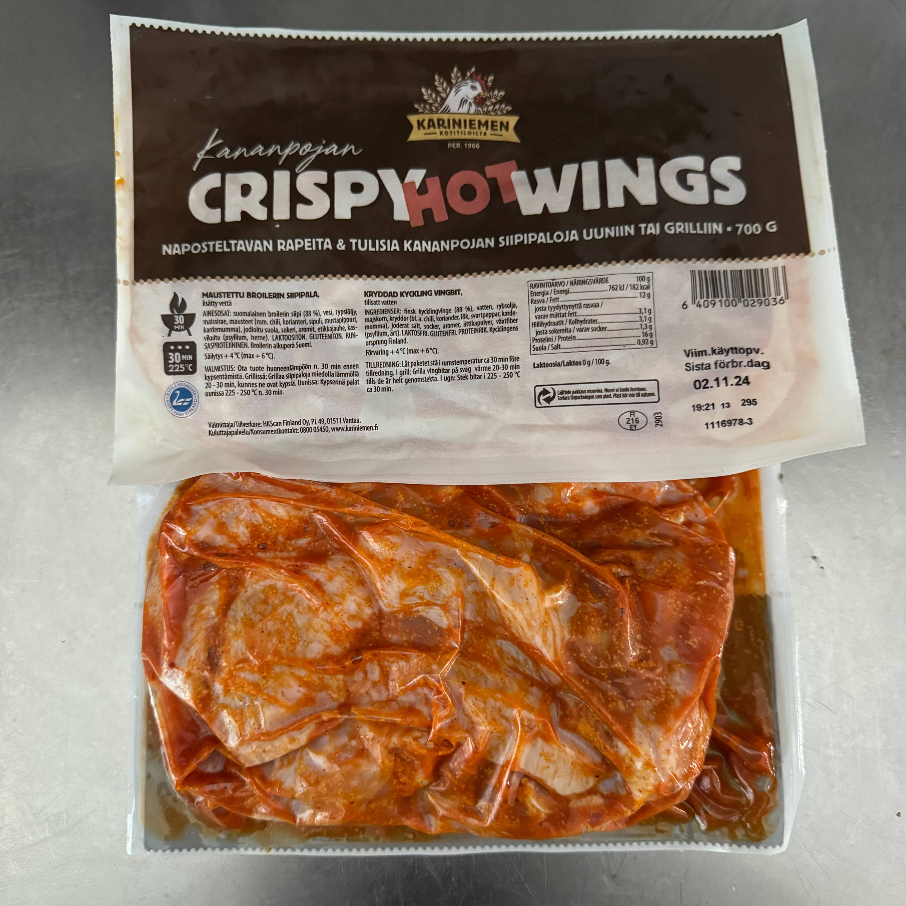
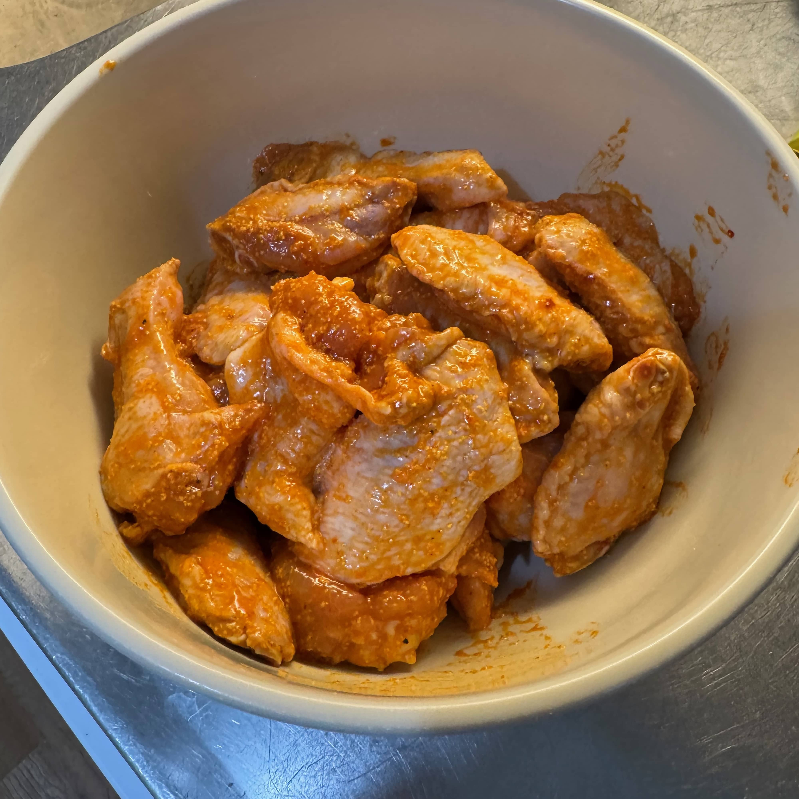
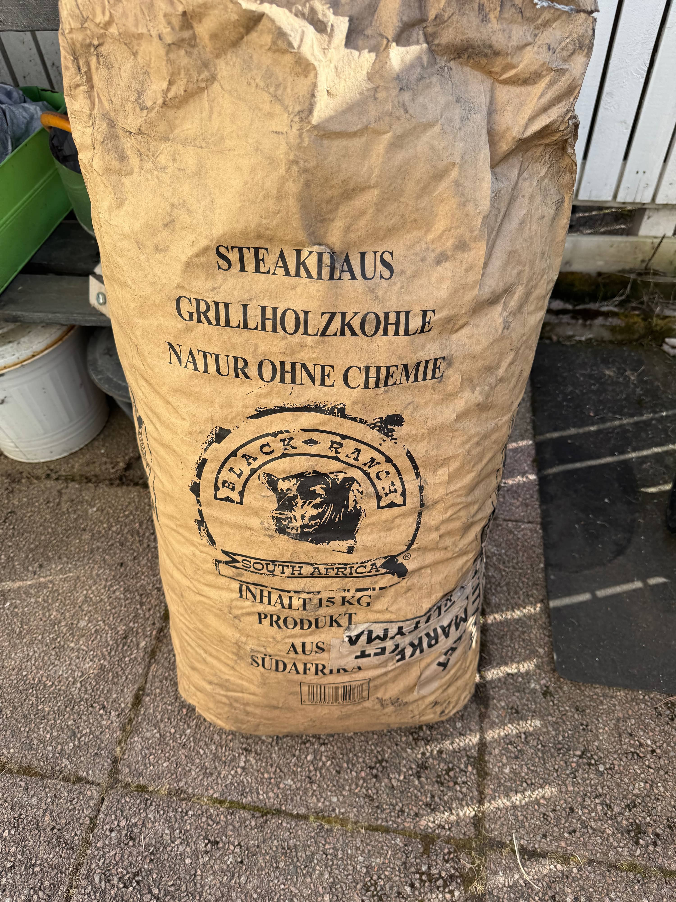
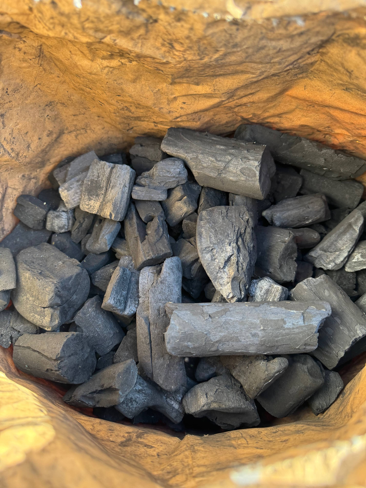
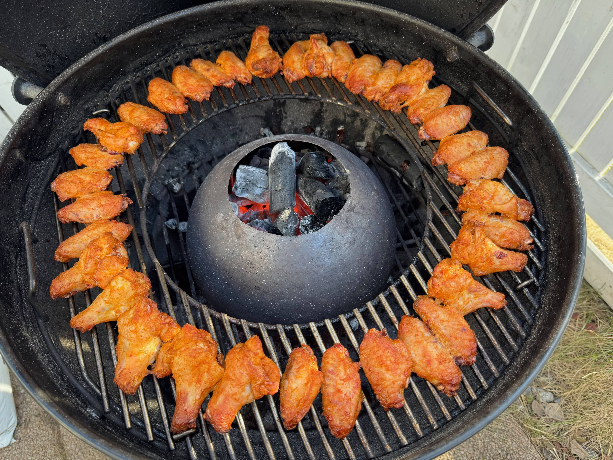
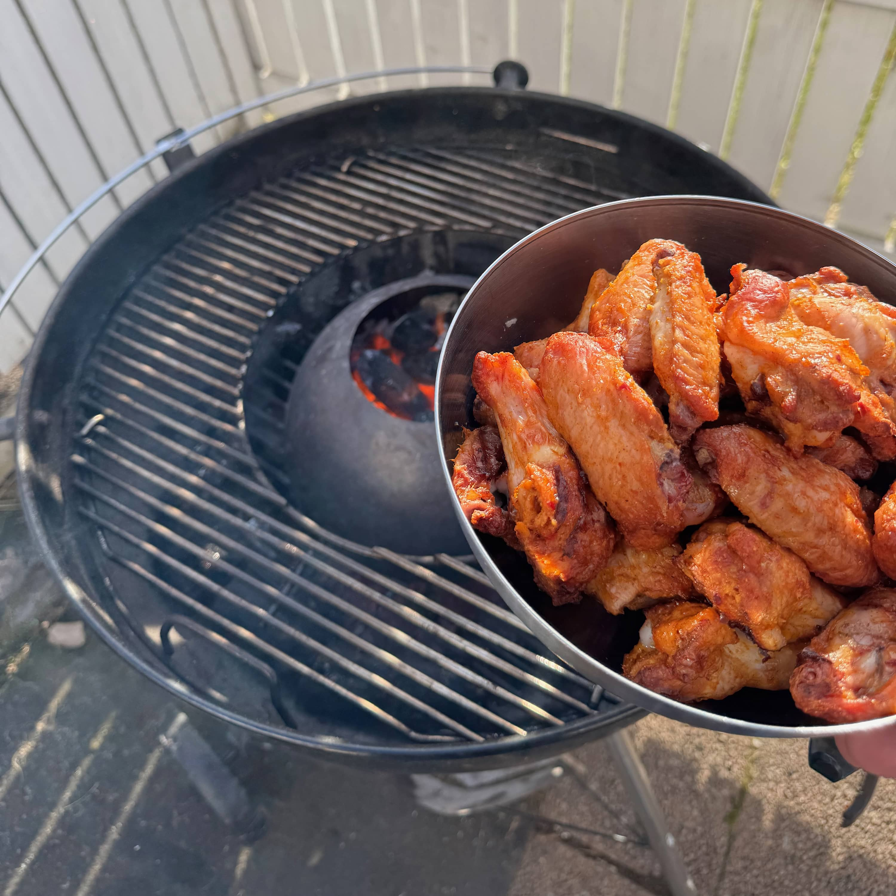
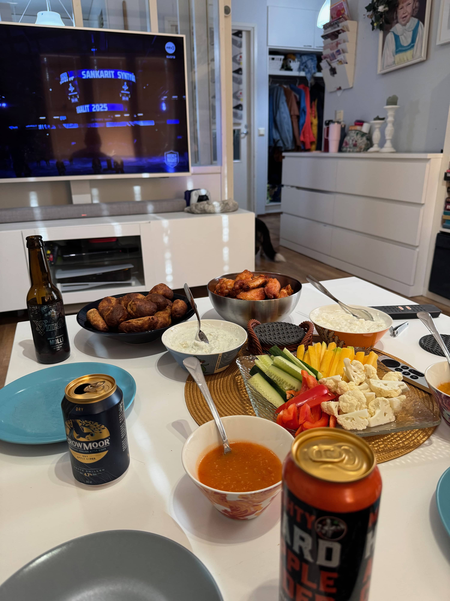

Olin jo viime talvena pakkaseen jemmannut halvalla Wingsejä. Niitä kun silloin tällöin saa alennuksesta päiväyskamana. Näin pakkasessa onkin odottamassa wingsejä nälkäisille. Tällä kertaa oli sopivasti KalPan peli, joten mikäs sen parempaa, kuin wingsit, jäkis ja pari juomaa sekä hyvä seura.

Wingsit otin pakaksesta edellisenä päivänä sulamaan jääkaappiin. Otin ne sitten reilu tunti ennen grillausta huoneenlämpöön. Tällä kertaa oli pakkasessa jemmassa Kariniemen Crispy Hot wings.





Olin tarjouksesta napannut uusia hiiliäkin ja K-Citymarketin 15kg säkki Black Ranch Acasia hiiliä pääsi kokeiluun. Sanoisin, että tuo hiili on ihan ok kokoista ja sopivan hintaista jos sen saa 29 eurolla. Menee itsellä ns. hot & fast touhuun eli ei ollut hutiostos - ainakaan ekan grillauksen perusteella.





Blogin lukijoille [Ikean Vortex](https://bbqblogi.fi/ikean-viiden-euron-vortex-seka-wingsien-teko/) onkin tuttu ja se on mun vakiotyyli tehdä Wingsit pallossa. Tähän menee 2 noita 700g paketteja Wingsejä ja tosta määrästä näkyi 3 nälkäistä aikuista syövän oikein hyvin. 

Wingsithän ei tartte, kuin asetella grilliin ja antaa sitten olla siellä. Lämpöä on oman mittarin mukaan 250+ astetta. 

Wingsit oli pallossa vajaa puoli tuntia. Välillä käänsin vain Weberin pallon kantta, jotta ilma-aukko olisi hieman eri kohdassa. Ei taida isompaa merkitystä olla, mutta näin ajattelin tehdä ja ei se ainakaan pilannut. Samalla tuli vilkaistua mitä palloon kuuluu.





Noissa oli jo oma soosi ja siinä oli lähtökohtaisesti pientä tulisuutta. Oli sitten lisäksi paria eri vahvuusta kastiketta, joita jokainen sai itse läträtä. Samaten kahta eri soosia: aura ja feta. Tietty hieman kasviksia ja juomista.

Onneksi wingsit sentään onnistui hyvin sillä perjantain peli ei mennyt KalPalla hyvin. Lauantaina onneksi sentään onnistui.