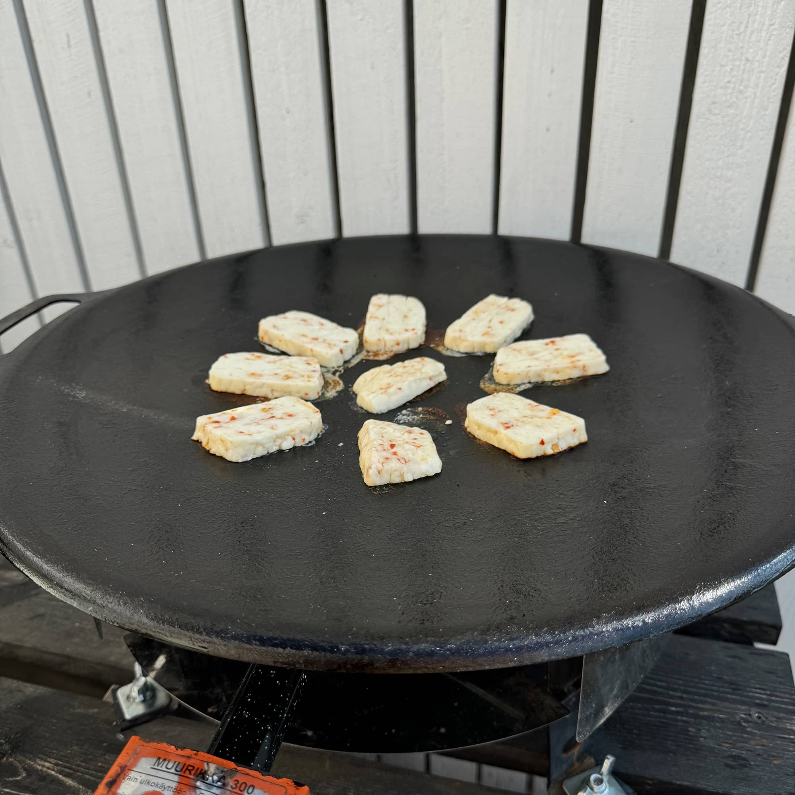

Kreikassa oma lempilounas on edullinen gyros pita. Syön sen yleensä kanalla tai possulla, mutta on tullut syötyä myös loistava halloumi versiokin. Tällä kertaa, kun itse tehtiin niin yhdistettiin halloumi ja kana.

Kreikassahan gyros pitassa on yleensä seuraavat ainekset: pita leipä, tsatsiki, tomaatti, punasipuli, ranskalaisia sekä possu/kana/joku muu täyte. Hintaa tällä on yleensä 2-5 euroa hieman riippuen paikasta ja sijainnista yms.

Edellisenä päivänä tein jo tsatsikin tekeytymään ja siihen käytin luottoreseptiä, joka löytyykin jo [täältä blogista](/kreikkalaistyylisia-jauhelihapotkoja-tsatsikia-ja-kasviksia/). Tämä on hyvä tehdä edellisenä päivänä niin maustuu hieman ja kannattaa tehdä reilusti... Itse olisin voinut tehdä enemmän mitä tällä kertaa, mutta onneksi tätä saa tehtyä lisää.

Sitten mentiin pitaleipien kimppuun. Nämäkin halusin tehdä itse sillä niistä tuli joskus aiemmin tosi hyviä. Tällä kertaa paistossa halusin käyttää muurikkaa sillä siihen saatiin kolme pitaa kerralla paistumaan. Tämä vaati toki talven jäljiltä pientä putsausta ja rasvanpolttoa.

Pitaleivät teinkin netistä löytyneellä reseptillä ja sen suomennan teille tuonne alas vielä erikseen. Näistä tuli tällä kertaa vielä parempia, kuin viime kerralla ja sehän ei meitä tietysti haittaa. Vähän ehkä oisin voinut isommaksi/ohkasemmaksi tehdä, mutta näkyi nuo häviävän. Muurikalla saikin kivasti paistettua 3 näitä kerralla ja nopeutti huomattavasti paistoa.

Sitten itse asiaan. Eli grillaukseen. Olin tarjoushaukkana ostanut punalaputettua kanaa ja pistin ne vartaisiin ja grilliin. Niiden kaveriksi Muurikassa otettiin halloumille kiva pinta ja oli siellä tofuakin grillautumassa.

Sit tulee se vaikein eli täyttäminen. Heitä pohjalle tsatsikia ja pistä muut täytteet sisään. Sen jälkeen pistät menemään ääntä kohti ja voin sanoa, että oli hyvää. Meillä ei näissä versioissa ollut ranskalaisia nyt ollenkaan sillä kana / halloumi oli ihan riittävä.

## Reseptit

Tässä alla vielä reseptit kootusti.

### Tsatsiki

Tsatsikin resepti löytyy jo meidän blogista tästä artikkelista: [/kreikkalaistyylisia-jauhelihapotkoja-tsatsikia-ja-kasviksia/](/kreikkalaistyylisia-jauhelihapotkoja-tsatsikia-ja-kasviksia/)

### Pita-leivät

Tämä ohje on napattu samalta sivulta, kuin tuo tsatsiki ohjekin. Tällä on tullut tehtyä pitoja nyt parisen kertaa ja aina ne on hävinneet parempiin suihin.

Tästä ohjeesta tulee 6 kappaletta pita-leipiä.

Lähde: [https://realgreekrecipes.com/greek-pita-bread-recipe/](https://realgreekrecipes.com/greek-pita-bread-recipe/)

#### Ainesosat

- 500 grammaa jauhoja
- 9 grammaa kuivahiivaa
- 300 ml kädenlämpöistä vettä
- 1 tl sokeria
- 1 tl suolaa
- 3 rl oliiviöljyä

#### Ohje

**Taikina**

1. Sekoita jauhot, suola ja sokeri
2. Liuota hiiva veteen 
3. Lisää hiivavesi ja öljy jauhojen sekaan 
4. Vaivaa 6-10 minuuttia, kun taikina ei enää tartu (itse vaivasin koneella, voi vaivata käsinkin)
5. Öljyä isohko kulho ja aseta taikinapallo kulhoon (voi myös öljytä kevyesti taikinan) ja peitä esim. kelmulla tai kostealla liinalla 
6. Kohota 1.5 tuntia
   - Itse kohotin uunissa, jossa oli vain lamppu päällä - voi myös kohottaa huoneenlämmössä
   - Taikinan tulisi kolminkertaistua 
7. Öljyä työpöytää hieman ja ota taikina siihen 
8. Vaivaa taikinaa hieman jotta ilma lähtee pois 
9. Tee taikinasta pallo ja sitten "käärme/naru", jotta voit leikata taikinan osiin 
10. Jaa taikina 6 osaan
    - Voit myös punnita koko taikinan ja jakaa samankokoisiin palloihin 
11. Tee 6 pientä palloa (vastaavalla tavalla kuten esim. pizzapallot)
12. Voitele pallot kevyesti öljyllä ja peitä liinalla ja anna levätä 10 minuuttia

**Paistaminen**

Paistamisessa on pari vaihtoehtoa. Voit tehdä tämän paistinpannulla (tai valurautapannulla) tai sitten Muurikalla, kuten itse tein.

Paistaminen paistinpannulla:

1. Muotoile pallo noin pyöreäksi pitaksi (noin 20cm halkaisija)
2. Lämmitä pannu kuumaksi ja laita öljyä 
3. Paista pitaa molemmilta puolin 
4. Valmis pita kannattaa pistää esim. lautaselle liinan alle 
5. Toista 1-4 vaiheet kunnes kaikki pitat on paistettu

Muurikalla paistaminen:

1. Muotoile kaikki pallot pyöreiksi pitoiksi (n. 20cm halkaisija)
   - Itse leikkasin leivinpaperista paloja ja asetin muotoillut pitat niiden päälle ja näin sain pinottua ne valmiiksi paistoa varten
2. Paista Muurikassa niin monta kerrallaan kuin mahtuu, itselle meni kolme
3. Valmiit pitat kannattaa pistää lautaselle ja liinan alle
