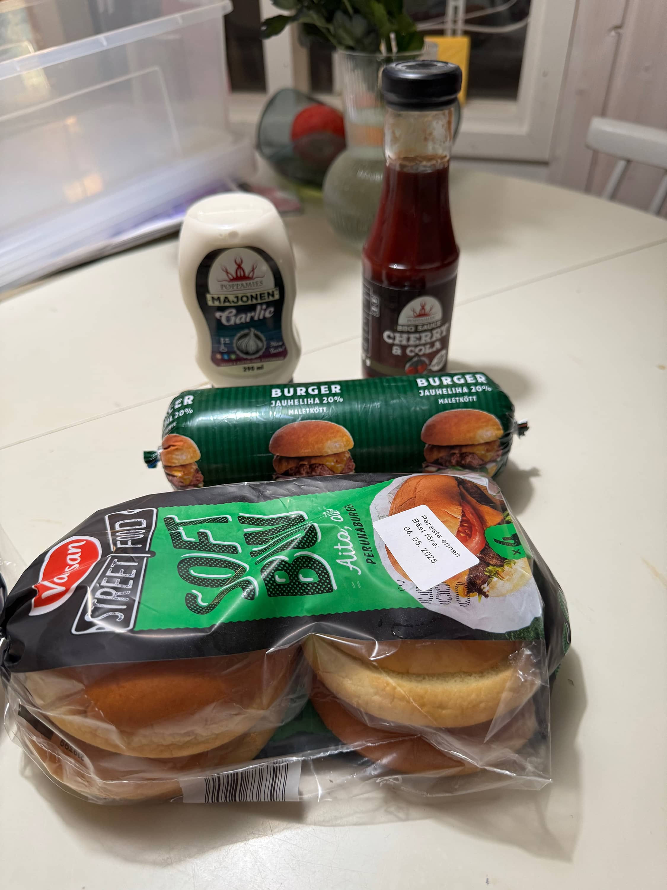
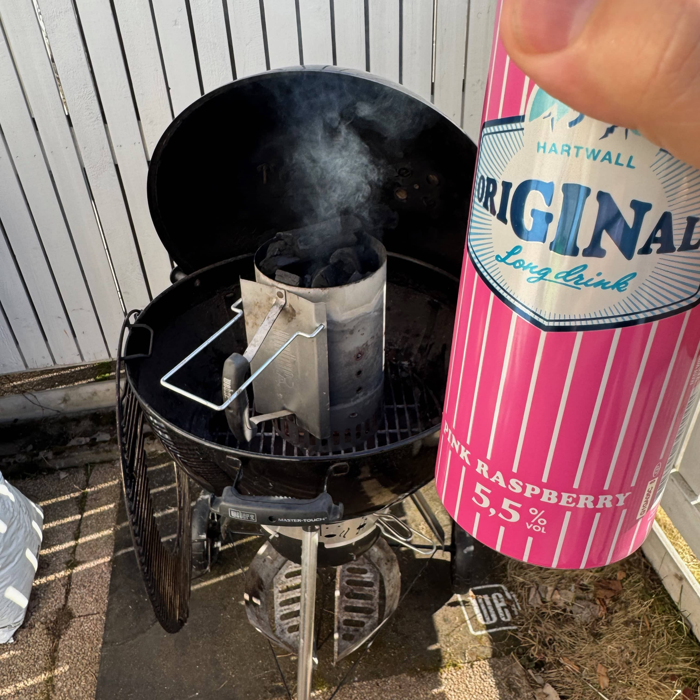
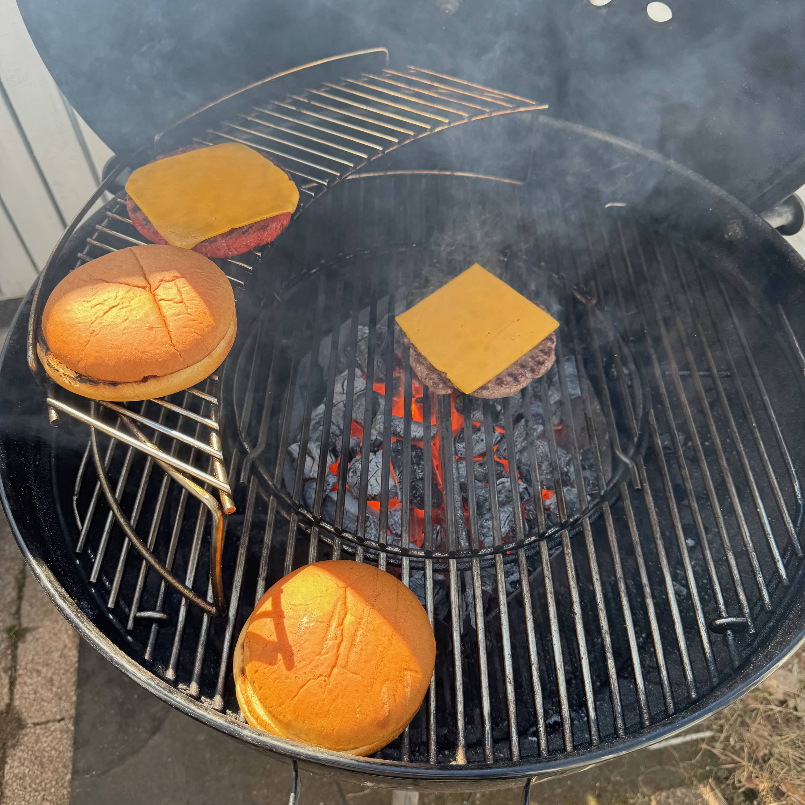
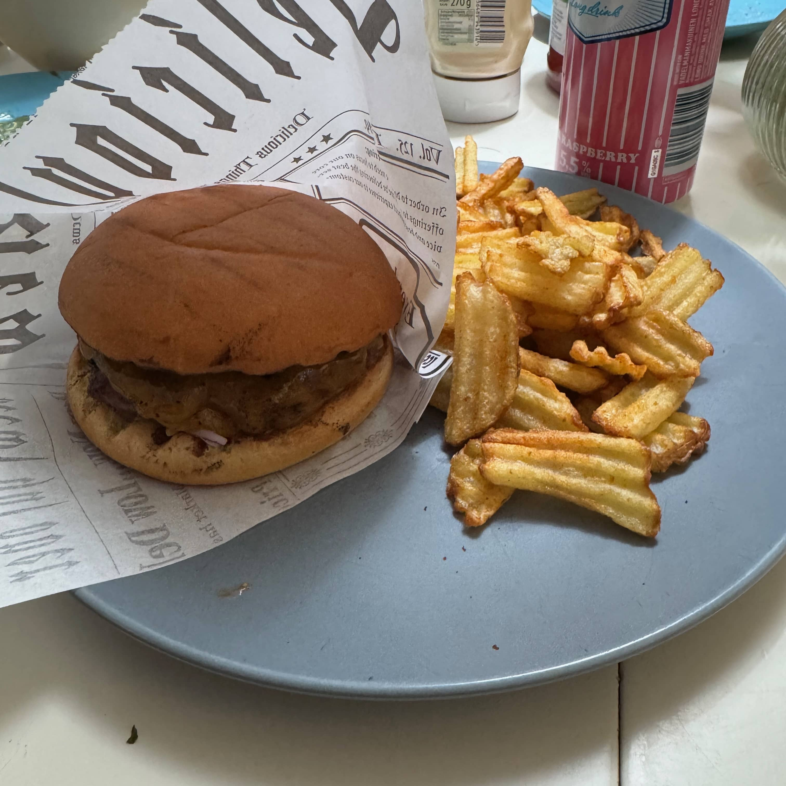
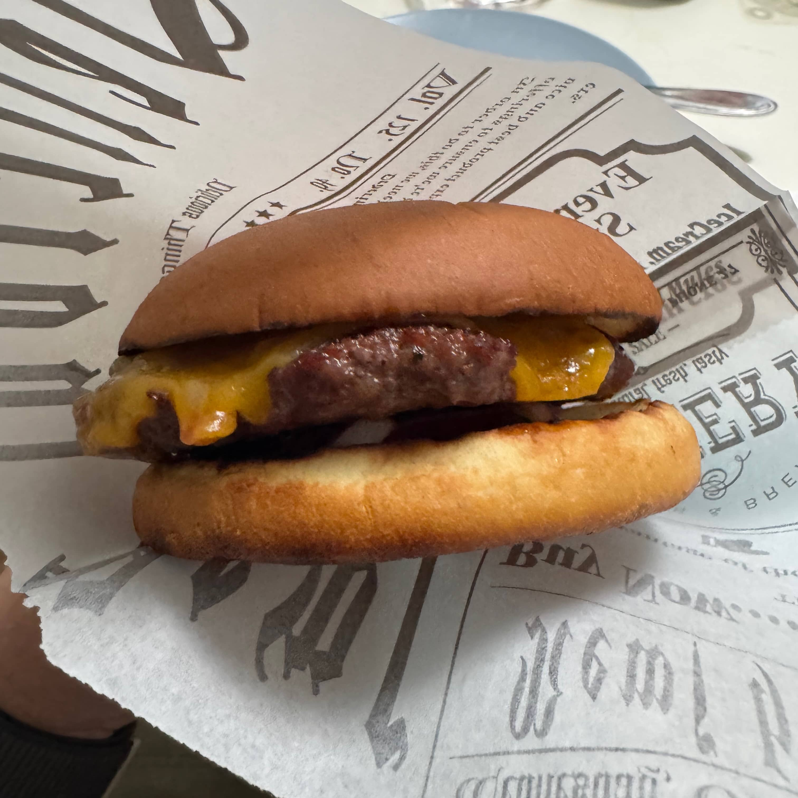

Nyt tulee semmoinen burgeri, että kelpaisi itse Poppamiehellekkin. Tämä resepti tulee nimittäin suoraan Markolta.  Katselin nimittäin YouTubesta [Burgerhoodin videota](https://www.youtube.com/watch?v=ctZKg7Bx8uk), jossa oli vieraana itse Poppamies eli Marko Suksi.

Tähän kohtaan olisi kiva kirjoittaa teksti: Yhteistyössä Poppamiehen kanssa. Ehkä joku päivä? Mutta piti itse Prismasta nämä ostaa ja harmistuin, että piti tuo lasipullo napata vaikka uusia muovipullojakin on tullut jo saataville. 

**Tämän burgerin ainekset on simppelit:**
- Burger sämpylät
- Poppiksen burgers & ribs rubi
- Poppiksen Garlic Marjonen
- Poppiksen Cherry & Cola BBQ kastike
- Burger jauhelihaa
- Juustoa
- Punasipulia

Kuvaan asti eksyi omat kaupan lempparisämpylät eli Street foodin soft bunsit ja sitten Snellmannin Burger jauheliha.

Olisiko se vappu aaton burgeri ellei olisi teemaan sopiva vappujuoma. Rouva on kasvisyöjä joten hänelle tuli toki oma burger pihvinsä. Siihen suosittelen ihan vegejauhista ja siitä voi tehdä pihvin. Tämä ei sitten kutistu.

Tein pihvit ensin ja pihviin laitoin hieman suolaa ja sitten burgers & ribs rubia mausteeksi. Nämä pintaan. Sitten vain kaikki grillin kautta ja juustoa päälle. Toi "ylähylly" Weberin pallossa on ollut tosi näppärä, kun voi pistää esim. sämpylät sinne lämpiämään kanssa.





Vappuaattona oli vielä kaverina airfryerissä tehdyt potut. Toinen burgerkuva alhaalla onkin Vappu päivän lounasburgeri samalla reseptillä.

Pitää vielä tuon kasaus mainita. Pohjaan tulee Cherry & Cola bbq soosi, kanteen sitten tuo Garlic Majonen. BBQ soosin päälle punasipuli ja sitten pihvi. Pihvissä, kun on jo juusto niin voi kannen pistää päälle. Itse heitin vielä tomaattia tuohon pihvin päälle.





Voin sanoa, että tää kombo toimi tosi hyvin. Loppujaan tosi simppeli, täysin käsin syötävä. Sopiva pikkuinen potku tulee tuosta ja itse en super tulisesta tykkää.

Ensi kerralla ehkä taas joku erilainen burgeri! 