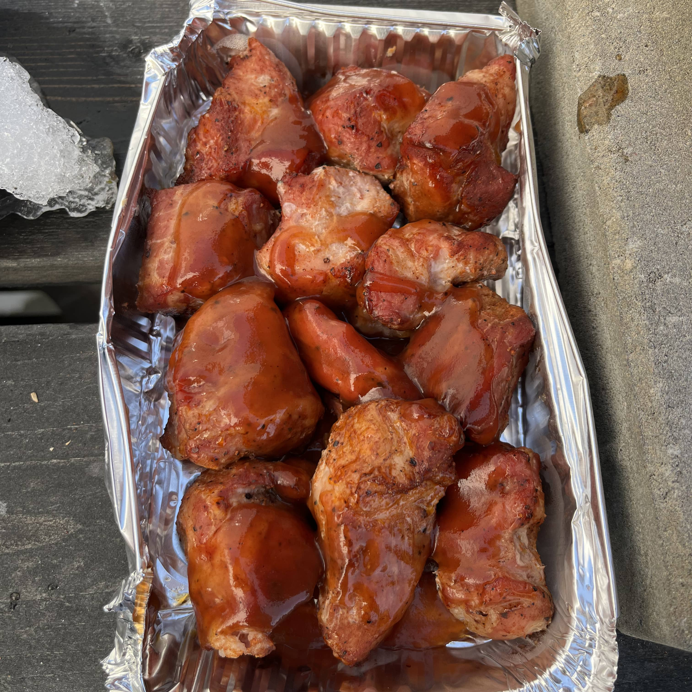

Pakko myöntää, talvella tuli grillattua tosi huonosti. Ihan hävettää. Uutena vuotena grillailtiin sentään nakkea ja semmoista. Kinkku jäi savustamatta, kun en tarjouksesta sopivankokoista löytänytkään ja korona kävi päälle. Nyt kuitenkin lähdetään takaisin asian ytimeen, kun kevät kolkuttaa ovella ja pitää alkaa treenaamaan. Otetaan [Bono Minimo](/bono-minimon-ensikaryt/) työvälineeksi ja tehdään possunoppia!

Possunoppiin törmäsin Facebookissa/Instagrammissa ja tarkemmin [Mikko](https://www.instagram.com/valtsungrilli/) siellä niitä postaili sinne. Sattuipa vielä kassleri olemaan K-Citymarketissa tarjouksessa.

Koska näitä tulisin syömään vain minä itse ja Bono Minimon tila on rajallinen niin päädyin tekemään puolet tästä kassusta ja puolet pistin pakkaseen odottamaan seuraavaa kertaa. Tehdään kassusta sopivia kuutioita (tai ainakin sinnepäin) ja pistetään rubi pintaan. Laittele myös suolaa jos ei rubissa sitä ole. Nyt oli Poppamiehen Burgers & Ribs rubia ja oisin voinut uskaltaa reilummin pistää. Ensi kerralla ehkä mennään ihan perinteisellä suola ja pippuri kombolla. Itse annoin maustua yön yli jääkaapissa näiden noppien vielä.

Sitten kun on odoteltu seuraavaan päivään on aika pistää kamado kuumaksi. Ensiksi nopat pistetään "nakuna" tunniksi ritilälle ja asteita olisi noin 110 celciusta. Epäsuoraa lämpöä haetaan. Tämähän onnistuu myös pallollakin. Isomman satsin ajattelinkin tehdä sillä ensi kerran. Alta näkeekin, että Bono Minimoon meni sopivasti tuo määrä mitä leikkelin.

Tunnin jälkeen alkaa jo nopat näyttää hyvältä. Ne onkin sitten aika pistää folioon tai vuokaan tai mihin haluatkaan. Itse käytin paria pientä foliovuokaa. Sinne sekaan haluamasi soosi niin ei pääse kuivamaan. Itselle valikoitui Poppamiehen Smoky Hickory BBQ soosi. Vuoka foliolla vielä peittoon.

Vuoassa ja peitettynä sekä soosattuna nämä on sitten pari tuntia samassa noin 110 asteessa. Suosittelen sekoittelemaan ja lisäämään tarvittaessa soosia jos näyttää siltä.





Pitihän se välistä käydä kurkkaamassa miltä siellä oikein näyttää.





Parin tunnin jälkeen otetaankin tovereilta foliokansi pois ja pistetään hieman lisää lämpöä (150-200) ja annetaan olla vielä 15-30 minsaa. Tässä vaiheessa voi kanssa lisätä halutessaan soosia glaseeraukseen.

Alta näkeekin sen, että vasemmassa vuoassa oli enemmän soosia kuin oikeassa. Siitä johtunee se, että hieman tummui tuo oikean vuoan palat. Olisi siis hieman pitänyt lisätä soosia ja sekoitella tuossa parin tunnin aikana.

Sitten alkaakin tämä homma olla taputeltuna ja aika alkaa maistelemaan.

Näähän onnistu siis tosi hyvin. Liha mureni melkein itsestään ja olihan nää nyt hyviä. Tätä voi varioida nimenomaan soosilla ja rubilla. Kuten mainitsin niin ensi kerran varmaan ihan perinteinen suola ja pippuri kombo. Soosiksi voisi myös itse koittaa tehdä bbq kastiketta.

## Resepti lyhyesti

1. Paloittele lihasta sopivia noppia eli kuutioita (tai ainakin sinne päin)
2. Laita haluamasi rubi pintaan 
3. Anna maustua yön yli tai anna sen nyt olla pari kolme tuntia edes (tai tee miten haluat, kokeile)
4. Grilli kuumaksi ja lämpöjä noin 110 astetta 
5. Nopat tunniksi nakuna ritilälle epäsuoralla tulella 
6. Nopat vuokaan soosin kanssa peitettynä pariksi tunniksi (voit tsekata välillä ja lisätä soosia / pyöritellä / ihastella)
7. Parin tunnin jälkeen suoja pois päältä ja lisää lämpöä peliin (150-200 astetta) noin 15-30 minuuttia (lisää tai ole lisäämättä soosia)
8. Syö

## Lisukkeet

Itse vedin nämä itse tehtyjen lohkoperunoiden ja Tzatzikin kanssa.

Tzatzikiin löytyy muuten aivan loistava ohje täältä: [https://www.realgreekrecipes.com/tzatziki-recipe/](https://www.realgreekrecipes.com/tzatziki-recipe/)  
On varmaan parhaita ohjeita mitä löytänyt ja tulee ihan Kreikka ja [Kreikan reissut](https://auringonalla.fi/) mieleen.

Lohkoperunat on itsellä yksinkertaiset:

1. Uuni 225 asteeseen lämpiämään 
2. Perunat lohkoiksi kuorineen (pese / huuhdo eka)
3. Sitten öljy, suola, pippuri sekä savupaprika sekaan ja sekoita 
4. Uunipellille tai astiaan 
5. 20 minuuttia uunissa jos ei ole ton jälkeen hyvät niin pidä vielä uunissa hetki kunnes ovat

## Mietteitä

Tää on kyllä yksi niistä resepteistä, jota suosittelen kokeilemaan. On muuten myös ns. aloittelijalle oikein hyvä resepti, kun ei tartte mitään sen ihmeellisempää olla.

Varmaan sama onnistuisi sähköuunissa tai leivinuunissa. Epäsuoralla itse tein joten varmaan tulisi syötävää. Pallossa nyt ainakin onnistuu sekä varmaan kaasugrillissäkin. Itsellä valikoitui kamado lähinnä siksi, että semmoinen on ja se ei ollut lumen vallassakaan.

Näitä tullaan tekemään uudemmankin kerran ja jäänee kyllä ns. kestolistalle. Näiden kanssa ajan arviointikin oli suht helppoa sillä voi varata semmoisen reilun 4h ennen ruokaa aikaa sytyttelyineen.
