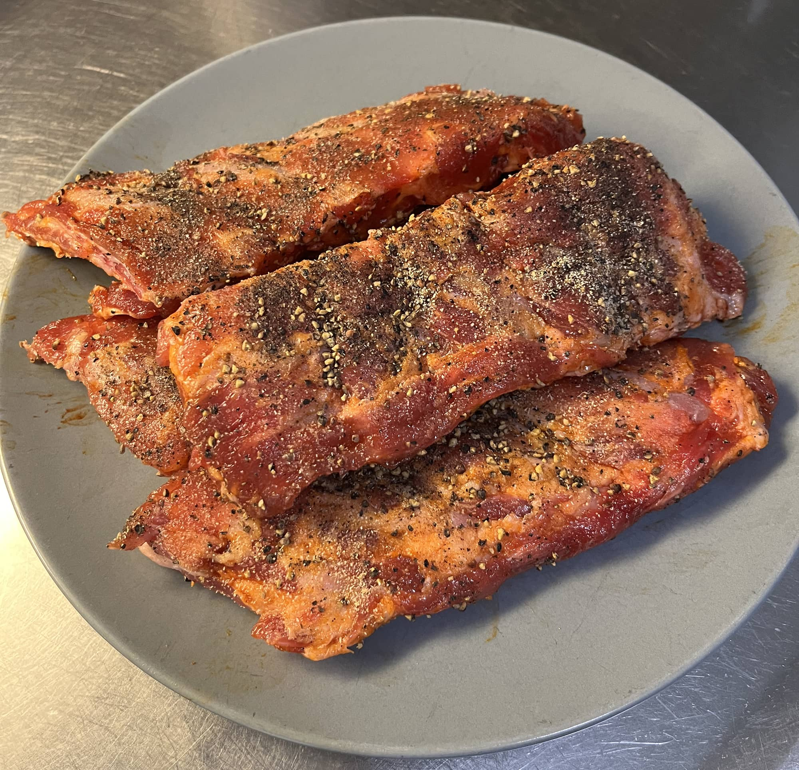

Kävi Sulo Vilenit Prisman lihahyllyllä, kun oli Herra Snellmannin Loin ribsejä bbq soosissa punaisella lapulla ja päätin, että otetaan kokeiluun. Pelivälineeksi otettiin tietenkin [Bono Minimo kamado](/testissa-bono-minimo-kamado/) sillä tuo yksi paketti menee siihen kevyesti ja menisi siihen enemmänkin jos laittaisi esim. kahteen tasoon.

Mitään isompaa pelisuunnitelmaa ei ollut, mutta ajatus oli 1.5h omppusavussa antaa nakuna olla ja sitten toiset 1.5h foliossa. Sen jälkeen sisälle folioon ja illemmalla sitten vielä lämpöä grillissä ja bbq soosia päälle. Ajatus, kun oli tehdä nämä valmiiksi myöhempää varten.

Ekahan tietysti otetaan paketista pois ja pyyhitään enimmät soosit pois. Sen jälkeen nappasin tuon luupuolella olevan kalvon pois. Tällä kertaa aika simppelit mausteet kun meni suola, pippuri ja valkosipulijauhe päälle molemmin puolin. Sen jälkeen grilliin hakemaan lämpöä (110 astetta oli ajatus).

Nakuna ollessa kävin about 20min välein hieman omppumehua suihkuttelemassa päälle. Lämmötkin pääs karkaamaan 150 asteeseen, mutta eipä se ole niin justiinsa. Jonkun 1h20min jälkeen käärin kaverit folioon ja pistin vielä hieman omppumehua kaveriksi. Samoihin lämpöihin 1.5 tunniksi. Taisipa olla ehkä lähemmäs 2 tuntia tuolla kun terassia pesi samalla.





Ribsithän oli valmista kamaa jo tuon jälkeen. Pistin noi kuitenkin lautaselle ja peitin foliolla. Ne oli siellä nelisen tuntia ja ajatus oli juurikin tämä, että teen ribsit valmiiksi niin ei ole epävarmuutta sitten myöhemmin ja ei tarvitse odotella näiden valmistumista.

Ribsien kaveriksi oli taas Sulo Vilen asialla ja K-Citymarketissa oli eurolla valmiiksi foliossa kirsikkatomaatteja ja pikkupaprikoita, näissä oli öljyt ja mausteet mukana. Harmitti, kun ei ollut ostanut enemmän... Kamadoon taas siis hieman lämpöä ja kasvikset ensin sinne. Sitten ne pois sieltä kun valmiit ja folion alle odottelemaan. Sitten vaimolle tofua grillattiin ensin ja ne folioon. Sitten vielä viimeiseksi ribsit kuumalle lämmölle ja bbq soosi pintaan.

Aika simppeli setti loppujaan ja tulen kyllä näitä ribsejä ostamaan uudestaan ja varsinkin jos lapulla. En ihan niin noista spareista välitä, kun niissä on sitä rustoa... Nämä onnistui nyt tosi hyvin ja ei tarvinnut kauheammin vängätä vastaan, kun liha irtosi nätisti. Savua ei ihan kauheasti tullut, mutta tämä oli allekirjoittaneen virhe sillä oli hieman huonosti laitettu nuo savupuut... Sitä sattuu.

Millä tavalla sinä teet ribsejä?
