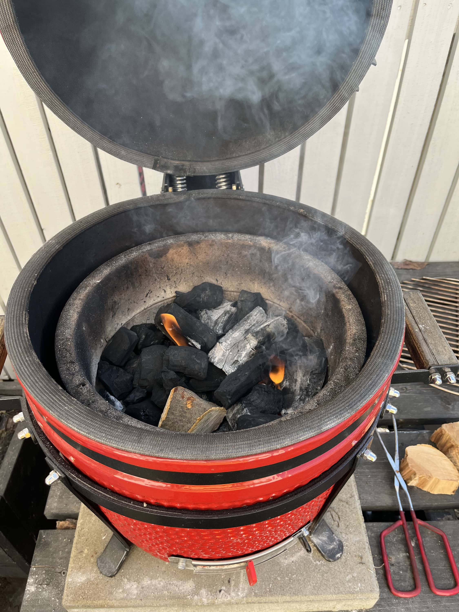
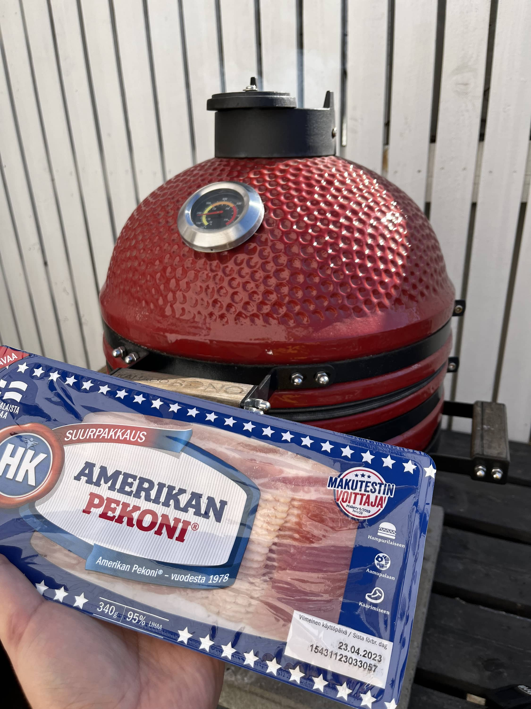
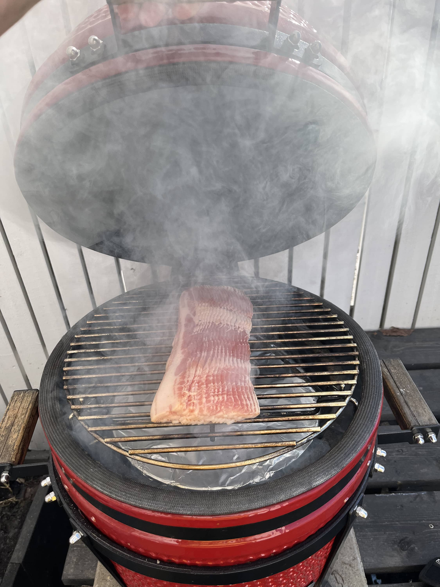
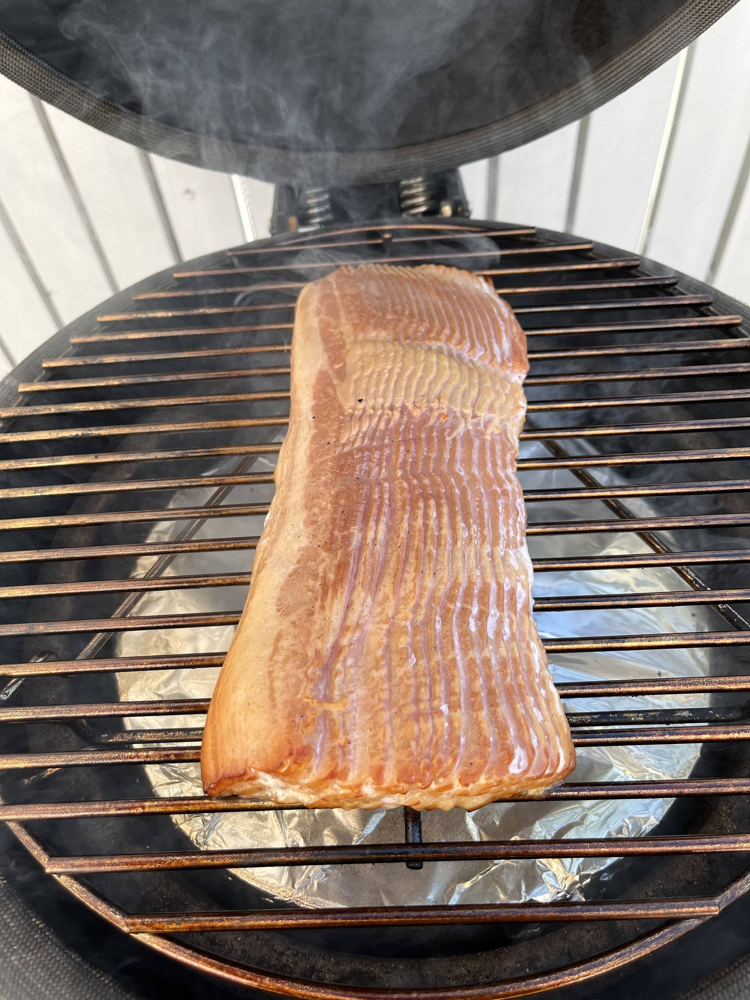
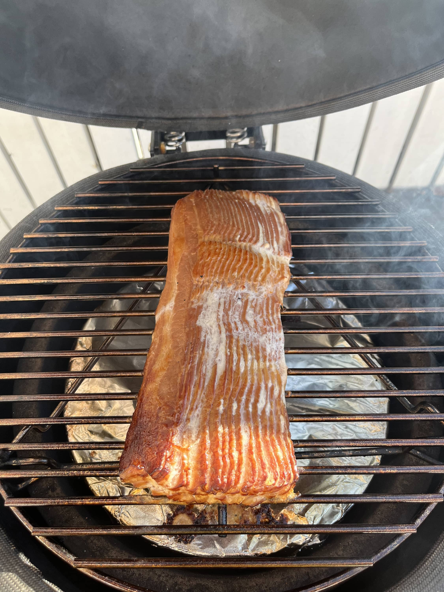
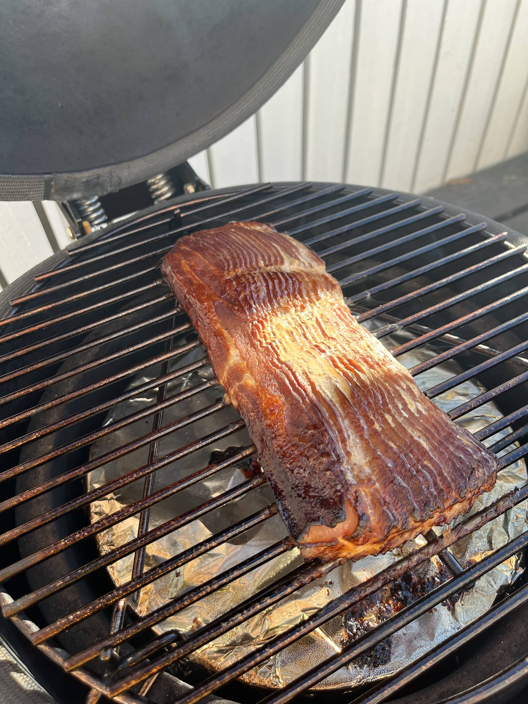
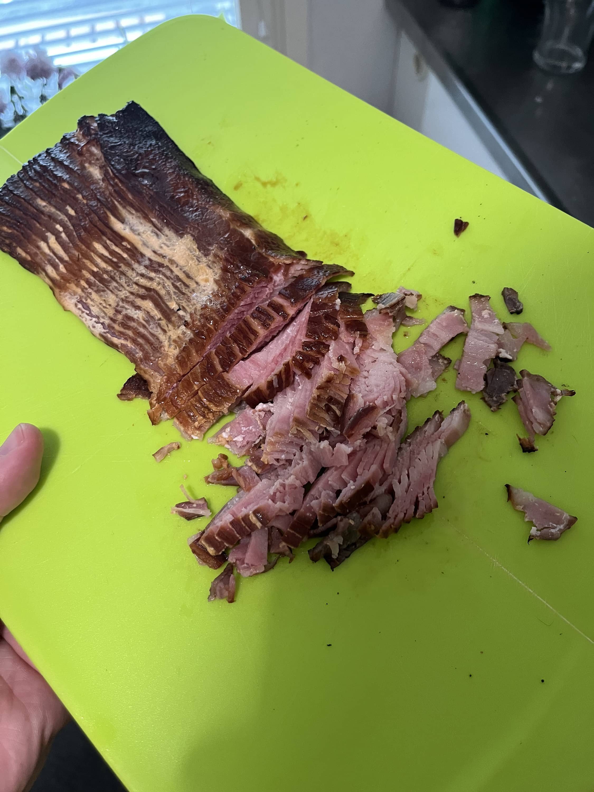

Savustettu pekoni. Kuulostaako hyvältä? Minusta kuulosti ja tämä onkin ollut kokeilulistalla viime syksystä saakka ja nyt juolahti mieleen, että kokeillaan. Työvälineeksi otetaan Bono Minimo kamado ja aletaan savustamaan.





Täähän on siis tosi simppeli projekti. Kamadoon noin 110 astetta lämpöä, itsellä pyöri siinä 110-130 tienoilla ainakin toi oman mittarin mukaan. Epäsuoralla eli lämmönjakokiveä väliin. Sit annetaan sen olla savussa 1.5-2 tuntia.

Alla onkin jokunen kuva prosessista ja tokihan sitä pitää kurkkia mitä sille kuuluu!





Sit kun alkaa näyttää omaan hyvältä, ota se pois. Itsellä oli parisen tuntia ja olisi hieman aiemmin voinut ottaa pois jo.

Täähän on super helppo projekti sillä ei tartte tehdä mitään muuta, kuin pistää kamado (tai muu grilli) tulille ja savua sisään. Annat olla ja nautit lopputuloksesta.

Tämähän on hyvä tämmöisenäänkin, mutta toimisi hyvin myös pizzassa ja pastassa. Tästä jo osa hävisi, mutta ajattelin tehdä pastaa lopuista.
