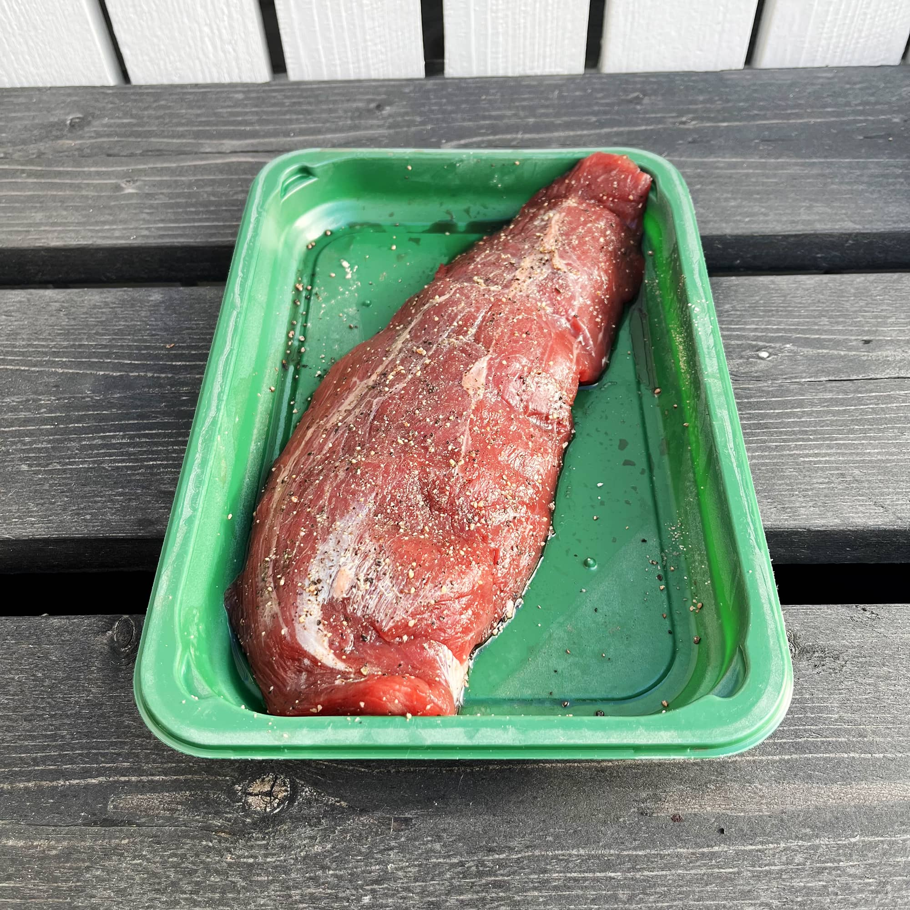
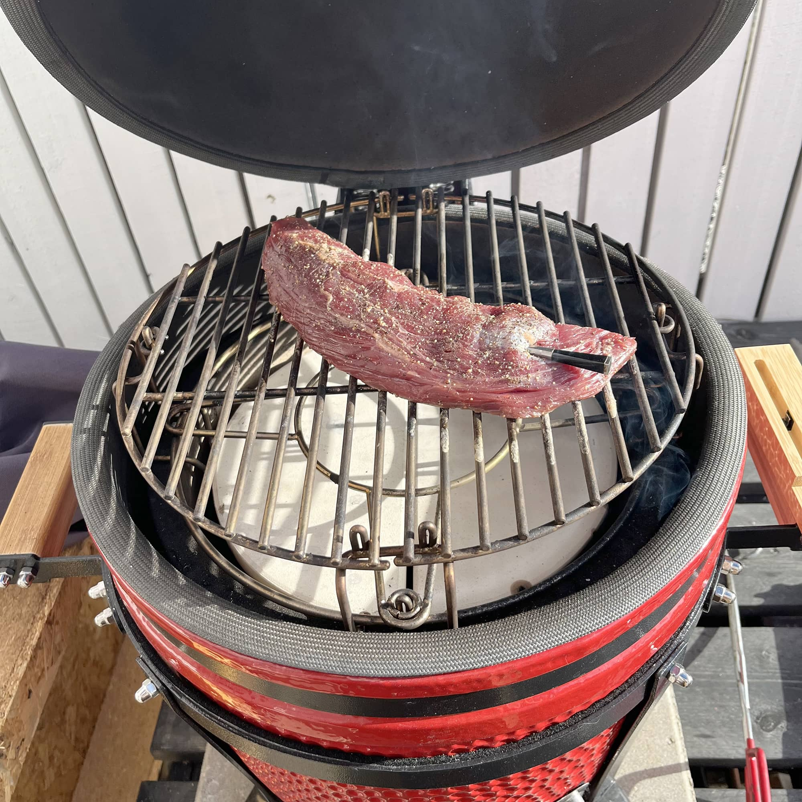
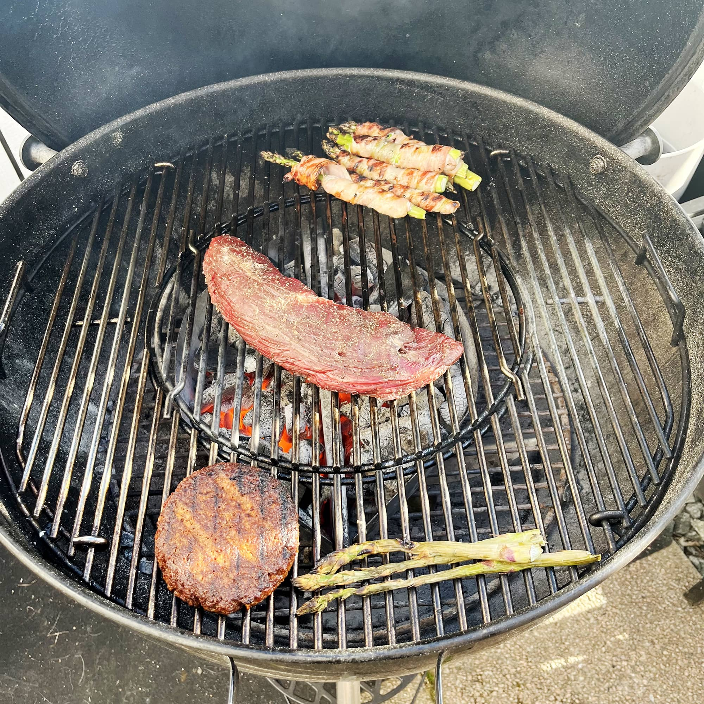
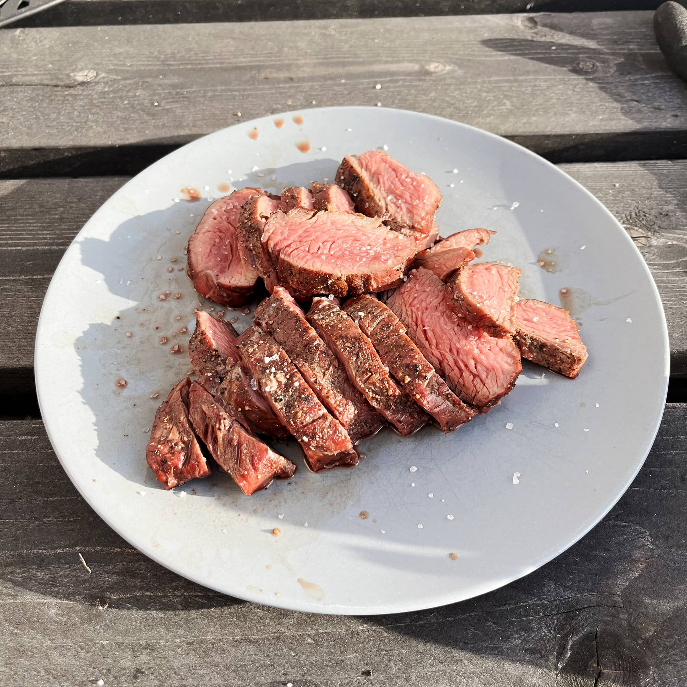
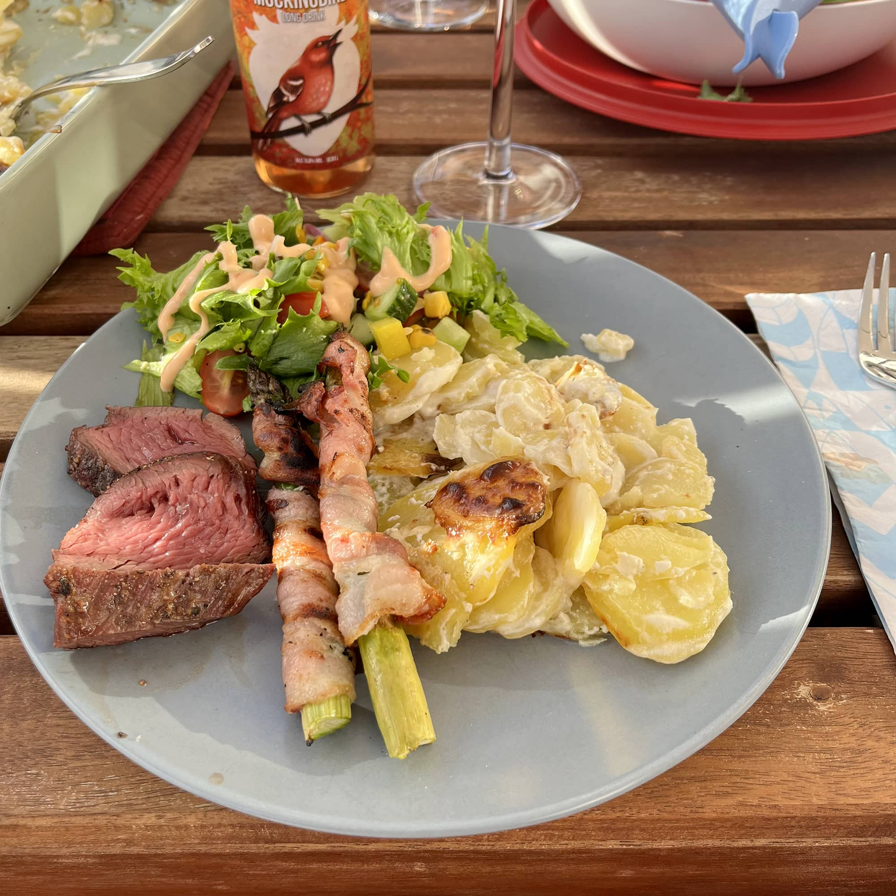

Sattuipa K-citymarketista löytymään -30% lapulla naudan petite tender (tunnetaan myös teres major nimellä). Olin tätä jo viime syksynä katsellut ja nyt se sitten lähti ostoskoriin ja sitä kautta sitten grilliin.

Suunnitelmana oli vetää tämä ns. reverse sear metodilla. Eli ensin ottaa sisälämmöt ja lopuksi sitten pintaan väriä. Lähdin simppelisti alkuun eli maustoin suolalla ja pippurilla.

Grilliin pistin lämpöjä 120-150 astetta ja sitten lihakimpale epäsuoralle lämmölle [kamadon](/bono-minimon-ensikaryt/) hellään huomaan.

Olihan siinä mulla Meater kiinni ja tässä ei kyllä kauaa mennyt. Ajatus oli ottaa sisälämpö siihen 48 asteeseen. Tässä meni itselle yllättävän vähän, mutta käyhän se järkeen, kun ei ole kovin iso kimpale kyseessä. Taisi alussa sisälämpö olla 13 astetta ja meni joku 20 minuuttia, että päästiin 48 asteeseen. Siitä sitten otin mötkön hieman lepäämään.

Mulla ei ollut savua tai mitään tuossa eli täysin epäsuoralla tulella tehtiin tämä. [Pallogrillissä](/weber-master-touch-gbs-e-5750-hiiligrilli-57-cm-yhden-kesan-jalkeen/) oli tulossa sitten samalla muuta lisuketta kuten kasvispihviä ja parsaa (pekonilla ja ilman) niin siihen hieman lisää lämpöä ja petite tender suoraan lämpöön.

Tässä ei nyt sitten kauaa mennyt sillä sisälämpö oli hyvissä kuosissa ja annettiin käytännössä hitusen väriä ja pintaa tuolle mötkölle. Siitä sitten hitusen lepiä, kun haetaan hieman kärkisuolaa ja katetaan muut valmiiksi. Liha leikkuuseen (huomatkaa erittäin ammattimainen - not - tarjoilu).

Lopullinen annos oli sitten seuraavanlainen: petite tender, itse tehdyt kermaperunat, perus salaatti, pekoniparsaa

Tuohan hävisi tietysti hyvinkin nopeasti parempiin suihin ja ei tuosta petite tenderistä jäänyt mitään jäljelle. Muille syöjille tuo maistui hyvin ja en kyllä kaivannut noihin mitään lisämaustetta eli naudan kanssa suola ja pippuri on tosi hyvä. Tuossa tuli pippurikin mukavasti esiin ja suolaa oli pöydässä jos tuntui siltä, että sitä tarttee lisää.

Ehdoton suositus tälle lihalle ja tulen varmasti tekemään uudemmankin kerran. Itselle nämä on täysin uusia lihoja ja en ole näitä itse tehnyt. Ajatuksena on sitten tehdä myös flank steakkia, hanger steakkia ja tomahawkia. Pitää katsoa josko saisi possun ja naudan ribsitkin tälle kesälle.

**Grillit kuumiksi!**
