Koska viime vuonna jäi blogaamatta joulukinkun teko kamadossa, niin tänä vuonna korjataan tämä erhe. Tänäkin vuonna päätin tehdä kinkun tuossa minun [Kamado Bono Minimossa](/testissa-bono-minimo-kamado/) ja sen koosta johtuen valitsin pienemmän kinkun eli noin 3 kg version. Ja muutenkin, kun huushollissa ei muita kinkun syöjiä ole niin tämmöinen pienempi kinkku riittää oikein hyvin.

## Kinkun valmistelu

Kyseessä oli itsellä pakastekinkku. Viime vuonna muistan ottaneeni tämän pakkasesta jääkaappiin edellisenä iltana ja silloin kesti hieman yli 3 kilon kinkun tekemisessä koko päivä. Tänä vuonna otinkin kinkun pakkasesta jo pari päivää ennen grillausta, jotta varmasti ehtii kunnolla sulaa.

Ennen kamadoon laittoa kuivasin vain kinkun ja tökkäsin Meaterin kiinni. En alkanut maustamaan tai suolaamaan kinkkua lisää. Jätin verkonkin paikalleen niin pysyy kinkku ns. kasassa. Osa ottaa verkon pois, mutta tällöin kannattaa käsitellä kinkkua varovasti.

## Kinkun paisto kamadossa

Kamadoon laitoin täyden pesällisen Khaya-hiiliä ja sytytin ne. Tällä välin kun kamado lämpeni niin puuhastelin hieman muita. Kun kamadon mittari näytti 120 astetta, kinkku sisään! Tavoitteena oli pitää lämpötila 110-130 asteen välissä koko paiston ajan. Laitoin kinkun rasvapuoli alaspäin niin suojaa hieman lämmöltä ja kinkun alla oli vielä folioastia keräämässä enimmät tippuvat rasvat.


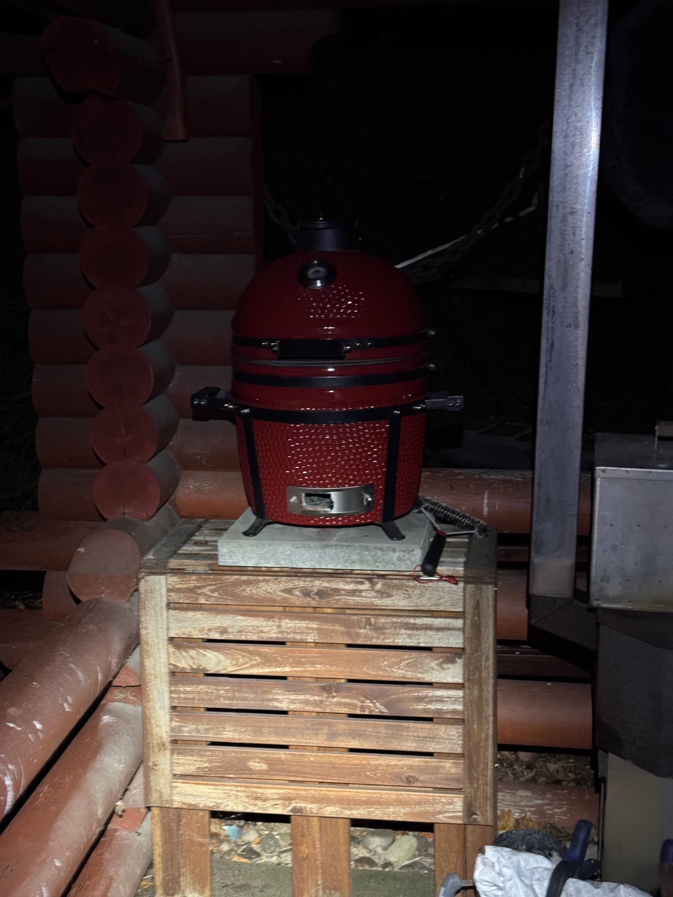
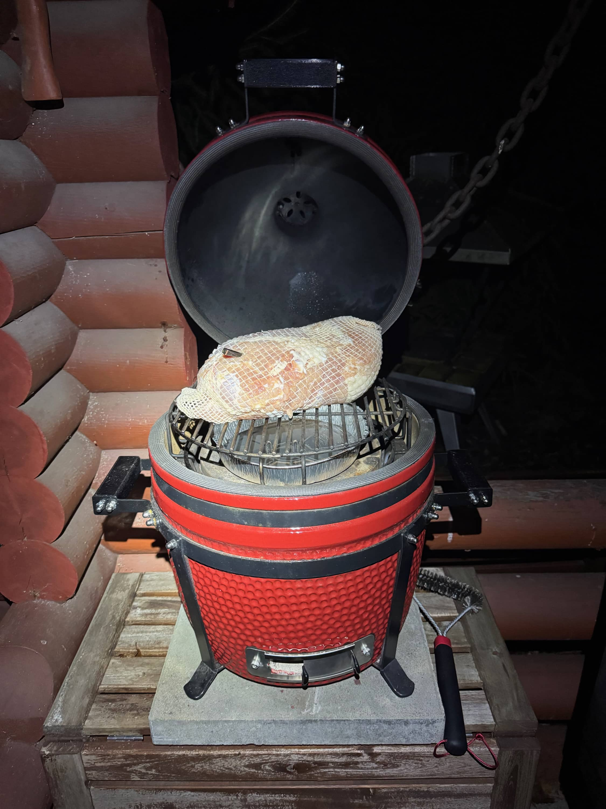


Kinkku paistui pääasiassa itsestään. Se hyvä puoli kamadossa on, että kun lämmön saa säädettyä kohdilleen niin se jaksaa puurtaa siellä itsestään. Kovapuuhiiliäkään ei kulu paljoa ja lämpö kun on mieto (110-130 välissä) niin pikku kamado täydellä hiilipesällä jaksaa helposti koko päivän.

Itsellä oli tosiaan Meater laitettu ja nyt kun tässä uudessa talossa on hieman enemmän lääniä ja matkaa tuolle paistopaikalle niin Meater oli paritettu iPadissä joka oli ikkunalaudalla, josta on suora yhteys kamadoon ja Meateriin. Meater oli itse kiinni kinkussa ja kamadossa, sen puinen telakka oli grillikatoksessa ja iPad sisällä talossa. Koska oli vielä Meater Cloudiin yhdistetty (eli kirjautuneena) niin puhelimella näin tätä kautta tilanteen. Oma malli on blogissakin nähty [Meater+](/meater-ensimmainen-kokeilu).

Alla onkin kuvaa kannen aukaisusta ja iPadin sijainnista. Tuossa on myös kiva bonus sillä Meaterin app pysyy auki ja näkee myös ohi kulkiessa mikä tilanne.


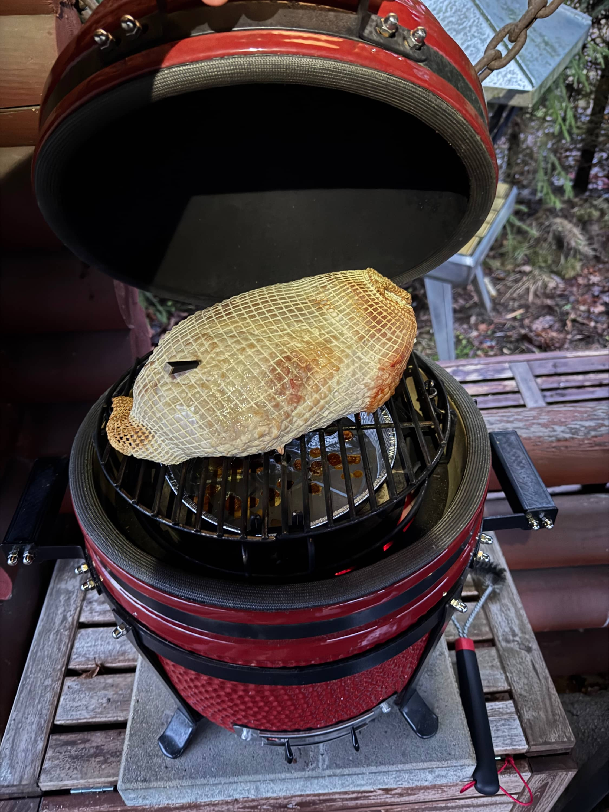
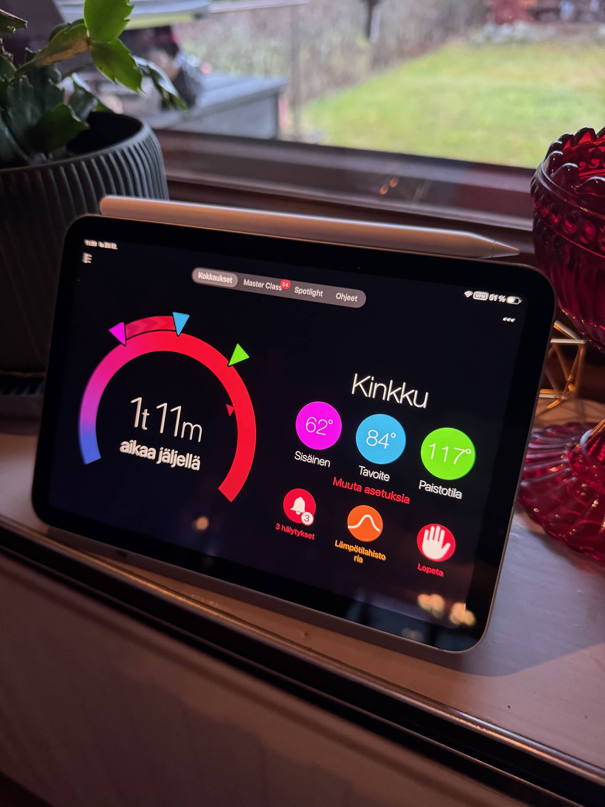
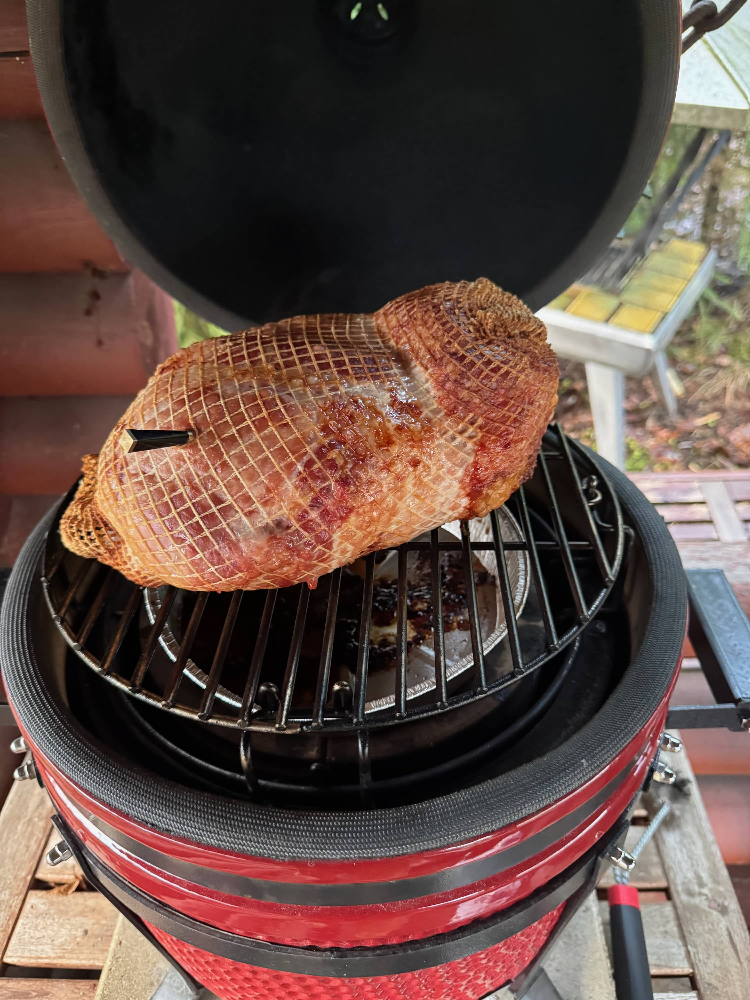


Sisälämpö kun näytti 82 niin päätin ottaa kinkun pois. Tällöin aikaa oli mennyt noin kuutisen tuntia ja kinkku oli saanut väriäkin. Otin kinkun sisälle ja sitten nappasin verkon ja nahat (sekä päällä olleet rasvat) pois. Tämän jälkeen pistin folion päälle ja jätin odottamaan sinappihuntua.


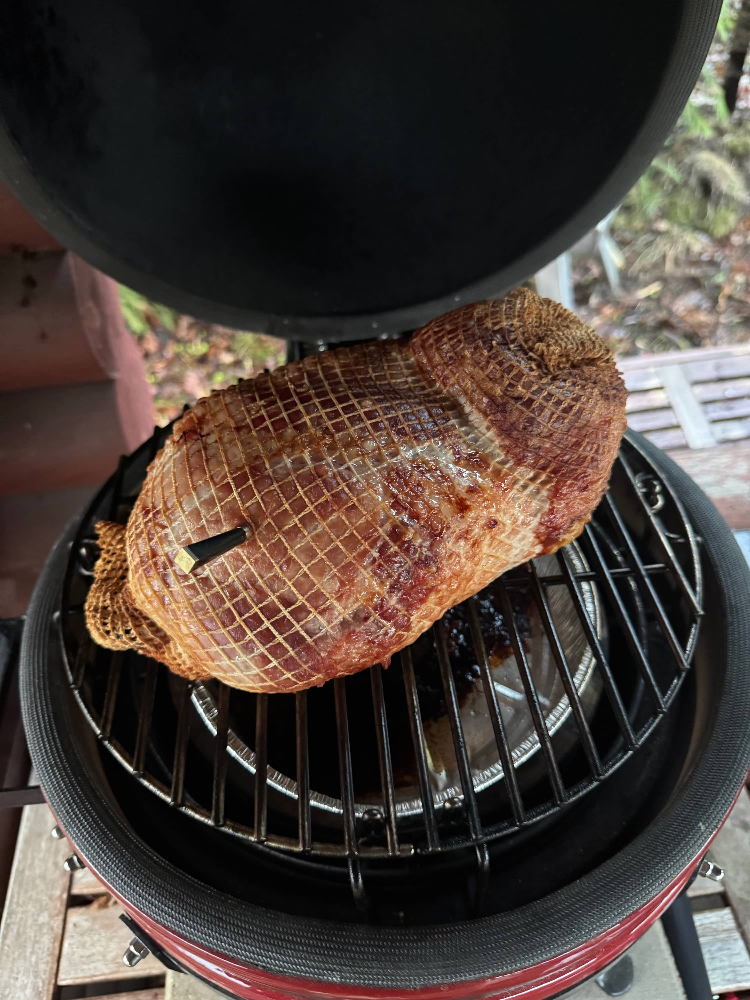
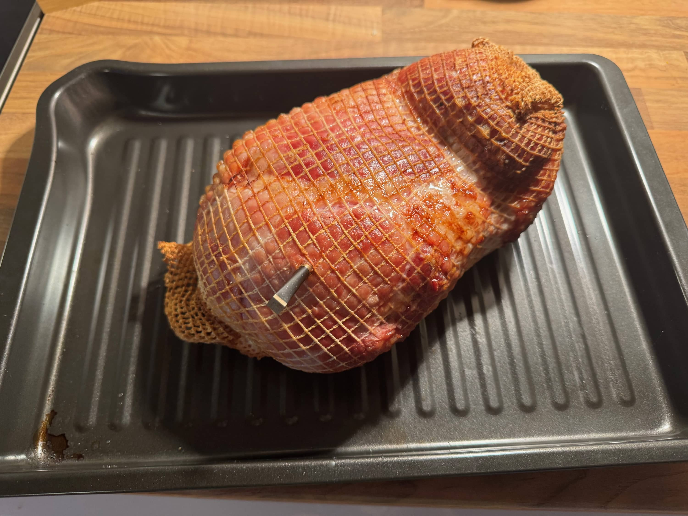
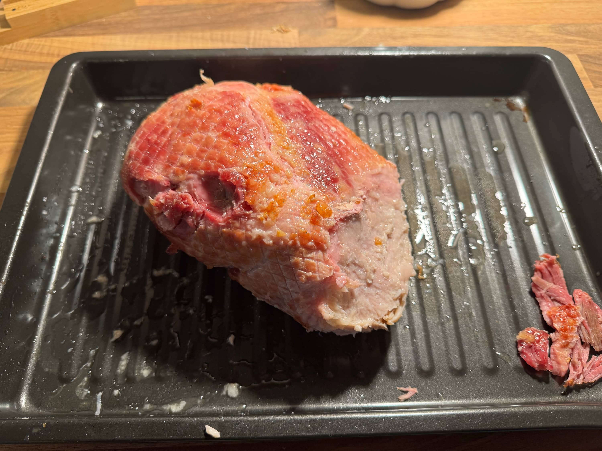


Rouva teki viskisinapin ja sen jälkeen saikin levitettyä sitä kinkun päälle ja korppujauhoa kaveriksi. Normaalissa uunissa pieni hetki, jotta saa korppujauho vähän väriä. Tämän jälkeen kinkku todetaan valmiiksi.

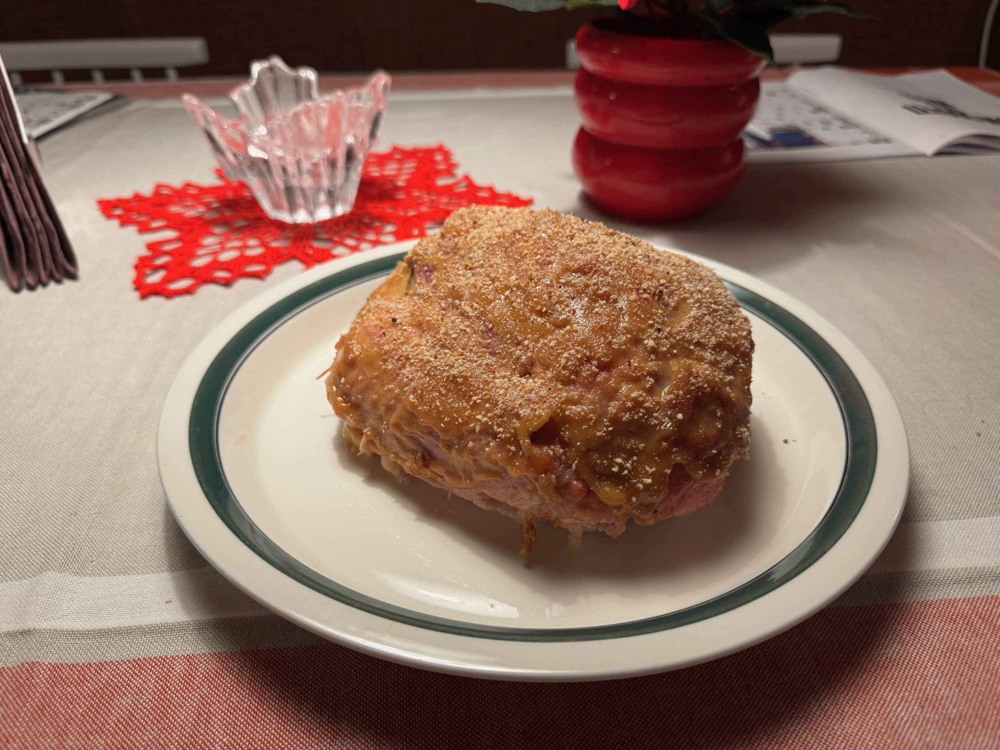

Illalla kinkun jäähdyttyä hieman päästiin maisteluun ja leikkasinkin kinkusta siivuja valmiiksi astiaan. Onhan toi nyt hyvännäköinen sisältäkin, kun on ottanut vähän smoke ringiäkin. 


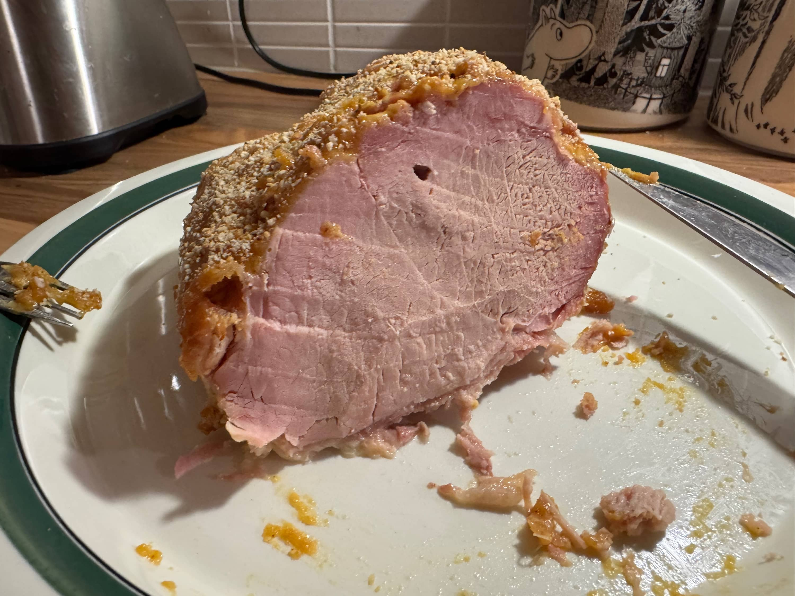
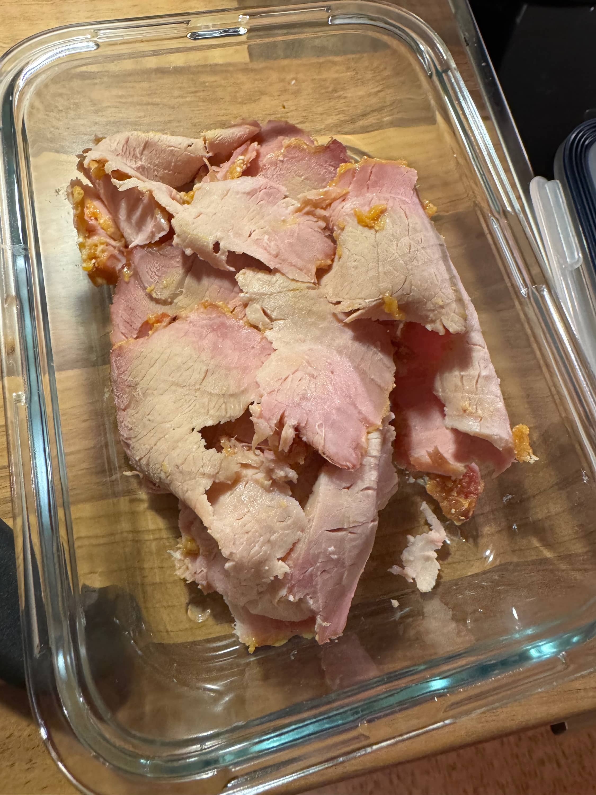


Tuli kerrassaan hyvä kinkku, olisi voinut paista murakammaksakin kun itse pidän vielä hieman murakasta. Seuraava kinkku sitten ehkä jopa 86 asteeseen. Mutta tämä oli onnistunut ja ei tule olemaan ongelmaa syömisessä.

## Yhteenveto - Joulukinkku kamadossa

**Kinkku:** ~3 kg pakastekinkku (sulatus 2 vrk jääkaapissa)  
**Lämpötila:** 110-130°C (epäsuora lämpö)  
**Sisälämpö:** 82°C (tai 86°C jos pidät murakammasta)  
**Aika:** ~6 tuntia  
**Hiili:** Täysi pesällinen Khaya kovapuuhiiliä (riittää reilusti)

Suosittelen kyllä lämpimästi kinkun tekoa kamadossa sillä siinä säästää myös sähköä ja aika pitkälti tulee myös itsestään tuolla. Ei kauheammin tarvinnut säätää ja hiiliä ei tarvinnut lisätä kertaakaan ja niitä jäi vielä reilusti sillä eihän tuo ollut, kuin 6 tuntia siellä.

Miten sinä teet kinkun tänä vuonna? Oletko kokeillut tehdä kamadossa tai grillissä?

🎄 **Hyvää joulua kaikille!** 🎄