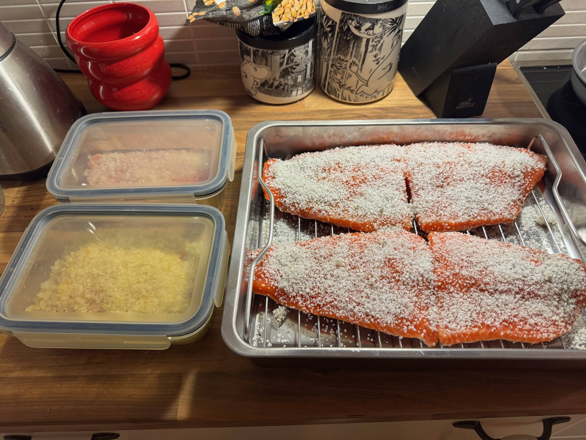
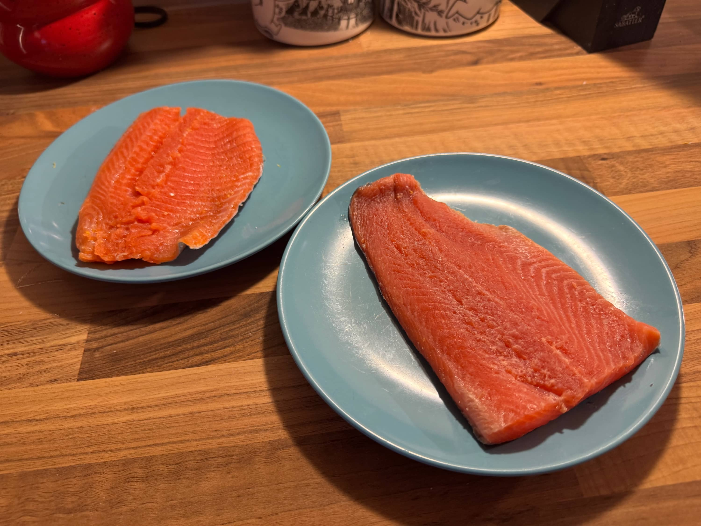
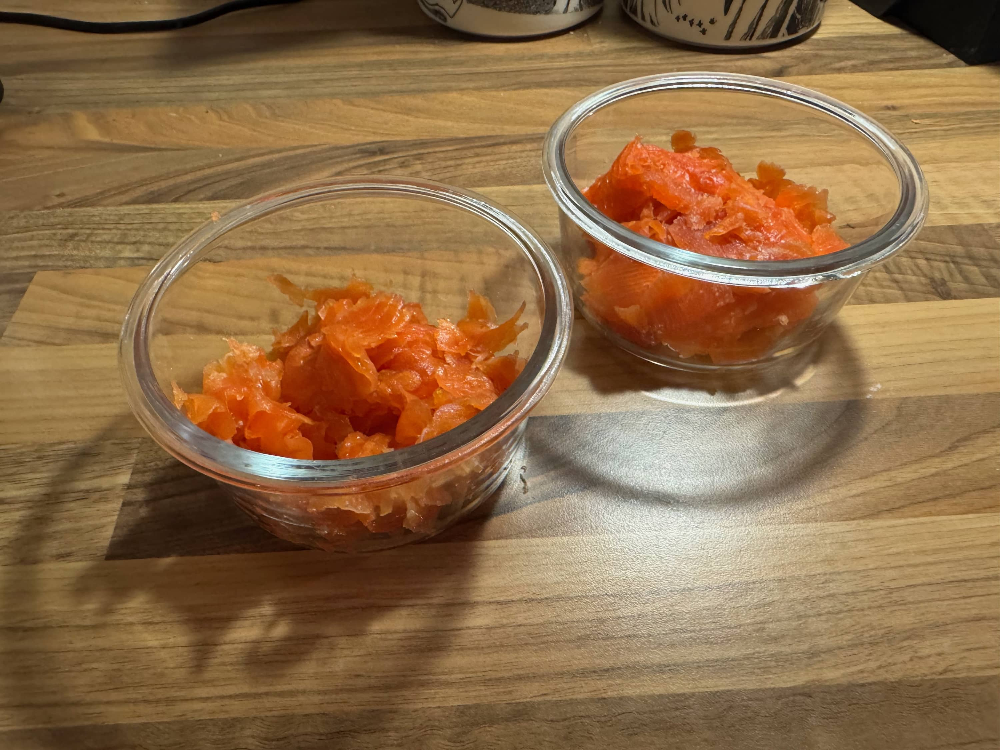
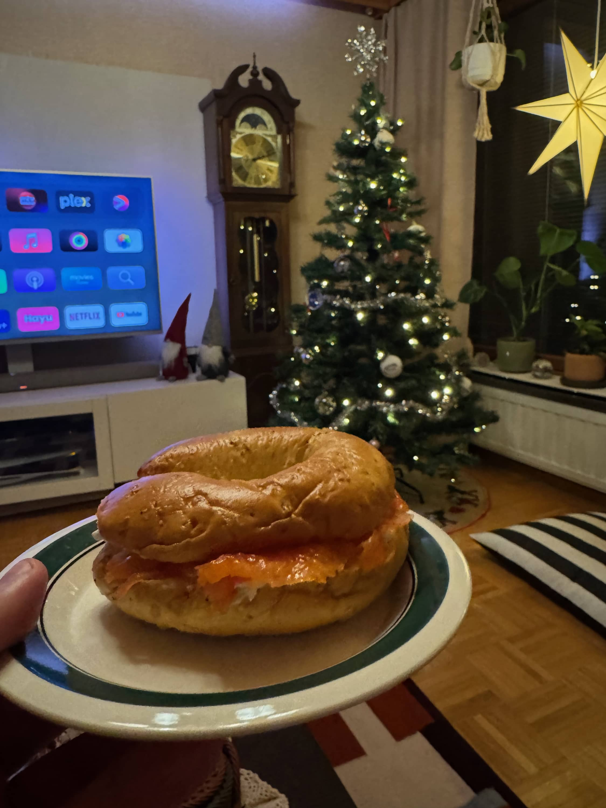
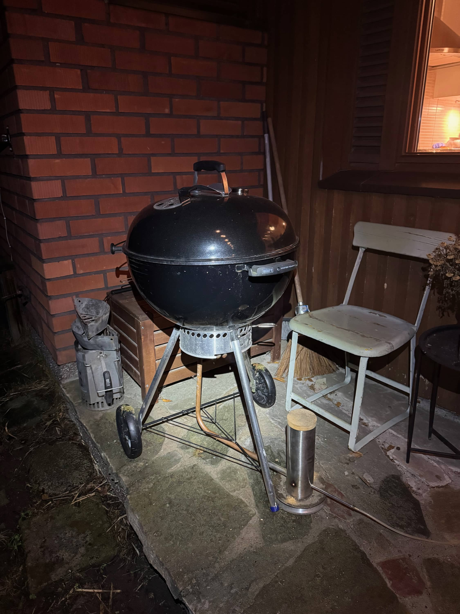
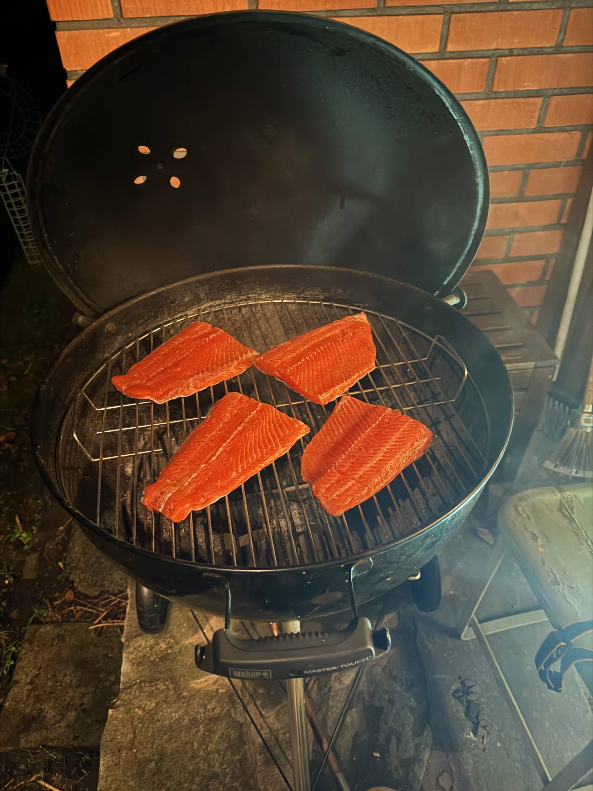
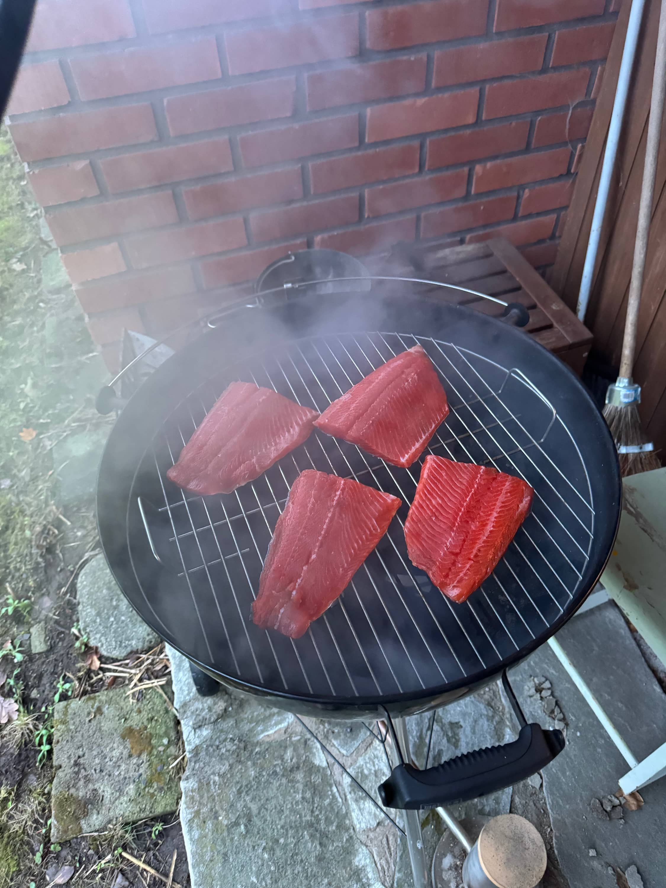
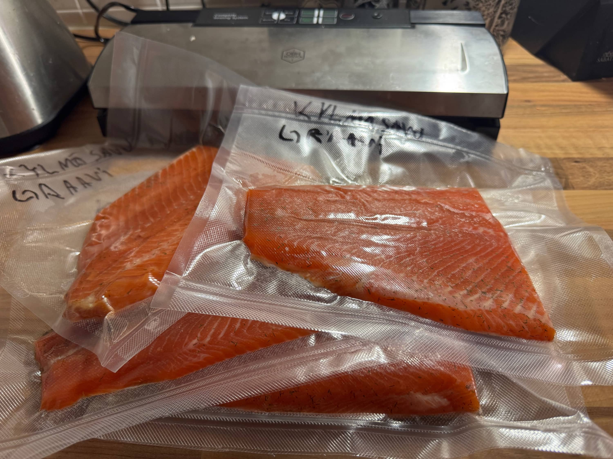

Tänä jouluna tehdään kalaa kolmella eri tapaa. Kahta erilaista graavia ja sitten kylmäsavulohta. Graavilohi tulee onneksi ns. itsekseen ja samoin kylmäsavukin, mutta sitä pitää hieman vahtia jo.

## Graavilohet

Tänä vuonna tehdään tosiaan kahta erilaista graavilohta. Kokeillaan hieman erilaisia komboja. Graaviin on yksi file käytössä ja puolitin sen niin saadaan pari eri versiota. Molempien versioiden ohjeet on tuolla alempana.

### Graavaus

Tämähän on äärettömän yksinkertaista. Kala fileeksi (älä ota nahkaa pois) ja ota ruodot pois. Tänä vuonna ostin valmiita fileitä ja niissä olikin jo suurin osa ruodoista poistettu. Kävin silti läpi ja poistin loputkin pinseteillä.

Sen jälkeen suolat ja mahdolliset mausteet päälle ja jääkaappiin graavautumaan. Itse laitoin ihan vain rasiaan ja siihen suolat ja mausteet. Versioiden reseptit alempana.

Molemmat graavit oli itsellä noin 16h jääkaapissa ja sen jälkeen huuhtelin ne kylmällä vedellä ja kuivailin talouspaperilla. Sitten pistin vielä vakuumiin ne ja jääkaappiin odottamaan syömistä.





Pitihän tuota päästä jo illalla maistamaan. Rinkelisämpylä paahtimeen, tuorejuustoa ja graavia. Tohon kun olisi ollut vielä pikkelöityä punasipulia tai mummonkurkkuja niin olisi ollut vielä hitusen parempi.

Molemmat kokeilut oli onnistuneita ja tuo Lauri Kaivoluodon resepti vei tällä kertaa voiton.

### Versioiden reseptit

Tässä on vielä molempien versioiden käytetyt aineet.

#### Versio 1: Viskigraavi

Tähän versioon laitoin vajaa pari ruokalusikallista viskiä. Käytin savuista Ardbeg An Oa viskiä, jotta saisi hieman savunmakua. Sitten lisäksi pelkkää merisuolaa.

#### Versio 2: Lauri Kaivoluodon sitrusgraavi

Tähän versioon tulee sitruunan ja appelsiinin kuoret. Puolikkaalle lohifileelle laitoin noin 400g merisuolaa ja raastoin sitruunan ja appelsiinin kuoret.

## Kylmäsavulohi

Kylmäsavulohikin on suhteellisen simppeli prosessi. Tässäkin ensin kala fileeksi ja ruodot pois. Tämän jälkeen kala suolaan ja nyt käytin valmista [graavisuolaa](https://www.puuilo.fi/mausteporssi-graavisuola-1kg). Kalaan levitin käsipelillä suolaa niin että peittyi ja pistin yöksi jääkaappiin. Artikkelin ekassa kuvassa näkyykin osviittaa määristä.

Seuraavana aamuna sitten aletaan kylmäsavustamaan. Käyttöön otetaan blogissakin aiemmin nähty [Mustan savukehitin](/mustang-savunkehitin-kylmasavustuksessa-kokeillaan-tehda-kylmasavulohta-ja-savujuustoa/) ja Weberin pallogrilli. Itsellä on pikkuinen putki savukehittimestä pallogrilliin ja näin kalat saa savua. Olen vielä oman ritilän hankkinut Biltemasta kaloja varten. Olisi vielä pari filettä mahtunut, mutta näillä mennään.

Ennen savustusta kalat otettiin pois suolasta ja huuhdottiin kylmällä vedellä. Tämän jälkeen kuivailin talouspaperilla ja pistin kalat savustumaan.





Välillä piti käydä katselemassa miltä siellä savuissa näyttääkään.

Kalat oli kylmäsavussa reilu 10 tuntia ja sen jälkeen otin ne pois ja pistin vakuumiin. Kalat saa olla vakuumissa jääkaapissa pari päivää ennen syömistä, jotta maku tasaantuu. Tai oikeastaan niin kauan kuin malttaa olla syömättä. Pienen maistiaisen otin ja olihan se hyvää.

Nyt oli savunkehittimen kanssa pientä ongelmaa sillä se sammui pari kertaa ja piti sytyttää uudelleen. Olisiko kosteudella ollut nyt hieman enemmän osaa sillä tuntui, ettei purut tippunut alaspäin ja piti "kopistella" niitä alas. Ehkä ensi kerran koitin ns. perinteisemmän savukehittimen avulla tätä touhua, mutta katsotaan.

## Yhteenvetoa

Tämäkin touhu on suhteellisen simppeliä ja tulee muuta puuhatessa. Tänä vuonna samana lauantaina paistettiin kinkku kamadossa ja tehtiin kalat.

Ihan tässä harmittelin ja ihmettelin syödessäni graavia, että miksi tulee loppujaan niin harvoin tehtyä sillä sehän on aivan äärettömän helppo tehdä itse. Ei kauheasti tule ostettua kaupasta graavia, kun sen voi tehdä itse halvemmalla. Kotimainen lohi on suht usein tarjouksessa ja niitä kannattaakin hyödyntää.

Miten sinä teet graavia tai kylmäsavulohta? Versioita on melkeinpä yhtä monta, kuin tekijääkin!

🎄 **Hyvää joulua kaikille!** 🎄