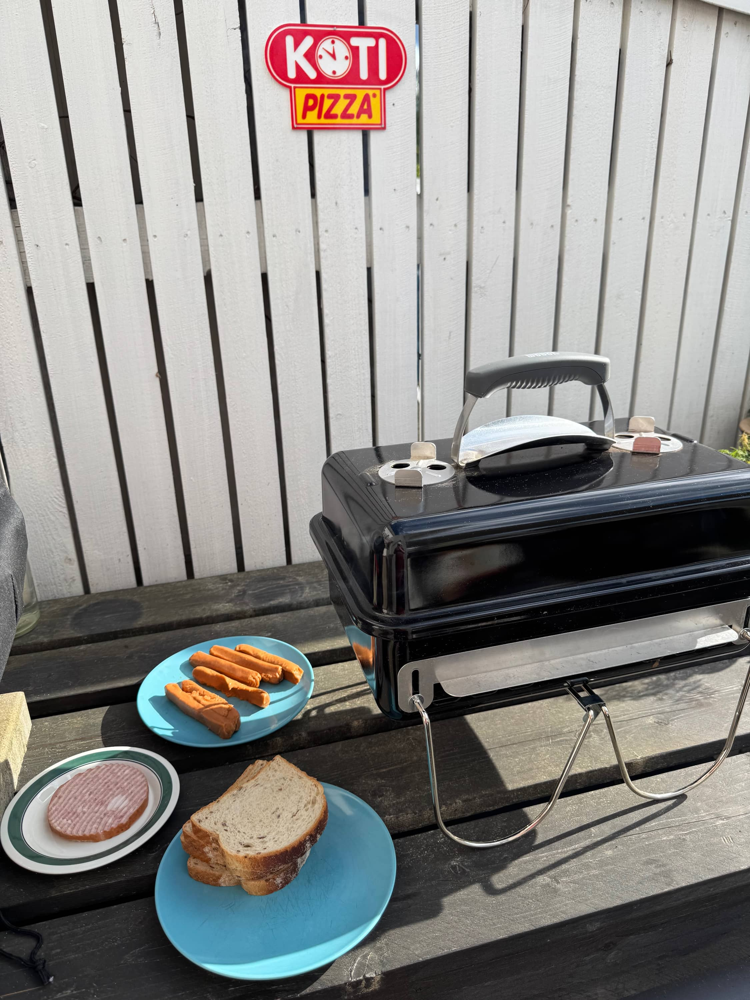
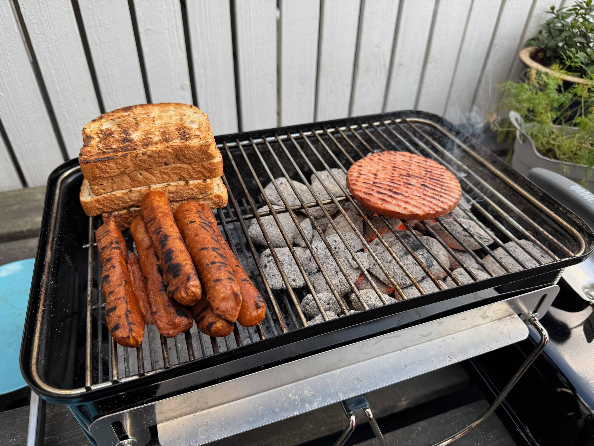
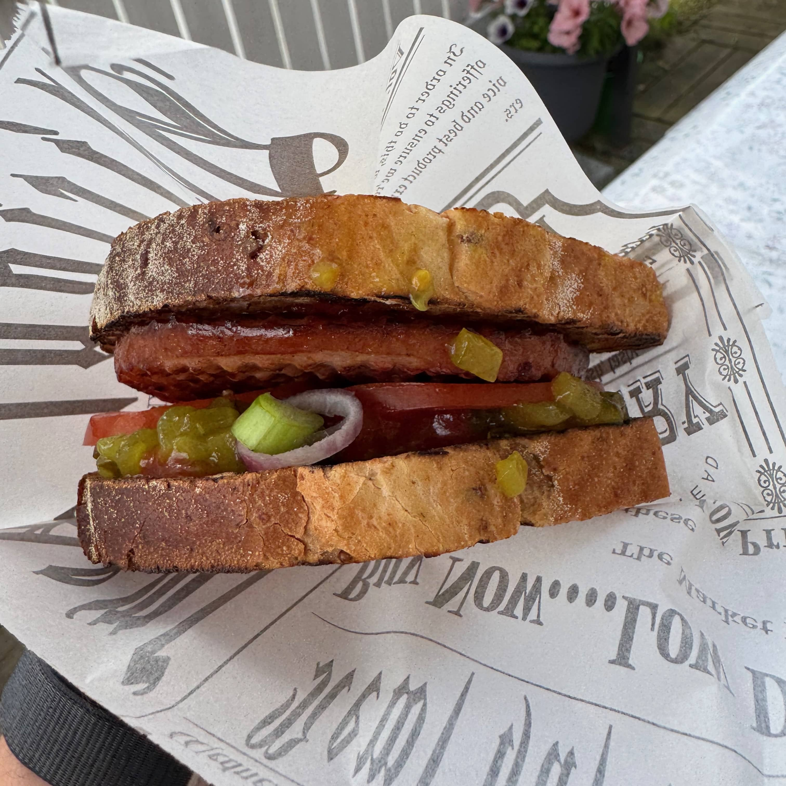

Tuli yksi päivä visio, että tehdään porilaisia tai ainakin eräänlainen versio niistä. Oli nimittäin makkarapihvejä tarjouksessa aiemmin viikolla ja pohdin mihin ne käyttäisi. Enpä ollut aiemmin tehnyt porilaisia, joten päätin alkaa kokeilemaan.

## Mikä on porilainen?

Olen kuullut porilaisesta ruokana aiemmin, mutta en tiedä olenko koskaan ns. aitoa porilaista syönyt, en ainakaan ole itse tehnyt. Piti ihan turvautua [Wikipediaan](https://fi.wikipedia.org/wiki/Porilainen), jossa sanotaan näin:

> Porilainen on suomalainen grilliruoka, joka yleensä koostuu kahdesta paahtoleivästä ja niiden välissä olevasta noin senttimetrin paksuisesta palasta jahtimakkaraa. 
> 
> Jahtimakkaran ja leivän lisäksi porilaisessa on raakaa sipulia hakkeena ja sinappia. Aidon Porilaisen tunnistaa oikeasta leivästä sekä tietynlaisesta makkarasta. Aitoon Porilaiseen ei kuulu esimerkiksi kananmunaa, juustoa tai majoneesia.

## Millainen porilainen me tehtiin?

Kuten sanoin niin ei lähdetty tekemään aitoa vaan omanlainen versio. Perusperiaate oli kuitenkin se, että on paahtoleipä ja sen välissä makkarapihvi sekä lisukkeet. 

Pelivälineeksi valikoitui Weber Go-Anywhere hiiligrilli ja siihen Weberin omat briketit. Tähän grilliin käy noi briketit oikein hyvin sillä ne on kooltaan pienempiä, kuin nuo omat ns. normi hiilet eli kovapuuhiilet, jotka on vähän möhköjä tähän.

Pistin toiselle puolen briketit ja toista puolta pidin sitten "kylmänä" puolena. Näin saan grillattua osissa nämä ja pysyy sitten vielä lämpimänä toiset. Tässä näkyy myös, että on veke versioon tehtiin rouvalle vekenakkeja ja lihalliseen oli makkarapihvi.





Itse porilaiset kasasin niin, että kansiin tuli hitusen sinappia ja ketsuppia. Sitten väliin makkarapihvin kanssa tuli kurkkusalaattia, kevätsipulia, punasipulia ja tomaattia.

Tämä meni heittämällä kyllä jatkoon. Tuli oikein hyvä ja piti vielä tuon jälkeen grillailla toinenkin itselle, kun kelpasi niin hyvin. Ehdottomasti kannattaa kokeilla ja johonkin illan istujaisiin aivan loistava eväs.

Isommalle porukalle jos tekee niin tekisin ehkä leivän paahdon uunissa grillivastuksella tai sitten muurikalla. Näin saisi leivät hieman nopeammin, kuin grillissä.

**Oletko sinä tehnyt porilaisia kotona?**