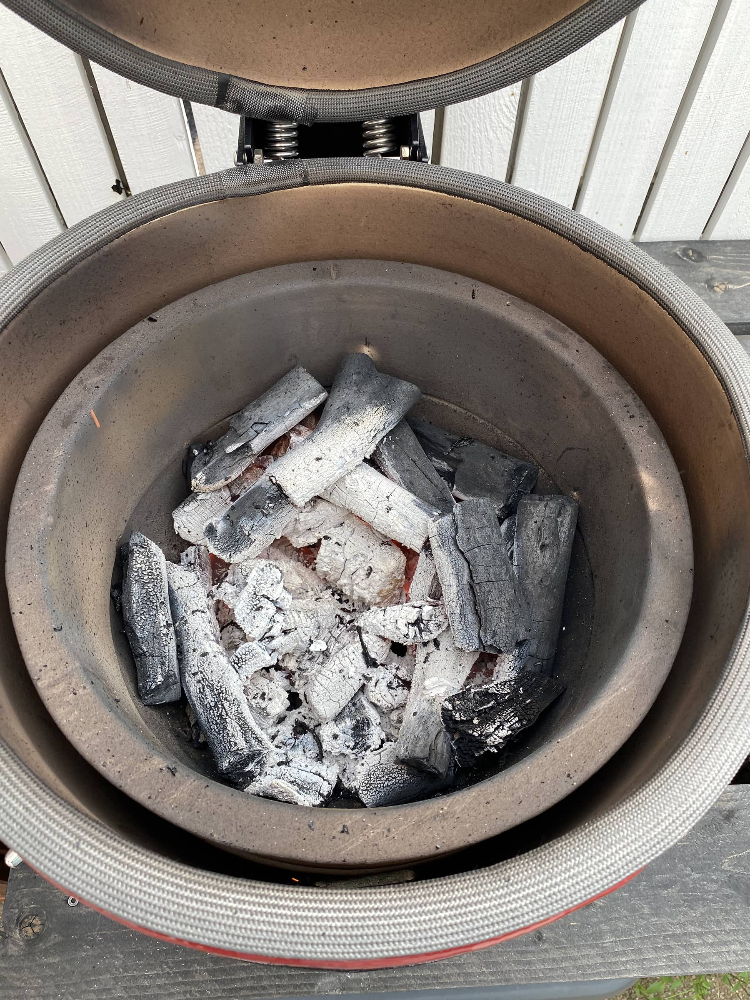

Oli aika pistää [vasta hankittu kamado](/bono-minimon-ensikaryt/) töihin. Tarkoituksena oli tehdä ensimmäistä kertaa pulled porkkia kamadolla. En muista olenko tehnyt itse pulled porkkia, mutta olen sitä kyllä syönyt. Katsotaan siis mitä tulee ja tässä hieman reseptin tapaistakin teille.

Vaimo löysi kaupasta maatiaispossun kasslerpalan ja sen kanssa testiin pääsi myös Meater+ lämpömittari (tästä tulee oma blogijuttu!). Otin tämän pariksi tunniksi huoneenlämpöön odottelemaan vuoroaan, kun värkkäsin [pizzataikinaa sunnuntaiksi](https://www.instagram.com/p/CS53sbfDK46/). Sen jälkeen paketista pois ja kuivailin sitä hieman talouspaperilla. Sitten laitoin Poppamiehen jenkkityylistä keltaista sinappia pintaan, jotta rubi pysyy hieman paremmin. Rubina oli kaapista löytynyt Poppamiehen pulled pork rubi. Tämä rubi taitaa olla vain tuossa esittelypakkauksessa missä on neljä eri rubia.

Sitten olikin aika pistää kamado lämpimäksi. Hiilinä otin kokeiluun [Sunset Charcoalin Marabua](https://sunsetcharcoal.com/fi/). Savuja otin sitten omppupuun paloilla.

Tavoitelämpö kamadolle oli 130 astetta. Siihen, kun sain lämmön asettumaan niin pistinkin lämmönjakolevyn ja kasslerin lämpöihin.

Ensimmäinen tunti meni oikeastaan lämpöjä säätäessä. En tiedä olisiko pitänyt pistää grilli lämpöihin ja sitten lämmönjakolevy ja ritilä jonka jälkeen katsoa miten asettuu ja sitten vasta kassler. Joku viisaampi ehkä voi tässä auttaa. Sainkin sitten lämmöt asettumaan siihen 128 asteeseen ja säädin sitä sitten hieman vielä jossain välissä ja siitä noustiinkin ja taidettiin käydä 140 pinnassa ennen folioon käärimistä. Olin päättänyt kääriä kasslerin folioon, kun sen sisälämpötila on 67 astetta. Tämä tapahtuikin sitten noin 3 tunnin kohdalla. Alla kuva siitä, kun avaan luukun ekan kerran ja sen jälkeen takaisin folioon.

Folioon käärimisessä lämmöt sitten hieman heitteli taas ja sainkin asettumaan 120-125 asteeseen, joka kelpasi. Sitten odottelin, kunnes sisälämpötila olisi 95 astetta ja tuo tökättävä lämpömittari menisi nätisti läpi lihasta. Tämän jälkeen otin pois kamadosta ja pistin sen pyyhkeen alle vetäytymään about tunniksi.

Vilkaisin vetäytymisen aikana kamadoa ja siellähän oli hiiltä vielä kivasti jäljellä ja oltaisiin päästy kyllä hyvinkin pitkälle vielä tuolla määrällä. Päätin avata luukut kunnolla ja hieman lämpöjä ritilälle, jotta saan siivoiltua kasslerin jämät siitä. Itse pyrin puhdistamaan ritilät aina kokkauksen päätteeksi niin olisi siisti seuraavaan kertaan sitten.

Oli aika katsoa mitä folion sisällä on ja sieltähän löytyy lihanpala!

Revin kasslerin ja pistin sekaan hieman tuota samaa rubia mitä pinnalla ja Poppamiehen smoky apple bbq kastiketta.

Pitihän se pikku burgeri tekaista tuosta. Väliin siis pulled porkkia, itse tehtyä kurkkusalaattia, tomaattia ja Koskenlaskija cheddar soosia. Lisukkeeksi sitten hieman coleslawta. Ellen väärin muista niin coleslawn ohje on [K-ruoka sivulta](https://www.k-ruoka.fi/reseptit/coleslaw-eli-amerikkalainen-kaalisalaatti).

Parin tunnin jälkeen oli muuten kamadossa vielä kivat jälkilämmöt ja oli vielä lämmin keramiikka.

## Resepti lyhykäisyydessään

1. Ota liha huoneenlämpöön tunti pari ennen 
2. Kuivaile liha talouspaperilla 
3. Laita rubi pintaan ja voit käyttää sinappia sidosaineena tai esim. öljyä tai sitten ei mitään muuta, kuin rubia 
4. Grilli/kamado tulille ja tavoitelämpö about 130 astetta 
5. Liha sisään grilliin 
6. Pidä liha grillissä 130 asteen lämmössä, kunnes sisälämpötila noin 67 astetta 
7. Kääri folioon ja pistä takaisin grilliin 
8. Sisälämpötila sinne 95 asteille ja ala tökkimään ja katso kunnes menee ilman vastusta sisään 
9. Liha pois ja vetäytymään 30+ minuutiksi 
10. Revi liha, mausta jos tuntuu siltä ja syö

## Mietteitä vielä

Tosiaan tuo alun lämmönsäätö hieman venyi ja varmaan vaikuttikin tuohon kokkauksen pituuteen. Nythän siinä meni 4.5h ja pidempäänkin, kun otetaan mukaan alkuvalmistelut ja lopun hommat. Tuo oli noin 1.5kg pala lihaa. Tekemällä oppii ja ehkä ensi kerralla alun lämmöt saadaan paremmin onnistumaan.

Toinen mitä mietin on se, että voikohan tuota Bono Minimon lämpömittaria kalibroida itse. Hieman taitaa olla heittoa vs. Meaterin lukema. Tätäkin pitää tutkia ja ehkä tehdä lisää kokeiluja.

Olisi muuten ehkä voinut olla hieman pidempään tuo liha niin olisi voinut tulla vielä parempi omaan makuun. Nyt oli kyllä jo tosi mehukas ja hyvin irtoava tapaus, mutta ehkä 15-30min olisi voinut parantaa asiaa tai sitten ei. Toinen on, että enemmän rubia olisi voinut pintään pistää vielä. Tämä ei ehkä niin iso juttu loppujaan sillä maustoin kuitenkin lihaa lisää vielä, kun olin repinyt sen. Pääasia, että lopputulos on omaan makuun.

Mikähän olisi myös lopputulema ollut, jos olisin lämmöt aluksi laittanut esim. 110 asteeseen ja lopussa sitten nostanut hieman lämpöjä esim. tuohon 130 asteeseen. Varmaan aikaa olisi ottanut hieman enemmän ennen käärimistä folioon, mutta olisikohan tullut parempi lopputulema?

Ylipäätään tosi kivaa hommaa ja oikeasti helppoa. Eihän tämä nyt ollut, kuin odottelua ja Meaterin seuraamista. Lihan, kun saa kamadoon niin voit puuhailla mitä haluat ja seuraavaksi tarvitsee vain heittää foliota niskaan. Sitten taas odotellaan valmistumista. Tämä taitaa olla myös yksi aloittelijaystävällisistä grillauksista sillä ei noiden lämpöjenkään niin just tarvitse olla.

Tämä sama ohjeistushan käy varmaan myös ihan sähköuuniinkin. Saati kaasupeliin sitten. Suosittelen kyllä kokeilemaan ja lopputulosta syödäänkin sitten hetki. Burgerin lisäksi käy mainiosti myös tortillan väliin tai sitten ihan leivän päälle.
