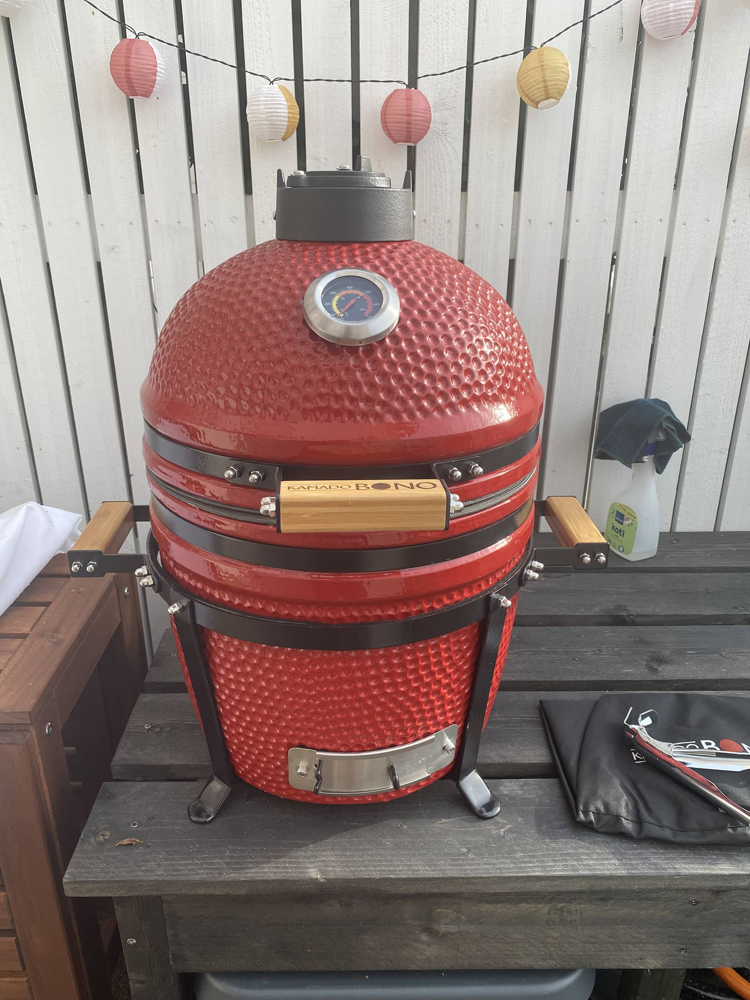
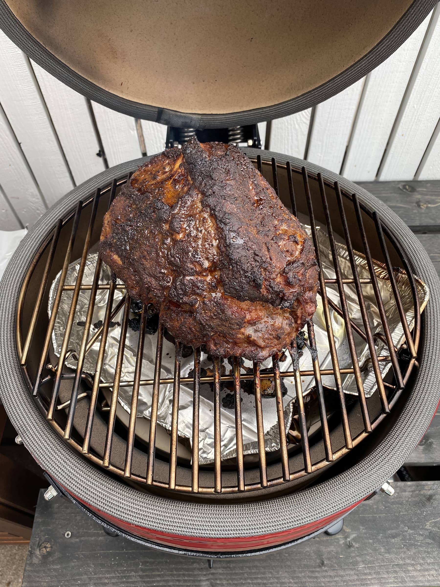
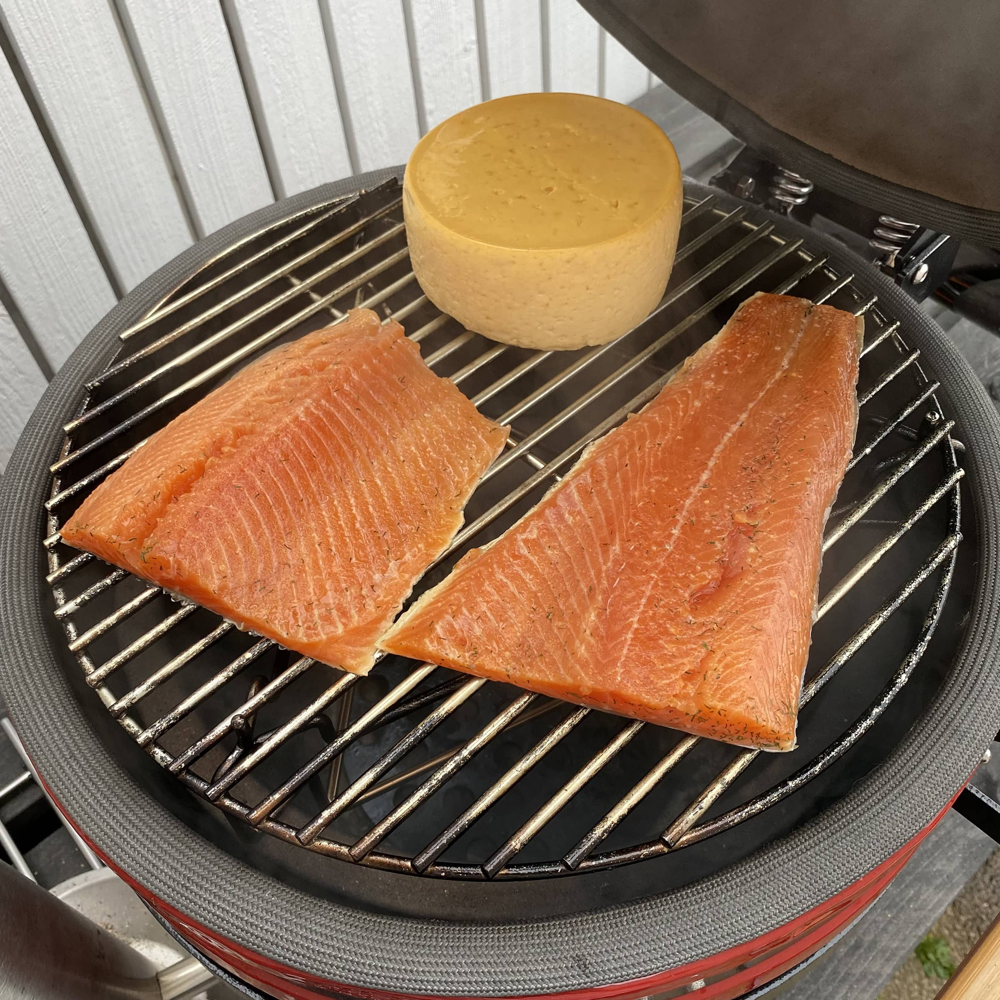
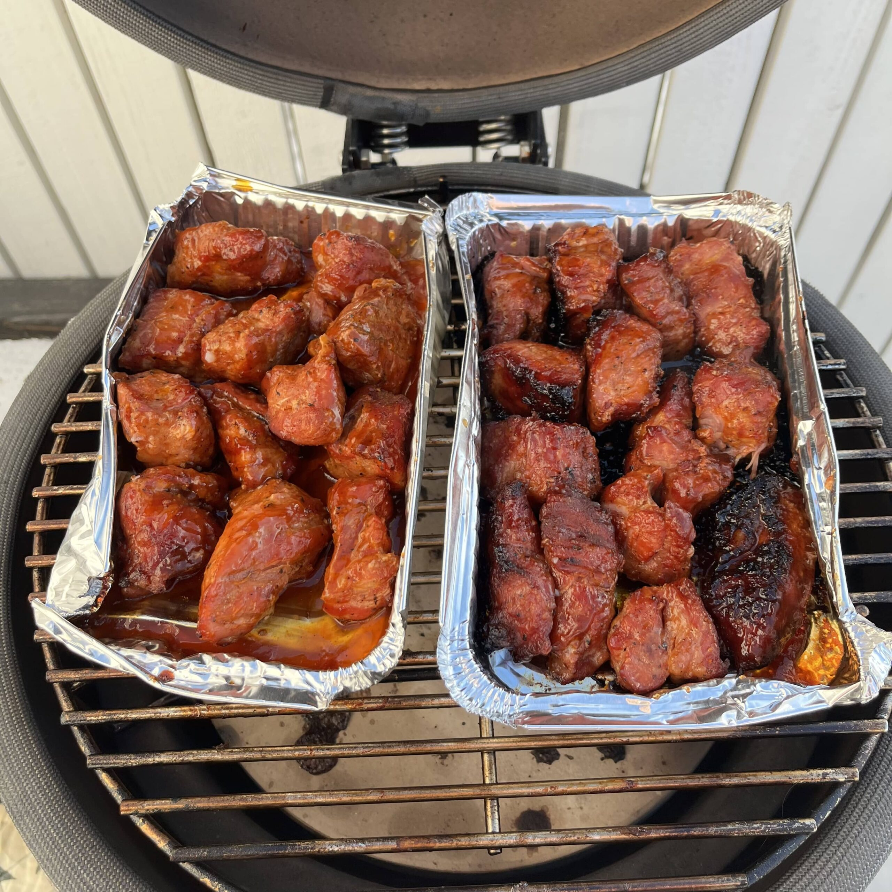
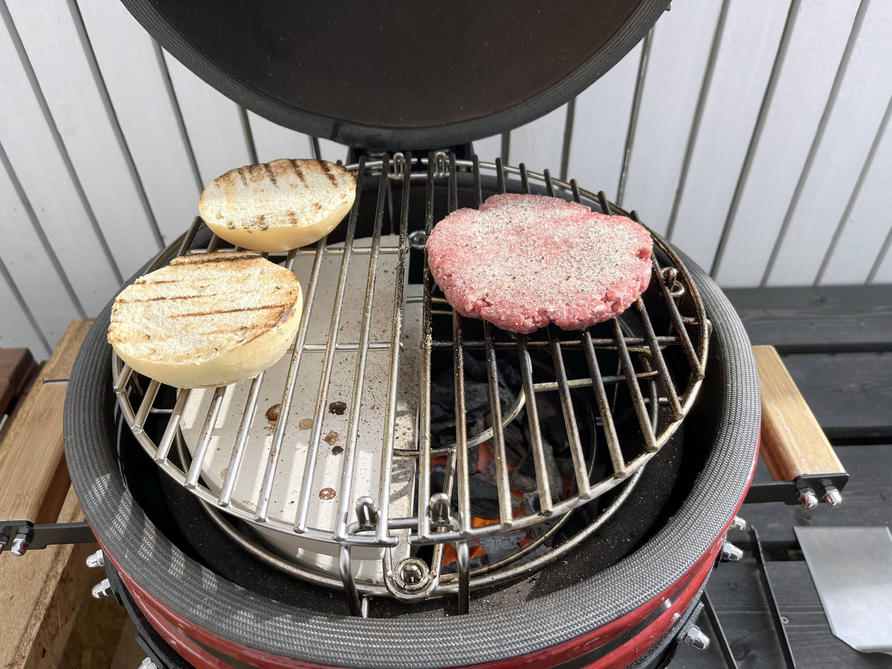
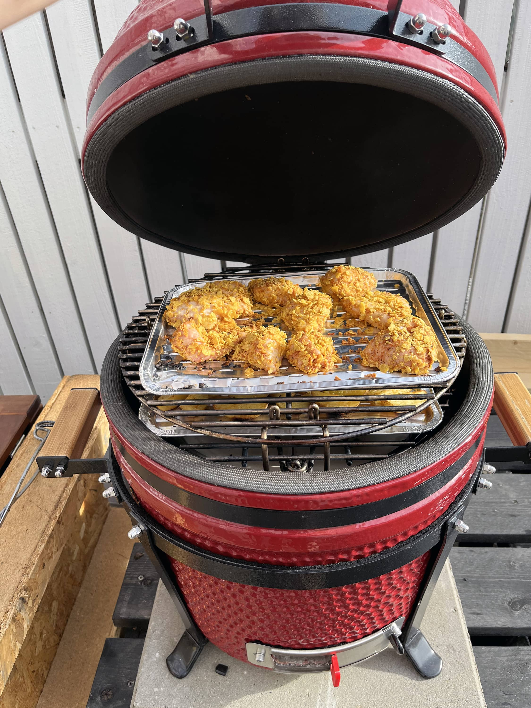

Nyt, kun tätä Bono Minimo kamadoa on käyttänyt viime vuoden lopulta saakka niin voikin kirjoitella hieman paremmin omia mielipiteitä. Ensikäryt voi lukea tietty jo [aiemmasta blogi kirjoituksesta](/bono-minimon-ensikaryt/).

Tässä on tosiaan luvassa omia välistä suht sekalaisia mietteitä tästä kamadosta. Jos jää jotain kysyttävää niin kysyä voi joko kommenteissa tai foorumeilla. Vastaan mielelläni kysymyksiin tai otan selvää!

Ensin pakollinen paha alta pois ja tämä on tosiaan ihan omilla rahoilla ostettu ja kukaan ei ole maksanut tästä mitään. Mielipiteet on omia oli ne hyviä tai huonoja (tai sekalaisia).

## Kohtaako hinta laadun?

Tämähän ei ole halvin pieni kamado eikä kyllä myöskään kallein. Eli mennään siihen keskikastiin hintaluokassa. Pakko myöntää, että katselin näitä halvempiakin kamadoja tässä pienessä kokoluokassa, mutta päädyin sitten lopulta tähän, koska tässä tuli kaikki matkassa mitä tarvitsee ja takuun pitäisi olla kohdillaan.

Kokemuksia, kun ei muista kamadoista ole ja varsinkaan noista halvemmista niin en niihin voi suoraan vertailla. Tämä kuitenkin on ollut tosi hyvä omassa käytössä ja olen tosi tyytyväinen. Hinta mielestäni kohtaa laadun ja tuon, kun hankkii niin ei kyllä tarvitse välttämättä hankkia mitään muuta kuin hiiliä ja tietty ruokaa mitä sinne laittaa.

Hauska olisi kyllä vertailla halvempaakin (sekä tietty kalliimpaakin) kamadoa tähän. Ehkä joskus. Sekä hauska olisi verrata tätä isompiinkin kavereihin sillä itsellä tämä on ensimmäinen kamado ylipäätään.

## Mitäs sillä on sitten grillattu?

Mitäpä sillä ei ole grillattu? Tällähän voit käytännössä grillata kaikkea mitä sinne saa mahtumaan.

Itselle eka ns. pitkä veto oli tietysti [pulled pork](/tehdaan-pulled-pork-kamadolla/) eli kassler meni sinne. Tämän tekoa suosittelen melkein muillekin ensimmäiseksi pitkäksi vedoksi low & slow tekniikalla sillä se antaa paljon anteeksi ja ei ole niin justiinsa. Ei kyllä ihan niin justiinsa kotona grillaamisessa ole mikään, mutta silti.

Pulled Pork tulossa

Tulipa tätä käytettyä myös [kylmäsavustuksessa](/mustang-savunkehitin-kylmasavustuksessa-kokeillaan-tehda-kylmasavulohta-ja-savujuustoa/), kun oli just sopiva siihen hommaan. Eli mielikuvitusta voi tosiaan näiden kanssa käyttää. Toki tässä paistuu ihan perus makkarat, kasvisnyytit sekä [burgeritkin](/tehdaan-burgereita/). Pihvit menee suoraan kuumalla tai reverse sear tekniikalla. Kuten tässä nyt tehtiin [petite tenderiä](/tehdaan-ensimmaista-kertaa-petite-tender/) myös ja alkuun pienemmällä lämmöllä kamadossa ja loppuun pallossa.

KylmäsavustustaPossunoppiaBurgeriaPetite tender

Kaikkeahan tällä voi grillata mitä muillakin vehkeillä. Erityisesti kamado soveltuu kuitenkin näihin low & slow hommiin sen lämmönsäädön ja keramiikan ansiosta. Tosin porukka paistelee isommilla kamadoilla pizzaakin tosi kovissa lämmöissä eli loppujaan ei rajaa ehkä olekaan...

Tämä koko sopii oikein mainiosti parin hengen grilliruoan tekoon. Saa hyvin tehtyä kaikkea, mutta jos isommalle poppoolle niin ota suoraan isompi jo. Tämä käy hyvin myös esim. pallogrillin kaveriksi jo tässä koossa jos isommalle poppoolle tekee. Olenkin käyttänyt tätä niin, että kamadossa pienempää lämpöä ja pallogrillissä kovempaa lämpöä. Kivaa on myös se, että tässä voi tulla esim. pulled pork valmiiksi, kun samalla grillaa toisella grillillä muuta.

## Käyttäminen

Tähän pätee sama logiikka, kuin mihin muuhun hiiligrilliin. Sytytä hiilet ja odota, että ne syttyy ja sopivaa lämpötilaa. Itse olen sytytellyt yleensä sytytyskiepillä tämän ja odotellut, että hiiliä syttyy sopivasti ja tämän jälkeen lyönyt kannen kiinni ja ottanut sopivan lämpötilan.

Tähän väliin hyvä vinkki. Kannattaa oikeasti odottaa, että se kannen keramiikka lämpiää myös. Näin voit olla varma, että se kamado on oikeasti lämmin, kun sinne laitat esim. kasslerin.

Tässä, kun olen paistellut viime aikoina 200 asteessa epäsuoralla niin olen huomannut, että pääsen helposti 200 asteeseen kun laitan samat ala- ja yläluukun asennot. Itsellä alaluukku on täysin auki ja ylhäältä on luukku kiinni mutta raot täysin auki. Tasainen 200 astetta on siinä ja se pysyy.

Matalissa lämpötiloissa on itsellä vielä opettelemista sillä tulee hieman säädeltyä lämpötilaa kesken kokkauksen ja hieman opetuttaa vielä.

Itsellä käyttö hieman laajeni tässä, kun hankin [monitoimiritilän](https://www.bigshop.fi/tuote/monitoimiritila-minimoon/) tähän. Ajatuksena oli saada [possunoppia](/possunopat-kamadossa/) parille eri tasolle. Possunoppia en ole vielä tehnyt, mutta olen huomannut jo burgereiden teossa tuon hyödylliseksi jo noiden kahden puoliympyrän muotoisten kivien ansiosta. Samoin kanaa ja pottuja tehdessä sain tuohon molemmat mahtumaan helposti yhtä aikaa. Tämä onkin lisäosa mitä voin suositella mihin tahansa kamadoon koosta riippumatta.

Kahden kerroksen väkeä

Sehän on myös huomioitava, että tämä "kylmenee" hitaammin, kuin esim. pallogrilli. Keramiikka tosiaan pitää lämpöä hyvin vaikka kaikki luukut olisi kiinni ja saattaa olla lämpöä hyvinkin vielä useamman tunnin ajan sen jälkeen, kun ollaan varsinkin kovilla lämmöillä grillattu. Tämä myös kannattaa ottaa huomioon jos ajatus on ensin kuumalla ja sitten ei niin kuumalla, että lämmönsäätö ottaa aikansa. Kuten myös muutenkin, ei ole sitä hätäisen hommaa.

Kamadon puhdistus on hieman työlästä, jos haluaa sen tehdä kunnolla. Mukana tuleva tuhkalapio tekee perushomman eli alailma-aukon kautta saadaan kaavittua tuhkaa pois. Jos kuitenkin kaikki tuhkat haluaa pois niin sitten pitää "purkaa" keramiikka ulos. Jonkinlainen hiilikori voisi myös olla kiva lisä tähän niin saisi helposti hiilet pois kamadosta, kun sitä haluaa putsata.

## Loppumietteitä

Tästä on pääosin positiivista sanottavaa. Ei ole vielä ainakaan kovin huonoja puolia tullut vastaan. Ainut on oikeastaan se, että noi kumit alailmansäädön luukuista lähti melkein heti pois ja on huonompi laatuista kun vertaa muuhun kamadoon. Mutta se ei ole isompi ongelma.

En oikeastaan millään tavalla kadu tämän hankintaa. Ehkä harmittaa se, että en heti aluksi ostanut tämmöistä isompana. Mutta olen toisaalta tohon pallogrilliinkin tosi tyytyväinen eli molempi parempi? Ehkä sitten, kun on pihalla tilaa enemmän niin voi hankkia pallogrillin kaveriksi isompaa kamadoa.

Tällä hetkellä tulee herkemmin laitettua Bono Minimo tulille, kuin Weberin pallogrilli. Lähinnä, kun teen itselleni ruokaa grillissä niin siihen mahtuu hyvin kaikki mitä tarvitsee. Sekä parin hengen eväätkin tullut tuolla mukavasti. Sitten jos pitää saada hieman enemmän kasvista ja muuta mahtumaan niin sitten pistetään pallogrilli tulille.

Tämän laadussakaan ei ole mitään moitittavaa. Kaikki toimii kuten uutenakin. Puuosat eli kahvaat on hieman nähnyt elämää, mutta sitä osasi odottaakkin, kun ulkona kuitenkin kamado on ollut talvenkin.

Lyhyesti. Todella hyvä ja hintansa arvoinen kamado tässä kokoluokassa. Antaa myös luottoa siihen, että Bonon isommatkin kamadot on hintansa arvoisia verrattuna muihin samankokoisiin.

**Onko sinulla sama kamado tai joku muu? Laita omia vinkkejä, kokemuksia tai kysymyksiä kommentteihin tai vaikka sitten foorumille!**
