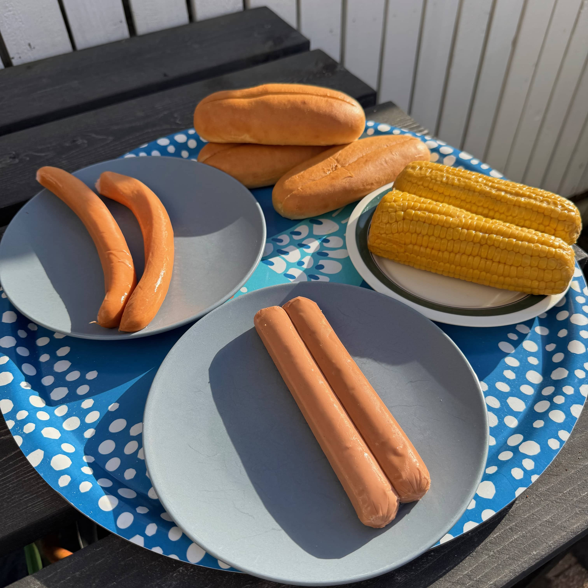
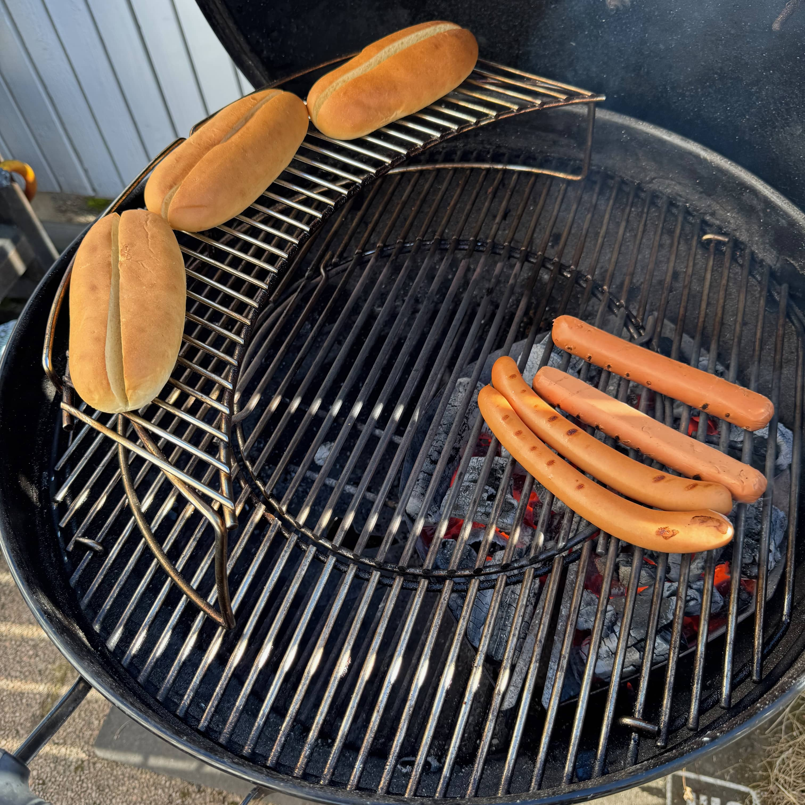
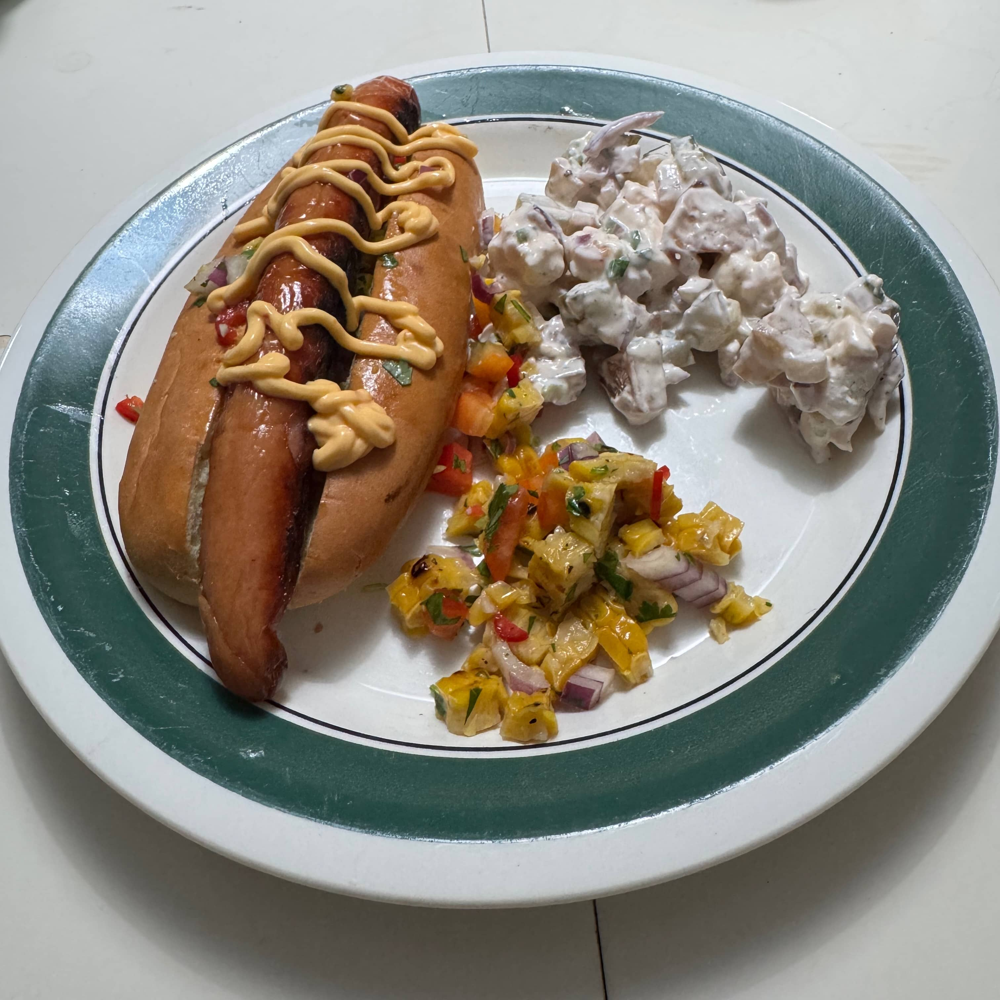

Vappuna toki pitää saada melkein pakollinen kombo jotenkin pöytään eli nakit ja perunasalaatti. Ei haluttu lähteä pelkkään nakkilinjaan ja tehtiin tällä kertaa hodareita ja perunasalaattia. Nyt vielä otettiin [viime vuoden](https://bbqblogi.fi/grillausta-koko-vappu/) ruokalista ja toistettiin se.

Aiempien [burgereiden](https://bbqblogi.fi/poppis-burgeri/) lisäksi tuli siis itse vapuksi tehtyä hodareita, perunasalaattia ja maissisalsaa. 

Perunasalaatin ja maissisalsan resepti onkin jo tuossa viime vuoden vappu [postauksessa](https://bbqblogi.fi/grillausta-koko-vappu/) joten en niitä toista tässä. Tää on kyllä voittava kombo.

Hodari sämpylöinä on Pupsin topcut sämpylöitä, jotka on kyllä tosi hyvät hodarisämpylät. Nakkeina oli tällä kertaa Savuhovin Hovinakki ja sitten vegemakkaraa rouvalle. 

Kaikkihan meni toki grilliin ja samalla grillailin maissitkin. Sämpylät sai mennä lämpiämään tuohon lisäritilälle.





Tää toimii, ei voi taas muuta sanoa. Hyvää tuli ja kelpasi. Heitin tällä kertaa pohjalle tuon maissisalsan hodarissa ja siihen nakki sekä cheddar kastike. Lisukkeena hieman pottusalaattia ja lisää maissisalsaa.

Ensi kerralla voi tehdä ehkä jotain erilaista hodaria sitten vuorostaan. Vaihtoehtoja on melkeinpä yhtä monta, kuin tekijääkin.

Blogia varten voisi joskus tehdä ns. minihodareita eli norminakeilla ja pienemmillä sämpylöillä. Näitä voi syödä useamman ja hieman eri komboilla.