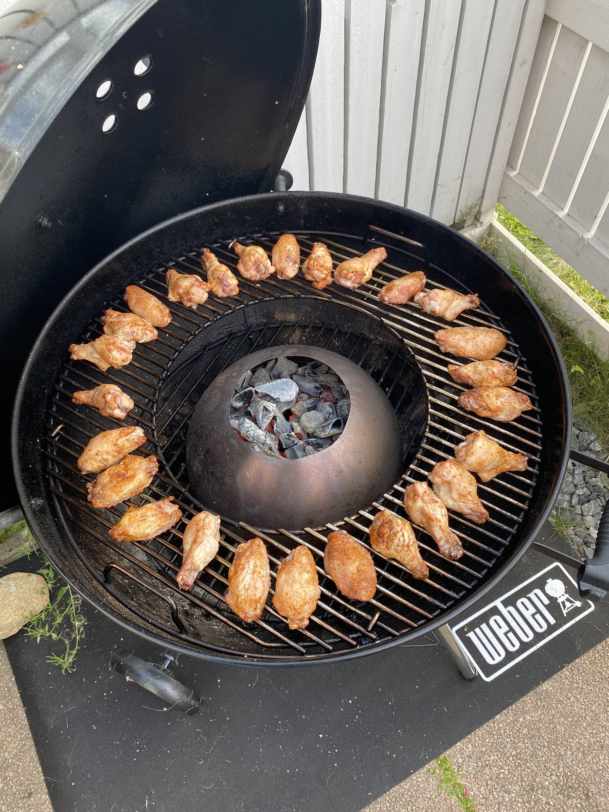

On nyt aika kirjoitella hieman omia mietteitä ja kokemuksia erittäin suositusta Weberin pallogrillistä. Nämä ovat täysin omia mietteitä ja tällä on grillailtu vasta vajaa 3kk joten lisää ajatuksia tulenee ajan kanssa. Sekä nyt on vielä vaikea sanoa miten tämä pallogrilli ikääntyy.

Tämä grilli oli itselle ensimmäinen hiiligrilli minkä kanssa on tullut pelattua. Aiempi grilli oli Landmannin kaasugrilli ja se olikin useamman vuoden käytössä. Sitä ennen oli myös kaasuvempele eli tämän myötä siirryttiin ns. oikeaan grillaukseen.

Sen sanon jo tässä, että kaasugrillihän on helppo käyttää ja nopea. Kaasu päälle, grilli lämpöihin ja ruoka tulille.

Tein jonkun verran tutkimista ja taustatyötä ennen, kuin päädyin tähän Weberin malliin. Toisena vaihtoehtona olisi ollut vastaava malli, mutta saranalla - päädyin haluamaan tämän irroitettavan kannen mallin sillä luin, että saranan kanssa on ollut ongelmia. Halusin myös säätää ilma-aukon paikkaa kantta kääntelemällä. Yhtenä syynä oli myös näiden Weberin pallojen takuu. Alla onkin listaus Weberin sivuilta takuusta:

- Alaosa ja kansi (10 Vuotta), Kattaa läpiruostumisen tai -palamisen – 05-2031
- One-Touch-puhdistusjärjestelmä (5 Vuotta), Kattaa läpiruostumisen tai -palamisen – 05-2026
- Muoviosat (5 Vuotta), Ei koske haalistumista tai värimuutoksia – 05-2026
- Kaikki muut osat (2 Vuotta) – 05-2023

Yhtenä syynä oli myös näiden jälleenmyyntiarvon säilyminen. Nämä menee käytettynäkin kaupaksi. Myös varaosien sekä lisävarusteiden saatavuus oli yhtenä kriteerinä. Olenkin jo parista [lisävarusteesta kirjoittanutkin tänne](/kategoria/lisavarusteet/).

Sattuipa tuolloin toukokuussa olemaan vielä Motonetissä kampanja tämän grillin ostaneille, jossa sai piippusytyttimen ja hieman hiiliä matkaan. Otin myös omaan settiin valurautaisen GBS systeemiin sopivan [ritilänkin](https://www.weber.com/FI/fi/tarvikkeet/ruoanlaitto/gourmet-bbq-system/8834.html?cgid=502#start=1).

## Aloittaminen ja grillaaminen

Ensin lähdettiin opettelemaan grillin sytyttämistä piippusytyttimellä. En ollut aiemmin käyttänyt, mutta tämähän onnistuu helposti. Piippuun hiiliä ja sytytyspala alle. Sitten sytytys ja odotellaan, että hiilet/briketit syttyy. Tämän jälkeen kaadetaan hiilet grilliin. Tämä metodi on ollut itsellä pääasiallisesti käytössä ja en ole vielä kokenut tarvetta muille tavoille. Tulenen testaamaan paria tapaa tänne blogiin, mutta siitä lisää myöhemmin.

Kun grilli on saatu syttymään niin onkin hyvä puhua mitä kaikkea onkaan tullut tehtyä. Sitähän on grillattu kaikenlaista aina perus makkarasta ribseihin asti. [Ribsit](/ikean-teline-ribseille-grillikylkiteline/) on tällä hetkellä niitä ns. pidempiä grillauksia ja makkarat taasen näitä nopeampia. Ajatuksena on vielä grillailla paljon lisää ja toiveissa olisi jatkaa grillausta ympärivuoden eikä vain kevät-kesä-syksy akselilla. Kokeiluun on vielä menossa pulled pork ja muuta pidemmän kypsytyksen kamaa. [Wingsejä](/ikean-viiden-euron-vortex-seka-wingsien-teko/) on tullut myös tehtyä ja täytyy vielä kehua niitä. Alla onkin pari kuvaa vielä.





## Ajatuksia itse grillistä

Ensin sanottava, että opettelua vielä on. Isoin haaste vielä itselle on lämmönsäätö varsinkin low & slow tyylisissä hommissa. Noihin hommiin voisi olla kamado parempi, mutta onnistuu kyllä pallollakin varsin mainiosti.

Grillihän on ajateltu pirun hyvin. Kansiteline toimii omaan makuun hyvin ja sen saa kivasti siihen sivuun, kun on menossa tuijottamaan omia grillauksiaan. Ritilänkin saa näppärästi roikkumaan kahvasta grillin sivuun ja tässäkin on mietitty tämä asia loppuun asti.

GBS eli Weberin oma Gourmet BBQ System on mielenkiintoinen lisä. Tämähän tarkoittaa käytännössä tuota irroitettavaa osaa keskellä ritilää. Tähän keskelle voikin siis laittaa minkä tahansa GBS lisävarusteen. Näitä on monenlaisia ja itse olenkin tuota valurautaista ritilää käyttänyt juuri hampurilaispihvien paistoon. Mietteissä onkin pitäisikö jossain välissä hankkia tasainen valurauta tuohon smash burger hommia varten.

Koko on oikeastaan passeli. Meitä syöjiä on pääasiassa kaksi, mutta toinen on kasvissyöjä ja toinen sekäsyöjä. Tilaa siis tarvitaan kahdellekin joskus reilusti kun on lihaa ja kasvista sekaisin. Usein myös syöjiä sattuu olemaan useampikin, joten tilaa tarvitaan.

## Lopuksi

Näin reilun 2kk jälkeen oon kyllä tosi tyytyväinen hankintaan. Hiiligrillauksen maailma on ihan erilainen ja tämä on kyllä alkanut olla ihan harrastuskin. On tullut tutkittua ja hankittua erilaisia hiiliä sekä brikettejä. On tullut koiteltua erilaisia tapoja grillata (hot & fast / low & slow / vortex / yms.). On tullut tehtyä ihan uusia ruokiakin grillillä mitä ennen ei olekaan tullut tehtyä.

Suosittelen ehdottomasti tätä grilliä. Ainakin näin lyhyen kokemuksen jälkeen.

Onko sinulla Weberin palloa, jos on niin heitä kommenttia! Saa heittää kommenttia vaikka ei olisikaan!
